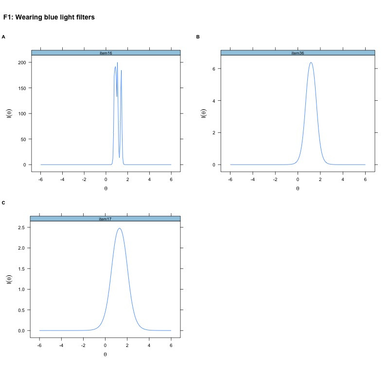
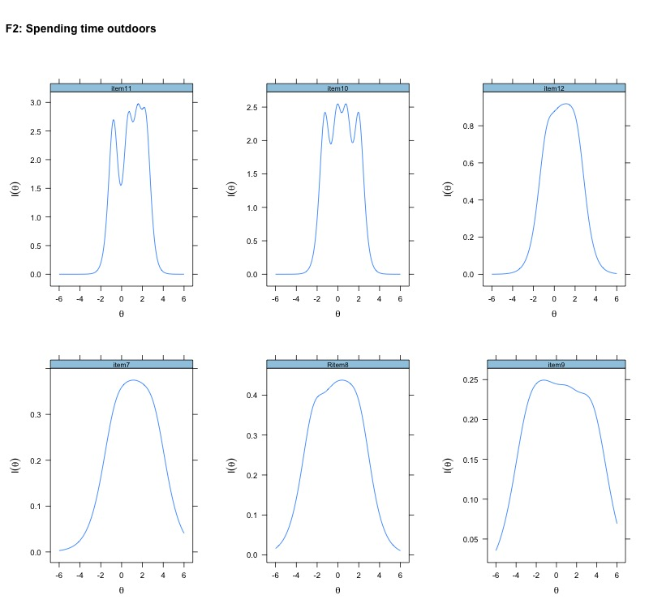
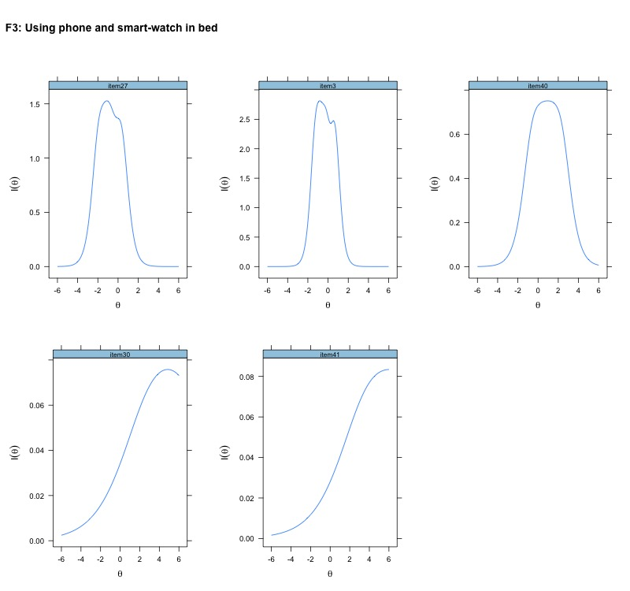
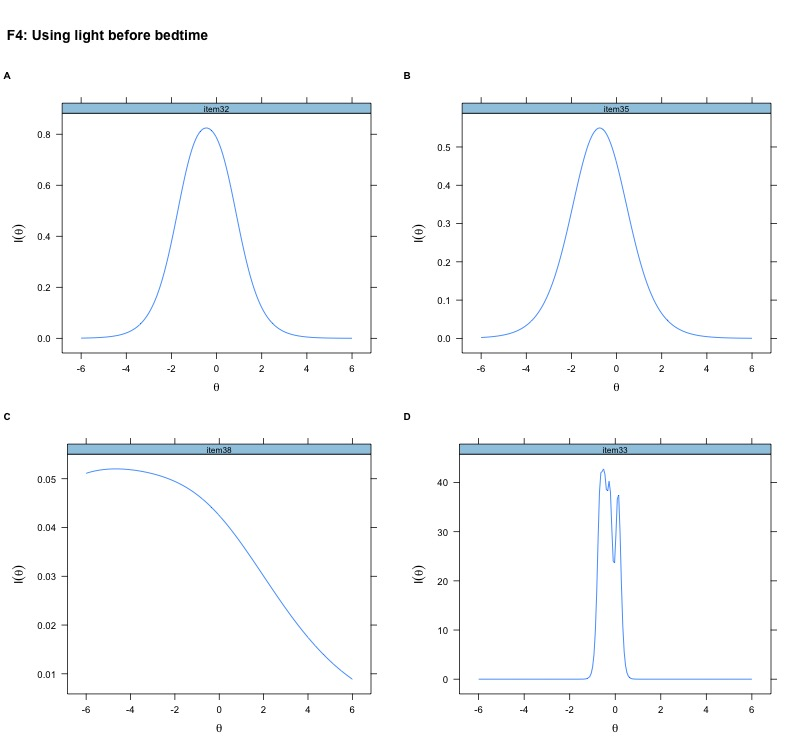
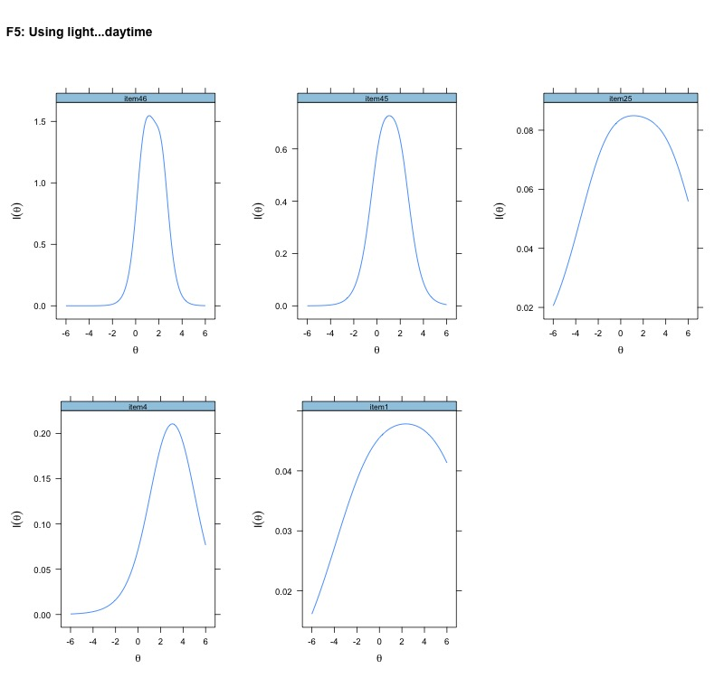

```{r factormp, warning=F}
map <- readr::read_csv("Table_raw/map_stat")
map <- map[,-1]
papaja::apa_table(map,align = "c", caption = "MAP Statistics",  font_size = "small")
```


```{r F1IF, echo=FALSE, fig.align='center', fig.cap='Item information curve of LEBA F1', out.height='160%', out.width='100%'}

```


```{r F2IF, echo=FALSE, fig.align='center', fig.cap='Item information curve of LEBA F1', out.height='160%', out.width='100%'}

```

```{r F3IF, echo=FALSE, fig.align='center', fig.cap='Item information curve of LEBA F1', out.height='160%', out.width='100%'}

```

```{r F4IF, echo=FALSE, fig.align='center', fig.cap='Item information curve of LEBA F1', out.height='160%', out.width='100%'}

```

```{r F5IF, echo=FALSE, fig.align='center', fig.cap='Item information curve of LEBA F1', out.height='160%', out.width='100%'}

```

