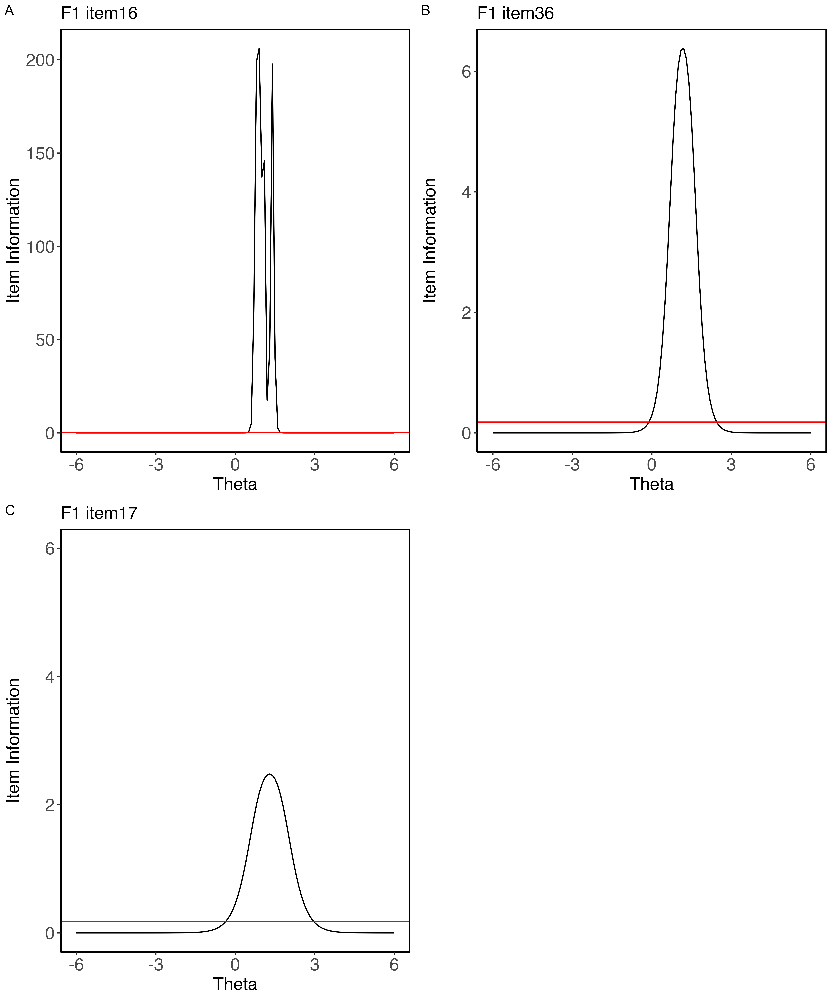
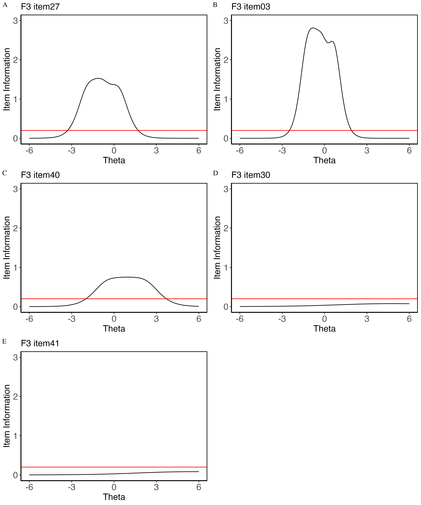

```{r factormp, warning=F}
map <- readr::read_csv("Table_raw/map_stat")
map1 <- (map$`MAP Statistic`)

map1 <- MOTE::apa(map1,5,F)
map1 <- as.character(map1)
map1 <- as.data.frame(map1)
colnames(map1) <- "MAP Statistics"
map2 <- map[,-c(1,2)]
map3 <- cbind(map1, map2)

papaja::apa_table(map3, caption = "Map Statistics")
```

```{r MI, include=F, warning=F}
data <- readRDS("leba_2021-09-08.rds")

# Separating EFA and CFA samples with descriptive column
descriptives.data <- data

## Merge "0"s and "1"s into "1"s select,subset assign)
descriptives.data[ , 9:56 ][ descriptives.data[ , 9:56 ] == 0 ] <- 1
#EFA.descriptives <- descriptives.data[1:428,]
EFA.descriptives <- subset(descriptives.data, IncludedInEFA == "TRUE")
#CFA.descriptives <- descriptives.data[429:690, ]
CFA.descriptives<- subset(descriptives.data, IncludedInEFA == "FALSE")

mi.desc_table <- CFA.descriptives[,c(1,2,5,6,7)] %>%
  tbl_summary(
    by = slypos_demographics_language.factor,
    statistic = list(all_continuous() ~ "{mean} ({sd})",
                     all_categorical() ~ "{n} ({p}%)"),
    digits = all_continuous() ~ 2,
    label = list(slypos_demographics_age ~ "Age",
                 slypos_demographics_sex.factor ~ "Sex",
                 slypos_demographics_work_or_school.factor ~ "Occupational Status",
                 slypos_demographics_school.factor ~ "Occupational setting"
                 ),
    missing = "no"
    ) %>% add_overall() %>% bold_labels() %>% add_p() %>% add_q() %>%
modify_header(label ~ "**Variable**") %>% separate_p_footnotes() %>%
  modify_caption("Demographic Characteristics: Native English Speakers") 


mides_kable <-  as_kable_extra(mi.desc_table, format = "latex",booktabs = T) 
```

```{r midesp, warning=F, message=F}
mides_kable %>% 
  kable_styling(latex_options = c("scale_down")) 
```

```{r F1IF, echo=FALSE, fig.align='center', fig.cap='Item information curve of LEBA F1', out.height='160%', out.width='100%'}

```

```{r F2IF, echo=FALSE, fig.align='center', fig.cap='Item information curve of LEBA F1', out.height='160%', out.width='100%'}
knitr::include_graphics('Manuscript.figures/F2.itemplots.png')
```

```{r F3IF, echo=FALSE, fig.align='center', fig.cap='Item information curve of LEBA F1', out.height='160%', out.width='100%'}

```

```{r F4IF, echo=FALSE, fig.align='center', fig.cap='Item information curve of LEBA F1', out.height='160%', out.width='100%'}
knitr::include_graphics('Manuscript.figures/F4.itemplots.png')
```

```{r F5IF, echo=FALSE, fig.align='center', fig.cap='Item information curve of LEBA F1', out.height='160%', out.width='100%'}
knitr::include_graphics('Manuscript.figures/F5.itemplots.png')
```

```{r personfit, fig.cap="Person fit of the five fitted IRT models (a) Wearing blue light filters (b) Spending time outdoors (c) Using phone and smartwatchin bed (d) Using light before bedtime (e) Using light in the morning andduring daytime", warning=FALSE, out.width="100%", out.height="120%"}
knitr::include_graphics("Manuscript.figures/personfit.png")
```