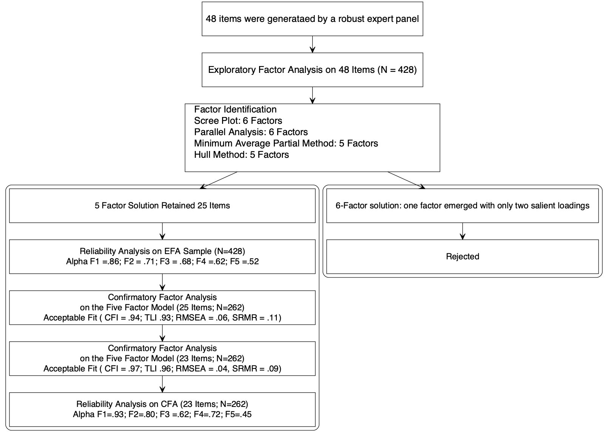
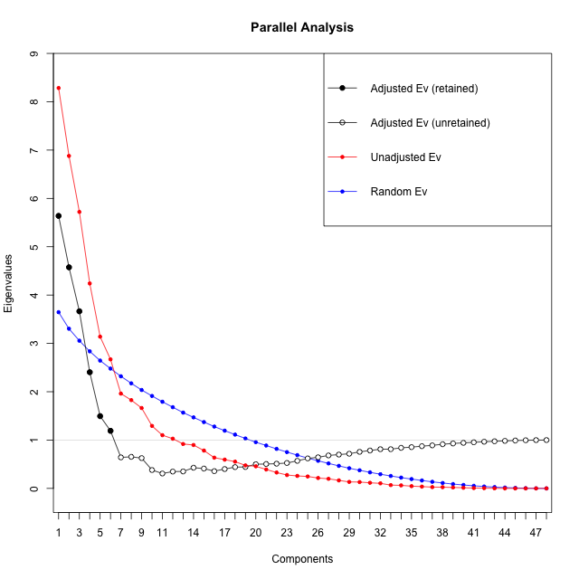
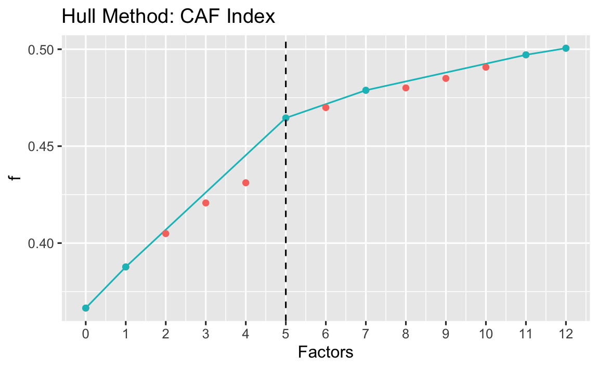
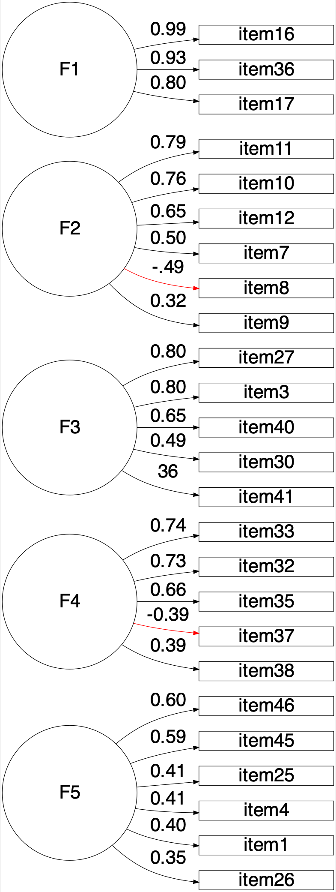

```{r dependencymanager, include = FALSE, warning=F}
knitr::opts_chunk$set(warning = F, error = F, message = F)
library(packrat)
packrat::init()
#Only use when you have added some pack
#packrat::snapshot(ignore.stale=TRUE) 

#To find and install required dependencies.
packrat::restore()
```

```{r eval=FALSE, include=FALSE}
#if "packrat" doesnot work you can run this chunk manually to get all required packs"

install.packages("devtools")
install.packages("semTools")
install.packages("MOTE")
install.packages("psych")
install.packages("dlookr")
install.packages("tidyverse")
install.packages("qgraph")
install.packages("kableExtra")
install.packages("paran")
install.packages("EFA.MRFA")
install.packages("rsvg")
install.packages("ggcorrplot")
install.packages("car")
install.packages("semTable")
install.packages("magick")
install.packages("mirt")
install.packages("cowplot")
devtools::install_github('rich-iannone/DiagrammeR')
devtools::install_github("crsh/papaja", force = T)
install.packages("DiagrammeRsvg")
devtools::install_github('SachaEpskamp/semPlot',  dependencies = T)
devtools::install_github("crsh/citr")


```

```{r setup}


library(papaja) # devtools::install_github("crsh/papaja")
library(lavaan)
library(semPlot) #devtools::install_github('SachaEpskamp/semPlot',  dependencies = T)
library(semTools)
library(MOTE)
library(psych)
library(dlookr)
library(tidyverse)
library(qgraph)
library(kableExtra)
library(paran) # Parallel analysis
library(EFA.MRFA) # Hull method
library(DiagrammeR) #devtools::install_github('rich-iannone/DiagrammeR')
library(DiagrammeRsvg) #For DiagrammeR
library(rsvg) #For DiagrammeR
library(ggcorrplot)
library(car) #Reversecoding
library(semTable)
library(magick)
library(mirt)
library(gtsummary)
r_refs("references.bib")
```

---
nocite: |
  `r cite_r("references.bib")`
---

```{r setup-chunk, include=FALSE}
knitr::opts_chunk$set(dev = "png",
                      dpi = 600,
                      echo = FALSE,
                      cache = TRUE)

```

# Introduction

Our study had four objectives. First, to develop an instrument to assess an individual's light exposure behavior. Second, to conduct an exploratory factor analysis(EFA) to understand the latent structure. The third one is to gather structural validity evidence for the latent structure obtained in EFA. Lastly, we gathered item information using Item response theory (IRT)[@bakerBasicsItemResponse2017] \# Methods

## Ethical approval

The cantonal ethics commission (Ethikkommission Nordwest- und Zentralschweiz, project ID Req-2021-00488) reviewed this project and issued an official clarification of responsibility (full document see Suppl. Fig X in appendix) stating: "The research project does not fall under the scope of the Human Research Act, because your project is using only anonymised data. An authorisation from the ethics committee is therefore not required and the EKNZ is not responsible for its review."

## Data Availability

## Survey characteristics

Data was collected in a quantitative cross-sectional approach via a fully anonymous online survey hosted on REDCap [CITE REDCAP HERE 1, 2] by way of the University of Basel (sciCORE; <https://redcap.scicore.unibas.ch/>). Participants for the anonymous online survey were recruited via the website of a Comic co-released with the survey [CITE COMIC HERE; <https://enlightenyourclock.org/participate-in-research/>], social media (i.e., LinkedIn, Twitter, Facebook), mailing lists, word of mouth, the investigators' personal contacts, and supported by distribution via f.lux software [CITE f.lux Michael Herf?].

Completing the online survey took approx. 15 to 20 minutes and was not compensated. The first page of the survey comprised a participant information sheet, where participants' informed consent to participate was obtained before any of the questions were displayed. Underaged participants (\<18 years) were urged to obtain assent from their parents/legal guardians, before filling in the survey. Information on the first page included the objectives of the study, inclusion criteria, estimated duration, the use, storage and sharing of the data, compensation (none), and information about the type of questions in the survey. Moreover, participants needed to confirm that they were participating the survey for the first time. To ensure high data quality, five attention check items were included in the survey (e.g., "We want to make sure you are paying attention. What is 4+5?"). The data analysed in this study was collected between 17.05.2021 and 03.09.2021. Questions incorporating retrospective recall were all aligned to the period of "past four weeks", matching the presented LEBA instrument.

In addition to the LEBA questionnaire, which is subject of the current study, the following variables and items were assessed but not included in the analysis:

-   Sleep disturbance and sleep-related impairment [CITE]
-   Sleep duration, timing, and latency, chronotype, social jetlag, time in bed, work/sleep schedule and outdoor light exposure duration [CITE]
-   Meal timing & caffeine consumption [CITE]
-   Light sensitivity (photophobia vs. photophilia) [CITE]
-   Self-reported pubertal stage (only if younger than 18 years old) [CITE]

Furthermore, the following 1-item demographic variables were assessed:

-   Age
-   Sex
-   Gender identity
-   Occupational Status
-   COVID-related Occupational setting during the past four weeks
-   Time zone & country of residence
-   English as native language

## Participants

```{r preparingData, include=FALSE}
data <- readRDS("leba_2021-09-08.rds")

# Separating EFA and CFA samples with descriptive column
descriptives.data <- data

## Merge "0"s and "1"s into "1"s select,subset assign)
descriptives.data[ , 9:56 ][ descriptives.data[ , 9:56 ] == 0 ] <- 1
EFA.descriptives <- descriptives.data[1:428,]
CFA.descriptives <- descriptives.data[429:690, ]

#Separating the EFA and CFA(only items)
sem.data <- data[, 9:56] #EFA & CFA data
sem.data[ sem.data == 0] <- 1 #Merged "0"s and "1"s into "1"s

## renaming the column-header
prefix <- "item"
sufix <- c(1:48)
colnam <- paste(prefix,sufix, sep = "" )
colnames(sem.data) <- colnam
```

```{r descriptives, eval=FALSE, include=FALSE}
#Use these  data frames for descriptive
EFA.descriptives #Only EFA, n =428
CFA.descriptives #Only CFA, n =262  
descriptives.data# Total sample, n = 690

```

```{r prepareDescTable, include=FALSE}

listdescVars <- colnames(descriptives.data[c(1:3,5:7)])


#seperating naming and  reducing data for descriptive Table 
desctable.data <- select(descriptives.data, c(listdescVars,
                          IncludedInCFA))

#renaming TRUE and FALSE from the IncludedInCFA to EFA and CFA for Descriptive Table
desctable.data$IncludedInCFA[desctable.data$IncludedInCFA == T ] <-
 "2. CFA Sample"
desctable.data$IncludedInCFA[desctable.data$IncludedInCFA == F ] <- 
 "1. EFA Sample"

# recode the Gender factor so it will only show "Gender Diverse" in the summary table
desctable.data$slypos_demographics_gender.factor <-
  recode_factor(desctable.data$slypos_demographics_gender.factor, "No" = "Yes",
         "Yes"= "No")
       
# create descriptive table for the demographic vars (excluding tz & Country) with gtsummary
desctable.data %>%
  tbl_summary(
    by = IncludedInCFA,
    statistic = list(all_continuous() ~ "{mean} ({sd})",
                     all_categorical() ~ "{n} ({p}%)"),
    digits = all_continuous() ~ 2,
    label = list(slypos_demographics_age ~ "Age",
                 slypos_demographics_sex.factor ~ "Sex",
                 slypos_demographics_gender.factor ~ "Gender-Variant Identity",
                 slypos_demographics_language.factor ~ "Native English Speaker",
                 slypos_demographics_work_or_school.factor ~ "Occupational Status",
                 slypos_demographics_school.factor ~ "Occupational setting"
                 ),
    missing = "no"
    ) %>% add_overall() %>% bold_labels() %>% add_p() %>% add_q() %>%
modify_header(label ~ "**Variable**") %>% 
as_kable(format = 'pipe') -> desc_kable #save it as a knitr::kable

```

```{r DescTabPrint, results='asis'}

desc_kable %>% kable_styling(desc_kable, repeat_header_text = "Participants' Demographic Characteristics")

```

Table 1 summarizes the survey participants' demographic characteristics. Only participants completing the full LEBA questionnaire were included, thus there are no missing values in the item analyses. XX participants were excluded from analysis due to not passing at least one of the "attention check" items. Anonymous responses from a total of *n* = `r nrow(desctable.data)` participants were included in the analysis of the current study, split into samples for exploratory (EFA: *n* = `r nrow(desctable.data[desctable.data$IncludedInCFA == "1. EFA Sample",])`) and confirmatory factor analysis (CFA: *n* = `r nrow(desctable.data[desctable.data$IncludedInCFA == "2. CFA Sample",])`). The EFA sample included participants filling out the questionnaire from 17.05.2021 to XX.XX.XXXX , whereas participants who filled out the questionnaire from YY.YY.YYYY to 03.09.2021 were included in the CFA analysis. Participants indicated filling out the online survey from a diverse range of geographic locations. The four most common geographic locations included:

`r kable(head(summary(descriptives.data$slypos_demographics_tz.factor), 4), format = "latex")`

For a full list of geographic locations, see Suppl. Table X in the appendix.

Age among all participants ranged from `r min(desctable.data$slypos_demographics_age)` years to `r max(desctable.data$slypos_demographics_age)` years (EFA: *min* = `r min(desctable.data$slypos_demographics_age[desctable.data$IncludedInCFA == "1. EFA Sample"])`, *max* = `r max(desctable.data$slypos_demographics_age[desctable.data$IncludedInCFA == "1. EFA Sample"])`; CFA: *min* = `r min(desctable.data$slypos_demographics_age[desctable.data$IncludedInCFA == "2. CFA Sample"])`, *max* = `r max(desctable.data$slypos_demographics_age[desctable.data$IncludedInCFA == "2. CFA Sample"])`), with an overall mean of \~ `r round(mean(desctable.data$slypos_demographics_age), 0)` years of age (Overall: *M* = `r mean(desctable.data$slypos_demographics_age)`, *SD* = `r sd(desctable.data$slypos_demographics_age)`; EFA: *M* = `r mean(desctable.data$slypos_demographics_age[desctable.data$IncludedInCFA == "1. EFA Sample"])`, *SD* = `r sd(desctable.data$slypos_demographics_age[desctable.data$IncludedInCFA == "1. EFA Sample"])`; CFA: *M* = `r mean(desctable.data$slypos_demographics_age[desctable.data$IncludedInCFA == "2. CFA Sample"])`, *SD* = `r sd(desctable.data$slypos_demographics_age[desctable.data$IncludedInCFA == "2. CFA Sample"])`). In total 47% of participants indicated female sex (EFA: 44%; CFA: 52%), 51% indicated male (EFA: 54%; CFA: 46%) and 2% indicated other sex (EFA: 2.1%, CFA: 1.9%). Overall 7.2% (EFA: 7.8%; CFA: 6.2%) participants indicated a gender-variant identity. In a "Yes/No" question regarding native language 46% of respondents (EFA: 46%; CFA: 45%) indicated to be native English speakers. For their "Occupational Status", more than half (57%) of the overall sample reported that they currently work (EFA: 55%; CFA: 61%), whereas 25% (EFA: 29%; CFA: 20%) reported that they go to school and 17% (EFA: 17%; CFA: 19%) responded that they do neither. With respect to the COVID-19 pandemic we asked participants to indicate their occupational setting during the last four weeks: In the overall sample 44% (EFA: 45%; CFA: 42%) of the participants indicated that they were in a home office/ home schooling setting., while 16% overall (EFA: 16%; CFA: 16%) reported face-to-face work/schooling. Lastly, 21% overall (EFA: 22%; CFA: 20%) reported a combination of home- and face-to-face work/schooling, whereas 19% overall (EFA: 17%; CFA: 23%) filled in the "Neither (no work or school, or indication)" response option. We tested all demographic variables in Table 1 for significant group differences between the EFA and CFA sample, applying Wilcoxon rank sum test for the continuous variable "Age" and Pearson's Chi-squared test for all other categorical variables via the gtsummary R package's "add_p" function [CITE]. The p-values were corrected for multiple testing applying false discovery rate (FDR) via the "add_q" function of the same package. After p-value (FDR) correction for multiple testing, none of the demographic variables were significantly different between the EFA sample and the CFA sample (all q-values *q* ≥ .2, indicating equivalence.

1.  Describe EFA and CFA sample separately.
2.  Sampling technique: Convince sampling (non-probability sample)
3.  Method: cross-sectional survey
4.  How many missing data?
5.  How incomplete data were addressed.
6.  Why such sample was chosen?

EFA: For exploring initial factor structure, a sample of 250-300 is recommended [@comreyFirstCourseFactor1992; @schonbrodtWhatSampleSize2013]

CFA: For estimating the sample size for the confirmatory factor analysis we followed the N:q rule [@bentlerPracticalIssuesStructural1987; @jacksonRevisitingSampleSize2003; @klinePrinciplesPracticeStructural2015; @worthingtonScaleDevelopmentResearch2006] where 10 participants per parameter is required to earn trustworthiness of the result. Our sample size exceeds the requirement.

## Procedure

### Development of the Scale

1.  How the items were generated
2.  How the literature was reviewed to identify construct adequacy of the items.
3.  Discuss the expert panel review process to assess content validity

```{r flowchart, include=FALSE }
Flowchart1 <- grViz("digraph nicegraph{
         
                    graph [layout = dot,fontsize = 20]
                     
                     node[shape = rectangle, margin = 0.2, width = 6.5, height = 1, 
                    fixedsize = true,fontsize = 20]  
                     
                    A[label = '48 items were generataed by a robust expert panel'] 
                    B[label = 'Exploratory Factor Analysis on 48 Items (N = 428)']
                    
                    node[shape = rectangle, margin = 0.2, width = 6.5, height = 2, 
                    fixedsize = true, fontsize = 20]
                    C[label = 'Factor Identification
                    Scree Plot: 6 Factors
                    Parallel Analysis: 6 Factors
                    Minimum Average Partial Method: 5 Factors
                    Hull Method: 5 Factors']
                    
                     subgraph cluster_1 {
                      graph[shape = rectangle]
                      style = rounded
                     node[ margin = 0.2,width = 6.5, height = 1, fixedsize = true, fontsize = 18 ]
                    
                     1[label = '5 Factor Solution Retained 25 Items']
                     2[label = 'Reliability Analysis on EFA Sample (N=428)
                    Alpha F1 =.86; F2 = .71; F3 = .68; F4 =.62; F5 =.52']
                    
                     3[label = 'Confirmatory Factor Analysis 
                     on the Five Factor Model (25 Items; N=262)
                      Acceptable Fit ( CFI = .94; TLI .93; RMSEA = .06, SRMR = .11)']
                    
                    4[label = 'Confirmatory Factor Analysis 
                     on the Five Factor Model (23 Items; N=262)
                      Acceptable Fit ( CFI = .97; TLI .96; RMSEA = .04, SRMR = .09)']
                     5[label = 'Reliability Analysis on CFA (23 Items; N=262) 
                      Alpha F1=.93; F2=.80; F3 =.62; F4=.72; F5=.45']
                    }
                subgraph cluster_2 {
                      graph[shape = rectangle]
                      style = rounded
                     node[ margin = 0.2,width = 6.5, height = 1, fixedsize = true ]
                    6[label = '6-Factor  one factor with only two salient loadings']
                    7[label = 'Rejected']
                    }     
                     
                    
                     edge[color = black,arrowhead = vee, arrowsize = 1.25]
                     A ->B
                     B ->C
                     C ->1
                     1 ->2
                     2 ->3
                     3 ->4
                     4 ->5
                     C ->6
                     6 ->7
                     
                     
}")

export_svg(Flowchart1) %>%
  charToRaw() %>%
  rsvg() %>%
  png::writePNG("Manuscript.figures/Flowchart1.png")

```

```{r FlowchartFig, fig.align='center', fig.cap='Development', out.height='100%', out.width='100%'}

```

### Data Collection

Timeline of data collection, ethical approval mode of data collection how consent was recorded.

## Analytic Strategies

We used R (version 4.1.0), including several R packages, for our analyses. Necessary assumptions of EFA, including sample adequacy, normality assumptions, quality of correlation matrix, were assessed. Our data violated both the univariate and multivariate normality assumptions. Due to these violations and the ordinal nature of our response data, we used a polychoric correlation matrix [@desjardinsHandbookEducationalMeasurement2018] for the EFA. We employed principal axis (pa), a factor extraction method with varimax rotation. PA is robust to the normality assumption violations [@watkinsStepbyStepGuideExploratory2020]. The obtained latent structure was confirmed by the minimum residuals extraction method as well. We used a combination factor identification method including scree plot[@cattellScreeTestNumber1966], Horn's parallel analysis [@hornRationaleTestNumber1965], minimum average partials method[@velicerDeterminingNumberComponents1976], and hull method [@lorenzo-sevaHullMethodSelecting2011] to identify factor numbers. Additionally, to determine the simple structure, we followed the following guidelines recommended by psychometricians (i) no factors with fewer than three items (ii) no factors with a factor loading \<0.3 (iii) no items with cross-loading greater than .3 across factors [@bandalosFactorAnalysisExploratory2018;

# Results

```{r EFAdata, include=FALSE}
### EFA data
EFA.data <- sem.data[1:428, ]
```

```{r EFAassumptions, include=FALSE}

#KMO test
KMO <- KMO(EFA.data) 

# Test of correlation matrix
bartlet <- cortest.bartlett(EFA.data, n =428)


#Histogram
#psych::multi.hist(EFA.data[,sapply(EFA.data, is.numeric)])

# Univariate normality

n1 <- shapiro.test(EFA.data$item1)
n2 <- shapiro.test(EFA.data$item2)
n3 <- shapiro.test(EFA.data$item3)
n4 <- shapiro.test(EFA.data$item4)
n5 <- shapiro.test(EFA.data$item5)
n6 <- shapiro.test(EFA.data$item6)
n7 <- shapiro.test(EFA.data$item7)
n8 <- shapiro.test(EFA.data$item8)
n9 <- shapiro.test(EFA.data$item9)
n10 <- shapiro.test(EFA.data$item10)
n11 <- shapiro.test(EFA.data$item11)
n12 <- shapiro.test(EFA.data$item12)
n13 <- shapiro.test(EFA.data$item13)
n14 <- shapiro.test(EFA.data$item14)
n15 <- shapiro.test(EFA.data$item15)
n16 <- shapiro.test(EFA.data$item16)
n17 <- shapiro.test(EFA.data$item17)
n18 <- shapiro.test(EFA.data$item18)
n19 <- shapiro.test(EFA.data$item19)
n20 <- shapiro.test(EFA.data$item20)
n21 <- shapiro.test(EFA.data$item21)
n22 <- shapiro.test(EFA.data$item22)
n23 <- shapiro.test(EFA.data$item23)
n24 <- shapiro.test(EFA.data$item24)
n25 <- shapiro.test(EFA.data$item25)
n26 <- shapiro.test(EFA.data$item26)
n27 <- shapiro.test(EFA.data$item27)
n28 <- shapiro.test(EFA.data$item28)
n29 <- shapiro.test(EFA.data$item29)
n30 <- shapiro.test(EFA.data$item30)
n31 <- shapiro.test(EFA.data$item31)
n32 <- shapiro.test(EFA.data$item32)
n33 <- shapiro.test(EFA.data$item33)
n34 <- shapiro.test(EFA.data$item34)
n35 <- shapiro.test(EFA.data$item35)
n36 <- shapiro.test(EFA.data$item36)
n37 <- shapiro.test(EFA.data$item37)
n38 <- shapiro.test(EFA.data$item38)
n39 <- shapiro.test(EFA.data$item39)
n40 <- shapiro.test(EFA.data$item40)
n41 <- shapiro.test(EFA.data$item41)
n42 <- shapiro.test(EFA.data$item42)
n43 <- shapiro.test(EFA.data$item43)
n44 <- shapiro.test(EFA.data$item44)
n45 <- shapiro.test(EFA.data$item45)
n46 <- shapiro.test(EFA.data$item46)
n47 <- shapiro.test(EFA.data$item47)
n48 <- shapiro.test(EFA.data$item48)

normality.tab = matrix(, nrow = 48, ncol = 2)
as.table(normality.tab)
rownameprefix <- "Item"
rownamesufix <- seq(1:48)
my.item.names <- paste(rownameprefix,rownamesufix, sep = "" )
rownames(normality.tab) <- my.item.names
colnames(normality.tab) <- c("statistic", "p")


normality.tab[,1] <- c(apa((n1$statistic),2,T),
                       apa((n1$statistic),2,T),
                       apa((n3$statistic),2,T),
                       apa((n4$statistic),2,T),
                       apa((n5$statistic),2,T),
                       apa((n6$statistic),2,T),
                       apa((n7$statistic),2,T),
                       apa((n8$statistic),2,T),
                       apa((n9$statistic),2,T),
                       apa((n10$statistic),2,T),
                       apa((n11$statistic),2,T),
                       apa((n12$statistic),2,T),
                       apa((n13$statistic),2,T),
                       apa((n14$statistic),2,T),
                       apa((n14$statistic),2,T),
                       apa((n16$statistic),2,T),
                       apa((n17$statistic),2,T),
                       apa((n18$statistic),2,T),
                       apa((n19$statistic),2,T),
                       apa((n20$statistic),2,T),
                       apa((n21$statistic),2,T),
                       apa((n22$statistic),2,T),
                       apa((n23$statistic),2,T),
                       apa((n24$statistic),2,T),
                       apa((n25$statistic),2,T),
                       apa((n26$statistic),2,T),
                       apa((n27$statistic),2,T),
                       apa((n28$statistic),2,T),
                       apa((n29$statistic),2,T),
                       apa((n30$statistic),2,T),
                       apa((n31$statistic),2,T),
                       apa((n32$statistic),2,T),
                       apa((n33$statistic),2,T),
                       apa((n34$statistic),2,T),
                       apa((n35$statistic),2,T),
                       apa((n36$statistic),2,T),
                       apa((n37$statistic),2,T),
                       apa((n38$statistic),2,T),
                       apa((n39$statistic),2,T),
                       apa((n40$statistic),2,T),
                       apa((n41$statistic),2,T),
                       apa((n42$statistic),2,T),
                       apa((n43$statistic),2,T),
                       apa((n44$statistic),2,T),
                       apa((n45$statistic),2,T),
                       apa((n46$statistic),2,T),
                       apa((n47$statistic),2,T),
                       apa((n48$statistic),2,T))

normality.tab[,2] <- c(apa((n1$p.value),2,T),
                       apa((n1$p.value),2,T),
                       apa((n3$p.value),2,T),
                       apa((n4$p.value),2,T),
                       apa((n5$p.value),2,T),
                       apa((n6$p.value),2,T),
                       apa((n7$p.value),2,T),
                       apa((n8$p.value),2,T),
                       apa((n9$p.value),2,T),
                       apa((n10$p.value),2,T),
                       apa((n11$p.value),2,T),
                       apa((n12$p.value),2,T),
                       apa((n13$p.value),2,T),
                       apa((n14$p.value),2,T),
                       apa((n14$p.value),2,T),
                       apa((n16$p.value),2,T),
                       apa((n17$p.value),2,T),
                       apa((n18$p.value),2,T),
                       apa((n19$p.value),2,T),
                       apa((n20$p.value),2,T),
                       apa((n21$p.value),2,T),
                       apa((n22$p.value),2,T),
                       apa((n23$p.value),2,T),
                       apa((n24$p.value),2,T),
                       apa((n25$p.value),2,T),
                       apa((n26$p.value),2,T),
                       apa((n27$p.value),2,T),
                       apa((n28$p.value),2,T),
                       apa((n29$p.value),2,T),
                       apa((n30$p.value),2,T),
                       apa((n31$p.value),2,T),
                       apa((n32$p.value),2,T),
                       apa((n33$p.value),2,T),
                       apa((n34$p.value),2,T),
                       apa((n35$p.value),2,T),
                       apa((n36$p.value),2,T),
                       apa((n37$p.value),2,T),
                       apa((n38$p.value),2,T),
                       apa((n39$p.value),2,T),
                       apa((n40$p.value),2,T),
                       apa((n41$p.value),2,T),
                       apa((n42$p.value),2,T),
                       apa((n43$p.value),2,T),
                       apa((n44$p.value),2,T),
                       apa((n45$p.value),2,T),
                       apa((n46$p.value),2,T),
                       apa((n47$p.value),2,T),
                       apa((n48$p.value),2,T))
                       

normalityprefix <- normality.tab[,1]
normalitysufix <- "*"
normality.names <- paste(normalityprefix,normalitysufix, sep = "" )


# Multivariate Normality
mardia <- mardia(EFA.data, na.rm = T, plot =F)

# Descriptive Stats
Descriptives <- psych::describe(EFA.data)
alpha <- psych::alpha(EFA.data)
Item.total <- alpha$item.stats

Des.combined <- cbind(apa(Descriptives$mean,2,T), apa(Descriptives$sd,2,T), apa(Descriptives$skew,2,T),apa(Descriptives$kurtosis,2,T), normality.names,  apa(Item.total$r.cor,2,F))

colnames(Des.combined) = c("Mean", "SD", "Skew", "Kurtosis", "Shapiro-Wilk Statistics","Item-Total Correlation")

rownameprefix <- "Item"
rownamesufix <- seq(1:48)
my.names <- paste(rownameprefix,rownamesufix, sep = "" )
rownames(Des.combined) = (my.names)
```

```{r CorrelationMatrix, include=FALSE}
#Polychoric Correlation matrix

correlations <- polychoric(EFA.data, correct = 0)
upper <- correlations$rho[upper.tri(correlations$rho, diag = F)]

min.cor <- abs(min(upper)) #minimum cor.coefficient of the matrix
max.cor <- abs(max(upper)) # max. correlation coefficient of the matrix

determinets <- det(correlations$rho) 
# Calculating the percentage of correlations higher than .30

BigR = sum(correlations$rho >= abs(.30) & correlations$rho < abs(1.0), na.rm =T)/2 
totR = length(EFA.data)*(length(EFA.data)-1)/2
cor.per <- print (BigR/totR)*100
```

```{r ItemAnalysis, include=FALSE}
# Item analysis
Item_analysis <- psych::alpha(EFA.data)
Item_analysis$item.stats$r.cor
R.cor.sum <- summary(Item_analysis$item.stats$r.cor)
low.r.corec <- abs(R.cor.sum[1])  #minimum item total correlation
high.r.corec <- R.cor.sum[6]     # maximum item total correlation
```

Sampling adequacy was checked using Kaiser-Meyer-Olkin (KMO) measures of sampling adequacy[@kaiserIndexFactorialSimplicity1974] . The overall KMO vale for 48 items was `r printnum(KMO$MSA)` which was above the cutoff value (.50) indicating a mediocre sample [@hutchesonMultivariateSocialScientist1999]. Table\@ref(tab:tabDes) summarizes the univariate descriptive statistics for the 48 items. some of the items were skewed with high Kurtosis values. Our data violated both univariate normality (Shapiro-Wilk statistics; [@shapiroAnalysisVarianceTest1965]) and multivariate normality assumptions (Marida's test;[@mardiaMeasuresMultivariateSkewness1970]). Multivariate skew was = `r printnum(mardia$b1p)` (p \<0.001) and multivariate kurtosis was = `r printnum(mardia$b2p)` (p \<0.001). Due to these violations and ordinal nature of the response data polychoric correlations over Pearson's correlations was chosen [@desjardinsHandbookEducationalMeasurement2018]. Bartlett's test of sphericity [@bartlettNoteMultiplyingFactors1954], $\chi^2$ (`r bartlet$df`) = `r apa(bartlet$chisq, 2, T)`, p \< .001] indicated the correlations between items are adequate for the EFA. However only `r apa(cor.per, 2,T)`% of the inter-item correlation coefficients were greater than .30. The inter item correlation ranged between `r apa(min.cor,2,F)` to `r apa(max.cor,2,F)`. And the corrected item-total correlations ranged between `r apa(low.r.corec,2,F)` to `r apa(high.r.corec,2,F)`.

```{r tabDes}
apa_table(Des.combined, caption = "Descriptive Statistics", align = "c", note = "*p<.001", longtable =T)
```

```{r figCor,out.width="50%",fig.cap= "Correlation plot of the items",results='asis', fig.align='center'}

ggcorrplot(correlations$rho, hc.order = TRUE, outline.col = "white", type = "lower")
#p.mat <- cor_to_p(correlations$rho, 428, method = "polychoric")
#to show pvalue in the fig add p.mat=p.mat
```

```{r factor_identification, include=FALSE}


# Parallel analysis
paran(correlations$rho, iterations=500, centile=0, quietly=FALSE,
      status=TRUE, all=FALSE, cfa=FALSE, graph=TRUE,
      color=TRUE, col=c("black","red","blue"),
      lty=c(1,2,3), lwd=1, legend=TRUE, file="Manuscript.figures/parallel.png",
      width=640, height=640, grdevice=png, seed=0, mat=NA, n=NA)

# HULL
hullEFA(EFA.data,extr = "ULS", index_hull = "CAF", display = TRUE, graph = T,
        details = TRUE)


#MAP
psych::VSS(EFA.data, rotate = "varimax", fm = 'minres', n.obs =428 )


```

Scree plot ( Figure \@ref(fig:facid)) suggested a six-factor solution. Horn's parallel analysis [@hornRationaleTestNumber1965] with 500 iterations also indicated a six-factor solution. However, the MAP method [@velicerDeterminingNumberComponents1976] and Hull method [@lorenzo-sevaHullMethodSelecting2011] suggested a five-factor solution. As a result, we tested both five-factor and six-factor solutions.

```{r factor_identification_fig, eval=FALSE, fig.align='center', fig.cap='Factor Identification (A) Parallel analysis (B) Scree Plot, fig.ncol=2, warning=FALSE, (C) Hull method', fig.show="hold", out.height="50%", out.width="50%"}

scree(correlations$rho,factors=TRUE,pc=TRUE,main="(B)",
      hline=NULL,add=F)


```

```{r EFA, include=FALSE}
fa.5F.1 <- fa(r=correlations$rho, nfactors = 5, fm= "pa",rotate ="varimax",
              residuals = TRUE, SMC = TRUE, n.obs =428)
AA <- print(fa.5F.1, cut = .3, digits = 3, sort = TRUE)


reduced.model.5F.1 <- dplyr::select(EFA.data ,
                                    -c( item20, item19, item5, item31, item44, item24, item43, item39, item22, item2, item18, item48, item42, item29, item6, item15, item23, item28, item14))

correlations.red.5F.1 <- polychoric(reduced.model.5F.1,correct = 0)

fa.5F.2 <- fa(r=correlations.red.5F.1$rho, nfactors = 5, fm= "pa",rotate ="varimax",
              residuals = TRUE, SMC = TRUE, n.obs =428)

BB <- print(fa.5F.2, cut = .3, digits = 3, sort = TRUE)

reduced.model.5F.2 <- dplyr::select(EFA.data, -c( item20, item19, item5, item31, item44, item24, item43, item39, item22, item2, item18, item48, item42, item29, item6, item15, item23, item28, item14, item34, item47, item21, item13))

correlations.red.5F.2 <- polychoric(reduced.model.5F.2,correct = 0)


fa.5F.3 <- fa(r=correlations.red.5F.2$rho, nfactors = 5, fm= "pa",rotate ="varimax",
              residuals = TRUE, SMC = TRUE, n.obs =428,max.iter = 500 )

CC <- print(fa.5F.3, cut = .3, digits = 3, sort = TRUE)

var1 <- CC$Vaccounted[2,1]*100
var2 <- CC$Vaccounted[2,2]*100
var3 <- CC$Vaccounted[2,3]*100
var4 <- CC$Vaccounted[2,4]*100
var5 <- CC$Vaccounted[2,5]*100
```

```{r EFAplotcode, include=FALSE}
#library(DiagrammeR)
EFAplot <- grViz("
digraph boxes_and_circles {

graph [layout = dot,rankdir = LR, fontsize = 40]

# node definitions with substituted label text
node [fontname = Helvetica, shape = circle,  margin = 0.5, width = 3.5, height = .5,
fixedsize = true, fontsize = 35]
F1 [label = 'F1']
F2 [label = 'F2']
F3 [label = 'F3']
F4 [label = 'F4']
F5 [label = 'F5']
node [fontname = Helvetica, shape = box]
b [label = 'item16']
c [label = 'item36']
d [label = 'item17']
e [label = 'item11']
f [label = 'item10']
g [label = 'item12']
h [label = 'item7']
i [label = 'item8']
j [label = 'item9']
k [label = 'item27']
l [label = 'item3']
m [label = 'item40']
n [label = 'item30']
o [label = 'item41']
p [label = 'item33']
q [label = 'item32']
r [label = 'item35']
s [label = 'item37']
t [label = 'item38']
u [label = 'item46']
v [label = 'item45']
w [label = 'item25']
x [label = 'item4']
y [label = 'item1']
z [label = 'item26']

{rank = same; F1 F2 F3 F4 F5}
# edge definitions with the node IDs
edge [fontname = Helvetica, fontsize = 35]
F1 -> b[label = '0.99']
F1-> c [label = '0.93']
F1-> d [label = '0.80']
F2 -> e [label = '0.79']
F2 -> f[label = '0.76']
F2 -> g [label = '0.65']
F2 -> h[ label = '0.50']
F2 -> i [label = '-.49',color =red]
F2 -> j [label = '0.32']
F3 -> k [label = '0.80']
F3 -> l [label = '0.80']
F3 -> m [label = '0.65']
F3 -> n [label = '0.49']
F3 -> o [label = '36']
F4 -> p [label = '0.74']
F4 -> q [label = '0.73']
F4 -> r [label = '0.66']
F4 -> s [label = '-0.39', color =red]
F4 -> t [label = '0.39']
F5 -> u [label = '0.60']
F5 -> v [label = '0.59']
F5 -> w [label = '0.41']
F5 -> x [label = '0.41']
F5 -> y [label = '0.40']
F5 -> z [label = '0.35']
}
")


export_svg(EFAplot) %>%
  charToRaw() %>%
  rsvg() %>%
  png::writePNG("Manuscript.figures/EFAplot.png")

```

```{r EFAplot, fig.align='center', fig.cap='Five Factor Solution', warning=FALSE, out.height="100%", out.width="120%"}


```

```{r Cronbach alpha for 5 fators, message=TRUE, warning=FALSE, include=FALSE}

Five.F1 <- dplyr::select(EFA.data, item16, item36, item17)
Five.F2 <- dplyr::select(EFA.data, item11, item10, item12, item7, item8, item9) 
Five.F3 <-  dplyr::select(EFA.data, item27, item3,item40, item30, item41)
Five.F4 <-  dplyr::select(EFA.data, item33,item32,item35, item37, item38)
Five.F5 <- dplyr::select(EFA.data, item46, item45, item25, item4, item1, item26)


Five.F1.alpha <- psych::alpha(Five.F1, check.keys = T) 
Five.F2.alpha <- psych::alpha(Five.F2, check.keys = T)
Five.F3.alpha <- psych::alpha(Five.F3, check.keys = T)
Five.F4.alpha <- psych::alpha(Five.F4, check.keys = T) 
Five.F5.alpha <- psych::alpha(Five.F5, check.keys = T) 

F1.alpha <- Five.F1.alpha$total$raw_alpha
F2.alpha <- Five.F2.alpha$total$raw_alpha
F3.alpha <- Five.F3.alpha$total$raw_alpha
F4.alpha <- Five.F4.alpha$total$raw_alpha
F5.alpha <- Five.F5.alpha$total$raw_alpha
```

```{r minres 5 factor supplimentary analyisis, eval=FALSE, include=FALSE}

#Supplementary EFA with Minres Extraction

fa.5F.min.1 <- fa(r=correlations$rho, nfactors = 5, fm= "minres",rotate ="varimax",
                residuals = TRUE, SMC = TRUE, n.obs =428)
EE <- print(fa.5F.min.1, cut = .3, digits = 3, sort = TRUE)


reduced.model.5F.min.1 <- dplyr::select(EFA.data ,
                                    -c( item20, item19, item5, item31, item44, item24, item43, item39, item22, item2, item18, item48, item42, item29, item6, item15, item23, item28, item14))

correlations.red.5F.min.1 <- polychoric(reduced.model.5F.min.1,correct = 0)

fa.5F.min.2 <- fa(r=correlations.red.5F.min.1$rho, nfactors = 5, fm= "minres",rotate ="varimax",
              residuals = TRUE, SMC = TRUE, n.obs =428)

FF <- print(fa.5F.min.2, cut = .3, digits = 3, sort = TRUE)

reduced.model.5F.min.2 <- dplyr::select(EFA.data, -c( item20, item19, item5, item31, item44, item24, item43, item39, item22, item2, item18, item48, item42, item29, item6, item15, item23, item28, item14, item34, item47, item21, item13))

correlations.red.5F.min.2 <- polychoric(reduced.model.5F.min.2, correct = 0)


fa.5F.min.3 <- fa(r=correlations.red.5F.min.2$rho, nfactors = 5, fm= "minres",rotate ="varimax",
              residuals = TRUE, SMC = TRUE, n.obs =428)

GG <- print(fa.5F.min.3, cut = .3, digits = 3, sort = TRUE)
```

```{r EFA 6 Factors Promax, eval=FALSE, message=FALSE, warning=FALSE, include=FALSE, results='hide'}
# EFA with 6 factor (rejected)


#correlations <- polychoric(EFA.factor, correct = 0)

fa.6F.1 <- fa(r=correlations$rho, nfactors = 6, fm= "pa",rotate ="varimax",
              residuals = TRUE, SMC = TRUE, n.obs =428)

II <- print(fa.6F.1, cut = .3, digits = 3, sort = TRUE)


reduced.model.6F.1 <- dplyr::select(EFA.data ,
                                    -c(item34, item44, item48, item43, item39, item22, item2, item20, item21, item24,item30, item14, item28, item6, item15, item23))

correlations.red.6F.1 <- polychoric(reduced.model.6F.1,correct = 0)

fa.6F.2 <- fa(r=correlations.red.6F.1$rho, nfactors = 6, fm= "pa",rotate ="varimax",
              residuals = TRUE, SMC = TRUE, n.obs =428)

JJ <- print(fa.6F.2, cut = .3, digits = 3, sort = TRUE)

reduced.model.6F.2 <- dplyr::select(EFA.data, -c(item34, item44, item48, item43, item39, item22, item2, item20, item21, item24,item30, item14, item28, item6, item15, item23, item18, item42, item47, item41))

correlations.red.6F.2 <- polychoric(reduced.model.6F.2,correct = 0)


fa.6F.3 <- fa(r=correlations.red.6F.2$rho, nfactors = 6, fm= "pa",rotate ="varimax",
              residuals = TRUE, SMC = TRUE, n.obs =428, max.iter = 500)

KK <- print(fa.6F.3, cut = .3, digits = 3, sort = TRUE)

# Residuals
residual.6F =residuals(fa.6F.3 , diag = FALSE, na.rm =T)
#Count of numbers of residuals>.05
BigRRR= sum(residual.6F>abs(.05), na.rm =T)
print(BigRRR)

#Total number of off diagonal elements in the data matrix
totRRR = length(reduced.model.6F.2)*(length(reduced.model.6F.2)-1)/2

# Proportion of off-diagonal elements >.10
sumRRR <- sum(BigRRR/totRRR*100)

hist(residual.6F, main = NULL, xlab = "Six factor Solution: Residuals",ylim=c(0, 400))
abline(h =65, lwd = 2, lty = 2)
abline(v =.05,lwd = 2, lty = 2)
```

```{r factordetails, include=FALSE}
#Preparing the EFA table
factor.des = matrix(, nrow = 27, ncol = 6)
as.table(factor.des)
rownames(factor.des) <- c("item16", "item36",  "item17",   
                          "item11",  "item10",  "item12", "item7",  "item8",  "item9", 
                          "item27", "item3",  "item40","item30","item41",
                          "item33", "item32", "item35","item37", "item38",
                          "item46", "item45", "item25", "item4", "item1", "item26", "internal Consistency","% of variance")


colnames(factor.des) <- c("F1", "F2", "F3", "F4", "F5", "Communality")

factor.des[,1] <- c(.99, .94, .80, "-","-","-","-","-","-","-","-","-","-","-","-",
                    "-","-","-","-","-","-","-","-","-","-",apa(Five.F1.alpha$total[,1],2,F), apa(var1,2,F))

factor.des[,2] <- c("-", "-", "-", .80,.76,.65,.50,-.50,.32,"-","-","-","-","-","-",
                    "-","-","-","-","-","-","-","-","-","-",apa(Five.F2.alpha$total[,1],2,F), apa(var2,2,F))


factor.des[,3] <- c("-", "-", "-", "-","-","-","-","-","-",.80,.80,.65,.45,-.36,"-",
                    "-","-","-","-","-","-","-","-","-","-", apa(Five.F3.alpha$total[,1],2,F),apa(var3,2,F))


factor.des[,4] <- c("-", "-", "-", "-","-","-","-","-","-","-","-","-","-","-",.74,
                    .73,.66,-.39,.36,"-","-","-","-","-","-",apa(Five.F4.alpha$total[,1],2,F), apa(var4,2,F))

factor.des[,5] <- c("-", "-", "-", "-","-","-","-","-","-","-","-","-","-","-","-","-","-","-","-",
                    .60,.59,.41,.41,.40,.39,apa(Five.F5.alpha$total[,1],2,F), apa(var5,2,F))

factor.des[,6] <- c (.99, .90,.66,.64, .59, .47, .27, .25, .11, .66, .68, .46, .35, .33, .56, .62, .45, .17, .18, .42, .37, .19, .22, .17, .17, "-", "-")

#Communality
Fac.5 <- fa.5F.3
min.com <- min(Fac.5$communality)
max.com <- max(Fac.5$communality)

# loading
min.loadings <- min(Fac.5$loadings)
max.loadings <- max(Fac.5$loadings)

# Residuals
residual.5F =residuals(fa.5F.3, diag = FALSE, na.rm =T)
#Count of numbers of residuals>.05
BigRR= sum(residual.5F>abs(.05), na.rm =T)
print(BigRR)

#Total number of off diagonal elements in the data matrix
totRR = length(reduced.model.5F.2)*(length(reduced.model.5F.2)-1)/2

# Proportion of off-diagonal elements >.10
sumR <- sum(BigRR/totRR*100)


```

Three rounds of EFA with all 48 items were conducted, and problematic items were gradually discarded (cross-loading items and poor factor loading (\<.30) items). Finally, a five-factor EFA solution with 25 items was accepted with low RMSR = 0.08 [@brownConfirmatoryFactorAnalysis2015], all factor-loading higher than .30 and no cross-loading greater than .30. We confirmed this five-factor latent structure using varimax rotation with a minimum residual extraction method (see the supplementary). Table\@ref(tab:TabEFA5) displays the factor-loading (structural coefficients) and communality of the items. The absolute value of the factor-loading ranged from `r apa(min.loadings,2,F)` to `r apa(max.loadings, 2, F)` indicating strong coefficients. The commonalities ranged between `r apa(min.com,2,F)` to `r apa(max.com, 2, F)`. However, the histogram of the absolute values of non-redundant residual-correlations (Fig\@ref(fig:Residuals) showed `r apa(sumR,2, T)`% correlations greater than the absolute value of .05, indicating a possible under-factoring. [@desjardinsHandbookEducationalMeasurement2018a]. Subsequently, we fitted a six-factor solution. However, a factor emerged with only one salient variable loading in the six-factor solution, thus disqualifying the six-factor solution.

In the five-factor solution, the first factor contained three items and explained `r apa(var1,2,F)`% of the total variance with a satisfactory internal reliability coefficient ($\alpha$ = `r apa(F1.alpha,2,F)`). All the items in this factor stemmed from the individual's preference to use blue light filters in different light environments. The second factor contained six items and explained `r apa(var2,2,F)`% of the total variance with a satisfactory internal reliability coefficient ($\alpha$ = `r apa(F2.alpha,2,F)`). Items under this factor commonly investigate an individual's hours spent outdoor. The third factor contained five items and explained `r apa(var3,2,F)`% of the total variance. Items under this factor dealt with the specific behaviors pertaining to sleep. However, the internal consistency reliability coefficient was not satisfactory ($\alpha$ = `r apa(F3.alpha,2,F)`). The fourth factor contained five items and explained `r apa(var4,2,F)`% of the total variance with an internal consistency coefficient, $\alpha$ = `r apa(F4.alpha,2,F)`. These five items stemmed from the behavior related to an individual's cellphone usage during the sleep-wakeup time. Lastly, the fifth factor contained six items and explained `r apa(var5,2,F)`% of the total variance. This factor tried to measure an individual's behavior lead by the awareness of light's influence on health. However, this factor showed unsatisfactory internal consistency reliability ($\alpha$ = `r apa(F5.alpha,2,F)`). It is essential to attain a balance between psychometric properties and the interpretability of the common themes when exploring the latent structure. As all of the emerged factors are highly interpretable, regardless of the apparent low reliability of the two factors, we retain the five-factor solution with 23 items for our confirmatory factor analysis (CFA). Two items showed negative factor-loading (items 44 and 21). Upon inspection, it was understood that these items are negatively correlated to the common theme, and thus in the CFA analysis, we reversed the response code for these two items.

```{r TabEFA5, results='asis'}

apa_table(factor.des,align = "c", note = "Only loading higher than .30 is reported")
```

```{r Residuals, out.height= "50%",  fig.align='center', fig.cap= ' Histogram of residulas:  five-factor solution',  out.width="50%",  warning=FALSE}
hist(residual.5F,  main = NULL, xlab = "Five-factor solution", ylim=c(0, 400))
abline(h =51, lwd = 2, lty = 2)
abline(v =.05,lwd = 2, lty = 2)

```

# Confirmatory Factor Analysis

```{r CFA data frame, include=FALSE}

### CFA Data
CFA.data <- sem.data[429:690,]
CFARitem8 = recode(CFA.data$item8, '1=5; 2=4; 3=3; 4=2; 5=1')
CFARitem37 = recode(CFA.data$item37, '1=5; 2=4; 3=3; 4=2; 5=1')
CFARitem26 = recode(CFA.data$item26, '1=5; 2=4; 3=3; 4=2; 5=1')
CFA.data <- CFA.data %>% 
  mutate(Ritem8 = CFARitem8, Ritem37 = CFARitem37, Ritem26 = CFARitem26)

#Hitogram
#psych::multi.hist(CFA.data[,sapply(CFA.data, is.numeric)])
```

```{r CFA 25items, include=FALSE }

LB.model.Cor.1 <- "F1 =~ a1*item16 + item36 + a2*item17
                 F2 =~ item11 + item10 + item12+ item7+ Ritem8+ item9
                 F3 =~  item27+ item3+ item40 + item30 + item41
                 F4 =~ a3*item32 + item35 + item38+ a4*item33 
                 F5 =~ item46+ item45+ item25+ item4+ item1 
                       a1==a2
                       a3==a4" 


fit.Cor.1 <- cfa(LB.model.Cor.1, data = CFA.data, ordered = names(CFA.data),estimator = "WLSMV") 

## Summary of Model 
cfa.sum.1 <- summary(fit.Cor.1, fit.measures =TRUE,standardized = TRUE,rsq =TRUE)


## Selected Fit measures 
fit.1 <- fitmeasures (fit.Cor.1,c("gfi", "agfi", "nfi","rfi", 
                       "cfi.scaled","tli.scaled",
                       "rmsea.scaled", "rmsea.ci.lower.scaled", "rmsea.ci.upper.scaled","srmr"))


reliability1 <- semTools::reliability(fit.Cor.1)

```

```{r mod1, include=FALSE}
modfit.Cor.one <- modindices(fit.Cor.1, sort. = TRUE) 
modfit.Cor.one[modfit.Cor.one$mi>3.84,]
```

```{r CFA23withMI, include=FALSE}
LB.model.Cor.2 <- "F1 =~ a1*item16 + item36 + a2*item17
                 F2 =~ item11 + item10 + item12+ item7+ Ritem8+ item9
                 F3 =~  item27+ item3+ item40 + item30 + item41
                 F4 =~ a3*item32 + item35 + item38+ a4*item33 
                 F5 =~ item46+ item45+ item25+ item4+ item1 
                       a1==a2
                       a3==a4
                item30 ~~  item41
                       "  

#item26 & 37 are removed
                
## Fit the model 
fit.Cor.2 <- cfa(LB.model.Cor.2, data = CFA.data, ordered = names(CFA.data),estimator = "WLSMV") 

rel.k <- semTools::reliability(fit.Cor.2, return.total = T)
## Summary of Model 
cfa.sum.2 <- summary(fit.Cor.2, fit.measures =TRUE,standardized = TRUE, rsq =TRUE)


## Selected Fit measures 
fit.2 <- fitmeasures (fit.Cor.2,c("gfi", "agfi", "nfi","rfi", 
                       "cfi.scaled","tli.scaled",
                       "rmsea.scaled", "rmsea.ci.lower.scaled", "rmsea.ci.upper.scaled","srmr"))


```

```{r mod2, include=FALSE}
modfit.Cor.one <- modindices(fit.Cor.2, sort. = TRUE) 
modfit.Cor.one[modfit.Cor.one$mi>3.84,]
```

We conducted a categorical confirmatory factor analysis with robust weighted least square (WLSMV) estimator as our response data was in ordinary nature [@desjardinsHandbookEducationalMeasurement2018a]. Commonly used Model fit suggestions of [@huCutoffCriteriaFit1999] focused on (i) the comparative fit index (CFI;) (ii) the Tucker Lewis index (TLI) (CFI/TLI, $goodfit \geq .95$, $acceptable fit\geq .90$) (ii) the root mean square error of approximation (RMSEA; close to .06 or below), (iii) the standardized root mean square (SRMR; close to .08 or below) to estimate the model fit. The chi-square test is also used to estimate the absolute model fit. Table\@ref(tab:tabCfa) summarizes the fit indices of our fitted model. The fitted model failed to attain an absolute fit estimated by the chi-square test. However, the chi-square test is sensitive to sample size and not recommended to be used as the sole index of absolute model fit [@brownConfirmatoryFactorAnalysis2015]. The other absolute fit index we obtained in our analysis was SRMR which does not work well with categorical data [@RN1272]. Subsequently, we judged the model fit based on the incremental fit indices: CFI, TLI and parsimony fit index-RMSEA. Our fitted model attained acceptable fit (CFI =`r apa(fit.1[5],2,F)`; TLI = `r apa(fit.1[6],2,F)`); RMSEA = `r apa(fit.1[7],2,F)`[`r apa(fit.1[8],2,F)`-`r apa(fit.1[9],2,F)`, 90% CI]) with two imposed equity constrain on item pairs 32-33 and 19-17 . However SRMR value was higher than the guideline (SRMR = `r apa(fit.1[10],2,F)`). Further by allowing one pair of items (30-41) to covary their error variance and discarding two item (item 37 & 26) for very low r-square value, our model attained best fit (CFI =`r apa(fit.2[5],2,F)`; TLI = `r apa(fit.2[6],2,F)`); RMSEA = `r apa(fit.2[7],2,F)`[`r apa(fit.2[8],2,F)`-`r apa(fit.2[9],2,F)`, 90% CI]) and SRMR value (SRMR = `r apa(fit.2[10],2,F)`) was also close to the suggestions of @huCutoffCriteriaFit1999. The internal consistency reliability coefficients McDonald's omega were `r apa(rel.k[5,1],2,F)`, `r apa(rel.k[5,2],2,F)`, `r apa(rel.k[5,3],2,F)`, `r apa(rel.k[5,4],2,F)`, `r apa(rel.k[5,5],2,F)` respectively indicating satisfactory reliability for F1, F2 and F4 [@najeracatalanReliabilityPopulationClassification2019]

```{r tabCfa, results='asis'}
CFa.matrix <- matrix("NA", nrow =2, ncol = 9)
colnames(CFa.matrix) = c("Model", "Chi-Squre", "df", "CFI", "TLI", "RMSEA", "RMSEA 90% Lower CI", "RMSEA 90% Upper CI", "SRMR")
CFa.matrix[1,] = c("Five factor model:25", 
                   apa(cfa.sum.1$FIT[6],2,T), 
                   apa(cfa.sum.1$FIT[7],2,T), 
                   apa(cfa.sum.1$FIT[19],2,F), 
                   apa(cfa.sum.1$FIT[20],2,T),
                   apa(cfa.sum.1$FIT[27],2,T),
                   apa(cfa.sum.1$FIT[28],2,T),
                   apa(cfa.sum.1$FIT[29],2,T),
                   apa(cfa.sum.1$FIT[35],2,T))


CFa.matrix[2,] = c("Five factor model:23", 
                   apa(cfa.sum.2$FIT[6],2,T), 
                   apa(cfa.sum.2$FIT[7],2,T), 
                   apa(cfa.sum.2$FIT[19],2,F), 
                   apa(cfa.sum.2$FIT[20],2,T),
                   apa(cfa.sum.2$FIT[27],2,T),
                   apa(cfa.sum.2$FIT[28],2,T),
                   apa(cfa.sum.2$FIT[29],2,T),
                   apa(cfa.sum.2$FIT[35],2,T))

apa_table(CFa.matrix, caption = "Fit indices of CFA", align = "c", landscape = T)

```

```{r figcfa, fig.cap = "(A) Five Factor Model of LEBA", , out.width="100%",  warning=FALSE}
#library(semPlot)

semPaths (fit.Cor.2 , 
          what= "std",
          #whatLabels = "std",
          intercepts = F,
          #style ="lisrel",
          #residScale = 6,
          theme = "colorblind",
          nCharNodes = 0,
          reorder =T,
          rotation =2,
          layout ="tree",
          cardinal = T,
          curvePivot =T,
          sizeMan =8,
          sizeMan2 = 1.5,
          sizeLat = 8,
          #edge.color = "black",
          thresholds = FALSE,
          equalizeManifests =T,
          fade = FALSE,
          edge.label.cex = .65,
          exoCov = FALSE)

           
```

```{r InvarianceAnalysis_data, include=FALSE}
invariance.data <- cbind(CFA.data, data$slypos_demographics_language.factor[429:690])
colnames(invariance.data)[52] <- "English_Speaking"

invariance.data %>% 
  group_by(English_Speaking) %>% 
  count()
```

```{r Invariance detail, include=FALSE}
# Configural invariance ####


configural <- cfa(model = LB.model.Cor.2,
                  data = invariance.data,
                  group = "English_Speaking",
                  ordered =   names(CFA.data),
                  estimator = "WLSMV")

summary(configural, fit.measures =TRUE,standardized = TRUE, rsq =TRUE)

fitmeasures (configural,c("gfi", "agfi", "nfi","rfi", 
                       "cfi.scaled","tli.scaled",
                       "rmsea.scaled", "rmsea.ci.lower.scaled", "rmsea.ci.upper.scaled","srmr"))


weak <- cfa(model = LB.model.Cor.2,
                  data = invariance.data,
                  group = "English_Speaking",
                  ordered =   names(CFA.data),
                  estimator = "WLSMV", 
            group.equal = "loadings")
            
summary(weak, fit.measures =TRUE,standardized = TRUE, rsq =TRUE)


fitmeasures (weak,c("gfi", "agfi", "nfi","rfi", 
                       "cfi.scaled","tli.scaled",
                       "rmsea.scaled", "rmsea.ci.lower.scaled", "rmsea.ci.upper.scaled","srmr"))

First.comp <- compareFit (configural, weak)
summary(First.comp)


strong <- cfa(model = LB.model.Cor.2,
                  data = invariance.data,
                  group = "English_Speaking",
                  ordered =   names(CFA.data),
                  estimator = "WLSMV", 
              group.equal = c("loadings", "intercepts"))
summary(strong, fit.measures =TRUE,standardized = TRUE, rsq =TRUE)

Second.comp <- compareFit  (weak, strong)
summary(Second.comp)


strict <- cfa(model = LB.model.Cor.2,
                  data = invariance.data,
                  group = "English_Speaking",
                  ordered =   names(CFA.data),
                  estimator = "WLSMV",  
              group.equal = c("loadings", "intercepts", "residuals")) 

summary(strict, fit.measures =TRUE,standardized = TRUE, rsq =TRUE)
fitmeasures (strict,c("gfi", "agfi", "nfi","rfi", "cfi.robust","tli.robust","rmsea", "srmr","aic"))

Third.comp <- compareFit(strict,strong)
summary(Third.comp)

structural <-cfa(model = LB.model.Cor.2,
                  data = invariance.data,
                  group = "English_Speaking",
                  ordered =   names(CFA.data),
                  estimator = "WLSMV",  
                 group.equal = c("loadings", "intercepts", "residuals", "means","lv.variances","lv.covariances"))

summary(structural, fit.measures =TRUE,standardized = TRUE, rsq =TRUE)
fitmeasures (structural,c("gfi", "agfi", "nfi","rfi", "cfi","tli","rmsea", "srmr","aic"))

fourth.comp <- compareFit  (structural,strict)
summary(fourth.comp)
comfit.par <- compareFit(configural, weak, strong, strict, structural)
summary (comfit.par)

models <-  list("Configural" = configural, 
                "Metric" = weak, 
                "Scalar" = strong, 
                "Residual" = strict, 
                "Structural"=structural)


Invariance.table <- compareLavaan(models,
              nesting = "Configural > Metric > Scalar > Residual  > Structural", 
              fitmeas = c("chisq.scaled", "df",  "cfi.scaled","tli.scaled","rmsea.scaled", "rmsea.ci.lower.scaled", "rmsea.ci.upper.scaled","srmr" ),
              scaled = T,
              chidif = T, digits = 2)

colnames(Invariance.table) <- c("Chi-Square", "df", "CFI", "TLI", "RMSEA", "RMSEA 90% Lower CI", "RMSEA 90% Upper", "SRMR", "Chi-Sqr comparison", "df*", "p")


```

```{r InvarianceTab}
apa_table(Invariance.table, align = "c",  caption = "Invariance Analysis", note = " a = Metric vs Configural; b = Scalar vs Metric; c = Residual vs Scalar; d = Structural vs Residual;* =  df of model comparison", landscape = T, font_size = "scriptsize" )


```

## IRT

```{r IRT data, include=FALSE}


IRTitem8 = recode(sem.data$item8, '1=5; 2=4; 3=3; 4=2; 5=1')
IRTitem37 = recode(sem.data$item37, '1=5; 2=4; 3=3; 4=2; 5=1')
IRTitem26 = recode(sem.data$item26, '1=5; 2=4; 3=3; 4=2; 5=1')
sem.data <- sem.data %>% 
  mutate(Ritem8 = IRTitem8, Ritem37 = IRTitem37, Ritem26 = IRTitem26)


F1 <- sem.data %>% 
  dplyr::select(item16, item36,  item17)


F2 <- sem.data %>% 
  dplyr::select(item11,  item10 , item12, item7, Ritem8, item9)

F3 <- sem.data %>% 
 dplyr::select(item27, item3,  item40,  item30,  item41)


F4 <- sem.data %>% 
 dplyr::select(item32, item35,  item38,  item33)

F5 <- sem.data %>% 
  dplyr::select(item46, item45, item25, item4, item1 )


## F1 IRT model####
F1_fit <- mirt(F1, model = 1, itemtype = 'graded', 
               SE = TRUE, Se.type = 'MHRM',
               technical = list(NCYCLES = 10000))


## F2 IRT model####
F2_fit <- mirt(F2, model = 1, itemtype = 'graded', SE = TRUE,
               Se.type = 'MHRM',technical = list(NCYCLES = 10000))


## F3 IRT model####
F3_fit <- mirt(F3, model = 1, itemtype = 'graded', SE = TRUE,
               Se.type = 'MHRM',technical = list(NCYCLES = 10000))


## F4 IRT model####
F4_fit <- mirt(F4, model = 1, itemtype = 'graded', SE = TRUE,
               Se.type = 'MHRM',technical = list(NCYCLES = 10000))


## F5 IRT model####
F5_fit <- mirt(F5, model = 1, itemtype = 'graded', SE = TRUE,
               Se.type = 'MHRM',technical = list(NCYCLES = 10000))


# Model Parameters ####
## F1 Model Parameters####
F1_params <- coef(F1_fit, IRTpars = TRUE, simplify = TRUE, rawug = FALSE) 
F1_items <- data.frame(F1_params$items)
F1l_se <- coef(F1_fit, printSE = TRUE)

## F2 Model Parameters####
F2_params <- coef(F2_fit, IRTpars = TRUE, simplify = TRUE, rawug = FALSE) 
F2_items <- data.frame(F2_params$items)
F2_se <- coef(F2_fit, printSE = TRUE)

## F3 Model Parameters####
F3_params <- coef(F3_fit, IRTpars = TRUE, simplify = TRUE, rawug = FALSE) 
F3_items <- data.frame(F3_params$items)
F3_se <- coef(F3_fit, printSE = TRUE)

## F4 Model Parameters####
F4_params <- coef(F4_fit, IRTpars = TRUE, simplify = TRUE, rawug = FALSE) 
F4_items <- data.frame(F4_params$items)
F4_se <- coef(F4_fit, printSE = TRUE)

## F5 Model Parameters####
F5_params <- coef(F5_fit, IRTpars = TRUE, simplify = TRUE, rawug = FALSE) 
F5_items <- data.frame(F5_params$items)
F5_se <- coef(F5_fit, printSE = TRUE)


itemparameters <- rbind(F1_items,F2_items, F3_items, F4_items,F5_items)


# Person Fit ####
## F1 Person fit ####
F1.personfit <- personfit(F1_fit) 
F1.personfit_model_misfits <- subset(F1.personfit, Zh < -2)
rownames(F1.personfit_model_misfits)
nrow(F1.personfit_model_misfits)
hist(F1.personfit$Zh, xlab = "Zh Statistics",main = "F1 Person Fit")
abline(v = -2, lwd = 2, lty = 2)

## F2 Person fit ####
F2.personfit <- personfit(F2_fit) 
F2.personfit_model_misfits <- subset(F2.personfit, Zh < -2)
rownames(F2.personfit_model_misfits)
nrow(F2.personfit_model_misfits)
hist(F2.personfit$Zh, xlab = "Zh Statistics",main = "F1 Person Fit")
abline(v = -2, lwd = 2, lty = 2)

## F3 Person fit ####
F3.personfit <- personfit(F3_fit) 
F3.personfit_model_misfits <- subset(F3.personfit, Zh < -2)
rownames(F3.personfit_model_misfits)
nrow(F3.personfit_model_misfits)
hist(F3.personfit$Zh, xlab = "Zh Statistics",main = "F1 Person Fit")
abline(v = -2, lwd = 2, lty = 2)

## F4 Person fit ####
F4.personfit <- personfit(F4_fit) 
F4.personfit_model_misfits <- subset(F4.personfit, Zh < -2)
rownames(F4.personfit_model_misfits)
nrow(F4.personfit_model_misfits)
hist(F4.personfit$Zh, xlab = "Zh Statistics",main = "F1 Person Fit")
abline(v = -2, lwd = 2, lty = 2)


## F5 Person fit ####
F5.personfit <- personfit(F5_fit) 
F5.personfit_model_misfits <- subset(F5.personfit, Zh < -2)
rownames(F3.personfit_model_misfits)
nrow(F5.personfit_model_misfits)
hist(F5.personfit$Zh, xlab = "Zh Statistics",main = "F1 Person Fit")
abline(v = -2, lwd = 2, lty = 2)


# Plots ####
## F1 Plots ####
F1_OCC <- plot(F1_fit, type = "trace", facet =T, main = "Blue Filter OCC")
F1_info <- plot(F1_fit, type = "infoSE", main = "Blue Filter Test Information")
F1_iteminfo <- plot(F1_fit, type = "infotrace", 
                    facet_items = T, main = "Blue Filter")

## F2 Plots ####
F2_OCC <- plot(F2_fit, type = "trace", facet =T, main = "Natural Light OCC")
F2_info <- plot(F2_fit, type = "infoSE", main = "Natural Light Test Information")
F2_iteminfo <- plot(F2_fit, type = "infotrace", facet_items = T, main = "Natural Light")

## F3 Plots ####
F3_OCC <-plot(F3_fit, type = "trace", facet =T, main = "Smart Device OCC")
F3_info <- plot(F3_fit, type = "infoSE", main = "Smart Device Test Information")
F3_iteminfo <- plot(F3_fit, type = "infotrace", 
                    facet_items = T, main = "Smart Device")

## F4 Plots ####
F4_OCC <-plot(F4_fit, type = "trace", facet =T, main = "Sleep Environment OCC")
F4_info <- plot(F4_fit, type = "infoSE", main = "Sleep Environment Test Information")
F4_iteminfo <- plot(F4_fit, type = "infotrace", facet_items = T,main = "Sleep Environment")


## F5 Plots ####
F5_OCC <-plot(F5_fit, type = "trace", facet =T, main = "Electric Light OCC")
F5_info <- plot(F5_fit, type = "infoSE", main = "Electric Light Test Information")
F5_iteminfo <- plot(F5_fit, type = "infotrace", facet_items = T,main = "Electric Light")

## Plot grid ####
library(cowplot)
OCC <- plot_grid(F1_OCC, F2_OCC,F3_OCC,F4_OCC,F5_OCC, 
          labels = c('A', 'B','C', 'D', 'E' ), label_size = 10)

Test_Info <- plot_grid(F1_info, F2_info,F3_info,F4_info,F5_info, 
          labels = c('A', 'B','C', 'D', 'E' ), label_size = 10)

Item_Information <- plot_grid(F1_iteminfo, F2_iteminfo,F3_iteminfo,F4_iteminfo,F5_iteminfo, 
          labels = c('A', 'B','C', 'D', 'E' ), label_size = 10)


```

We combined the EFA and CFA sample (N= 690) and fit each factor of LEBA as a unidimensional construct, and used the graded response model to obtain item parameters(\@ref(tab:IRTparameters). Item discrimination indicates the pattern of variation in the categorical responses with the changes in latent trait, and item information curve (IIC) indicates the amount of information an item carries along the latent trait continuum. Currently, apart from some general suggestions, there exists no definitive rule to judge the item discrimination and item information parameter quality. In this current study, we reported the item discrimination parameter and only discarded the items with relatively flat item information curve (information \<.2). @bakerBasicsItemResponse2017 categorized the item discrimination in as none = 0; very low =0.01 to 0.34; low = 0.35 to 0.64; moderate = 0.65 to 1.34 ; high = 1.35 to 1.69; very high \>1.70. Among the 23 items, 10 items were highly discriminating. Items 16 and 33 had very high discrimination parameters (28.55 & 13.50), indicating their limited applicability to people with a very high level of the latent attribute. Examination of the item information curve indicated 6 items (1, 25, 9, 38, 30, & 41) had relatively flat information curves thus discarded.

```{r IRTparameters}
apa_table(itemparameters, caption = "IRT Item parameters for the LEBA Scale", note = "a = item discrimination parameter; b(1-4) = response category difficulty parameter")
```

```{r itminfo, fig.cap="Item information curves (A) blue filter (B) natural light (C)smart device (D)sleep environment (E)electic light", warning=FALSE, out.width="100%", out.height="120%"}
plot_grid(F1_iteminfo, F2_iteminfo,F3_iteminfo,F4_iteminfo,F5_iteminfo, 
          labels = c('A', 'B','C', 'D', 'E' ), label_size = 10 )

```

```{r}
F2.redu <- sem.data %>% 
  dplyr::select(item11,  item10 , item12, item7, Ritem8)
F3.redu <- sem.data %>% 
 dplyr::select(item27, item3,  item40)

F4.redu <- sem.data %>% 
 dplyr::select(item32, item35,  item33)

F5 <- sem.data %>% 
  dplyr::select(item46, item45, item25 )
```

# Discussion

\newpage

# References

```{=tex}
\begingroup
\setlength{\parindent}{-0.5in}
\setlength{\leftskip}{0.5in}
```
::: {#refs custom-style="Bibliography"}
:::

\endgroup
