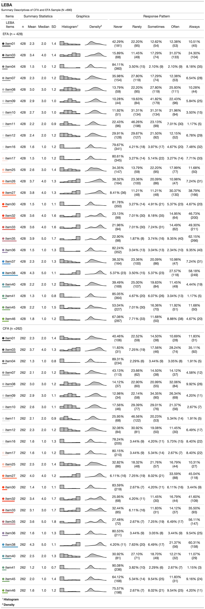

```{r setup, warning=FALSE, include=FALSE}
knitr::opts_chunk$set(echo = FALSE, warning = F, message = F, dpi=600)
options(knitr.duplicate.label = "allow")
set.seed(123)
par(family = "Arial")
```

```{r pacman, eval=FALSE, include=FALSE}
#You need to run this chunck 1X in your system 
#install.packages("pacman")
pacman::p_load(MOTE, tidyverse, psych, lavaan,kableExtra,gt,gtsummary, mirt,likert,kutils,semPlot,semTable,semTools,ggcorrplot,dlookr,qgraph,paran,EFA.MRFA,VIM,DiagrammeR,DiagrammeRsvg,ggplot2,cowplot,rsvg,questionr,magick, simsem,readxl)
pacman::p_install_gh("jthomasmock/gtExtras")
pacman::p_install_gh("crsh/papaja","crsh/citr", "masiraji/tabledown")
pacman::p_install_gh("masiraji/tabledown")

```

```{r library, include=FALSE}

library(papaja) # devtools::install_github("crsh/papaja")
library(lavaan)
library(semPlot) #devtools::install_github('SachaEpskamp/semPlot',  dependencies = T)
library(semTools)
library(MOTE)
library(car)#revercoding 
library(psych)
library(dlookr)
library(plyr)
library(tidyverse)
library(qgraph)
library(kableExtra)
library(paran) # Parallel analysis
library(EFA.MRFA) # Hull method
library(DiagrammeR) #devtools::install_github('rich-iannone/DiagrammeR')
library(DiagrammeRsvg) #For DiagrammeR
library(rsvg) #For DiagrammeR
library(ggcorrplot)
library(semTable)
library(magick)
library(mirt)
library(gtsummary)
library(gt)
library(gtExtras)
library(likert)
library(VIM) #Missing data
library(kutils)
library(simsem)
library(tabledown)
library(readxl)
r_refs("references.bib")
```

---
nocite: |
  `r cite_r("references.bib")`
  [@verriotto2017new][@eklund1996development][@bajaj2011validation][@dianat2013objective]
  [@horne1976self][@roenneberg2003life][@Olivier.2016][@buysse1989pittsburgh][@Xie.2021]
  [@Wu.2017]
---

# Introduction

-   Light exposure is important

-   Light exposure Behavior is important

-   Table: Overview Existing Related Scales: items in total / items on light exposure (behaviour)

-   Existing Scales: Review them in text

-   None of these do light exposure behavior.

```{r}
relevant.scale.data <- readxl::read_excel("Table_raw/relevant_scales.xlsx")
```

```{r results='asis'}
relevant.scale.data %>%
   kable( booktabs = T, caption ="Releated Scales", format ="latex", longtable =T) %>% 
  kable_styling(latex_options = c("repeat_header")) %>% 
  column_spec(1:4, width = "4cm")
```


# Methods

## Ethical approval

The cantonal ethics commission (Ethikkommission Nordwest- und Zentralschweiz, project ID Req-2021-00488) reviewed this project and issued an official clarification of responsibility (full document see Suppl. Fig X in appendix) stating: "The research project does not fall under the scope of the Human Research Act, because your project is using only anonymised data. An authorisation from the ethics committee is therefore not required and the EKNZ is not responsible for its review."

## Data Availability

## Survey characteristics

Data was collected in a quantitative cross-sectional approach via a fully anonymous online survey hosted on REDCap [@harris2009research; @harris2019redcap] by way of the University of Basel [sciCORE](https://redcap.scicore.unibas.ch). Participants were recruited via the [website](https://enlightenyourclock.org/participate-in-research) of a Comic co-released with the survey[@Weinzaepflen.2021] , social media (i.e., LinkedIn, Twitter, Facebook), mailing lists, word of mouth, the investigators' personal contacts, and supported by distribution of the survey link via f.lux software [@f.lux].

Completing the online survey took approx. 15 to 20 minutes and was not compensated. The first page of the survey comprised a participant information sheet, where participants' informed consent to participate was obtained before any of the questions were displayed. Underaged participants (<18 years) were urged to obtain assent from their parents/legal guardians, before filling in the survey. Information on the first page included the objectives of the study, inclusion criteria, estimated duration, the use, storage and sharing of the data, compensation (none), and information about the type of questions in the survey. Moreover, participants needed to confirm that they were participating the survey for the first time. To ensure high data quality, five attention check items were included in the survey (e.g., "We want to make sure you are paying attention. What is 4+5?"). The data analysed in this study was collected between 17.05.2021 and 03.09.2021. Questions incorporating retrospective recall were all aligned to the period of "past four weeks", matching the presented LEBA instrument.

In addition to the LEBA questionnaire, which is subject of the current study, the following variables and items were assessed but not included in the analysis:

-   Sleep disturbance and sleep-related impairment (adult and pediatric versions) [@Bevans.2019; @Buysse.2010; @Forrest.2018; @Harb.2015; @Yu.2011]
-   Sleep duration, timing, and latency, chronotype, social jetlag, time in bed, work/sleep schedule and outdoor light exposure duration (version for adults and adolescents) [@roenneberg2003life]
-   Sleep environment [@Olivier.2016]
-   Meal timing & caffeine consumption [custom items]
-   Light sensitivity (photophobia vs. photophilia) [@Wu.2017]
-   Self-reported pubertal stage (only if younger than 18 years old) [@Petersen.1988]

Furthermore, the following 1-item demographic variables were assessed:

-   Age
-   Sex
-   Gender identity
-   Occupational Status
-   COVID-19 related Occupational setting during the past four weeks
-   Time zone & country of residence
-   English as native language

## Participants

```{r Data, include=FALSE}
data <- readRDS("leba_2021-09-08.rds")

# Separating EFA and CFA samples with descriptive column
descriptives.data <- data

## Merge "0"s and "1"s into "1"s select,subset assign)
descriptives.data[ , 9:56 ][ descriptives.data[ , 9:56 ] == 0 ] <- 1
#EFA.descriptives <- descriptives.data[1:428,]
EFA.descriptives <- subset(descriptives.data, IncludedInEFA == "TRUE")
#CFA.descriptives <- descriptives.data[429:690, ]
CFA.descriptives<- subset(descriptives.data, IncludedInEFA == "FALSE")

#Separating the EFA and CFA(only items)
sem.data <- data[, 9:56] #EFA & CFA data
sem.data[ sem.data == 0] <- 1 #Merged "0"s and "1"s into "1"s

## renaming the column-header
prefix <- "item"
sufix <- c(1:48)
colnam <- paste(prefix,sufix, sep = "" )
colnames(sem.data) <- colnam
```

```{r prepareDescTable, include=FALSE}

listdescVars <- colnames(descriptives.data[c(1:3,5:7)])


#seperating naming and  reducing data for descriptive Table 
desctable.data <- dplyr::select(descriptives.data, c(listdescVars,
                          IncludedInCFA))

#renaming TRUE and FALSE from the IncludedInCFA to EFA and CFA for Descriptive Table
desctable.data$IncludedInCFA[desctable.data$IncludedInCFA == T ] <-
 "2. CFA Sample"
desctable.data$IncludedInCFA[desctable.data$IncludedInCFA == F ] <- 
 "1. EFA Sample"

# recode the Gender factor so it will only show "Gender Diverse" in the summary table
desctable.data$slypos_demographics_gender.factor <-
  recode_factor(desctable.data$slypos_demographics_gender.factor, "No" = "Yes",
         "Yes"= "No")
       
# create descriptive table for the demographic vars (excluding tz & Country) with gtsummary
desctable.data %>%
  tbl_summary(
    by = IncludedInCFA,
    statistic = list(all_continuous() ~ "{mean} ({sd})",
                     all_categorical() ~ "{n} ({p}%)"),
    digits = all_continuous() ~ 2,
    label = list(slypos_demographics_age ~ "Age",
                 slypos_demographics_sex.factor ~ "Sex",
                 slypos_demographics_gender.factor ~ "Gender-Variant Identity",
                 slypos_demographics_language.factor ~ "Native English Speaker",
                 slypos_demographics_work_or_school.factor ~ "Occupational Status",
                 slypos_demographics_school.factor ~ "Occupational setting"
                 ),
    missing = "no"
    ) %>% add_overall() %>% bold_labels() %>% add_p() %>% add_q() %>%
modify_header(label ~ "**Variable**") %>% modify_caption("Demographics") -> desc_table 

as_tibble(desc_table) -> desc_tibble 
as_kable_extra(desc_table, format = "latex",booktabs = T) -> desc_kable #save it as a knitr::kable

#summarise country/time zone data

descriptives.data%>%
  tbl_summary(
    label = slypos_demographics_tz.factor ~ "Time zone - Country",
    statistic = list(all_categorical() ~ "{n} ({p}%)"),
    missing = "no",
    sort = all_categorical() ~ "frequency",
    include = "slypos_demographics_tz.factor"
  )  %>% bold_labels() %>% 
  modify_header(label ~ "") %>%
  as_tibble(format = 'pipe') -> tz_tibble

```

```{r DescTabPrint, results='asis'}

desc_kable %>% kable_styling(latex_options = c("scale_down")) 
          

```

Table 1 summarizes the survey participants' demographic characteristics. Only participants completing the full LEBA questionnaire were included, thus there are no missing values in the item analyses. XX participants were excluded from analysis due to not passing at least one of the "attention check" items. For exploring initial factor structure (EFA) , a sample of 250-300 is recommended [@comreyFirstCourseFactor1992; @schonbrodtWhatSampleSize2013]. For estimating the sample size for the confirmatory factor analysis (CFA) we followed the N:q rule [@bentlerPracticalIssuesStructural1987; @jacksonRevisitingSampleSize2003; @klinePrinciplesPracticeStructural2015; @worthingtonScaleDevelopmentResearch2006], where ten participants per parameter is required to earn trustworthiness of the result. Our sample size exceeds these requirements: Anonymous responses from a total of *n* = `r nrow(desctable.data)` participants were included in the analysis of the current study, split into samples for exploratory (EFA: *n* = `r nrow(desctable.data[desctable.data$IncludedInCFA == "1. EFA Sample",])`) and confirmatory factor analysis (CFA: *n* = `r nrow(desctable.data[desctable.data$IncludedInCFA == "2. CFA Sample",])`). The EFA sample included participants filling out the questionnaire from 17.05.2021 to XX.XX.XXXX , whereas participants who filled out the questionnaire from YY.YY.YYYY to 03.09.2021 were included in the CFA analysis. Participants indicated filling out the online survey from a diverse range of geographic locations. The ten most common geographic locations included:

- `r tz_tibble[2,1]`:     `r tz_tibble[2,2]` 
- `r tz_tibble[3,1]`:     `r tz_tibble[3,2]`
- `r tz_tibble[4,1]`:     `r tz_tibble[4,2]`
- `r tz_tibble[5,1]`:     `r tz_tibble[5,2]`
- `r tz_tibble[6,1]`:     `r tz_tibble[6,2]`
- `r tz_tibble[7,1]`:     `r tz_tibble[7,2]`
- `r tz_tibble[8,1]`:     `r tz_tibble[8,2]`
- `r tz_tibble[9,1]`:     `r tz_tibble[9,2]`
- `r tz_tibble[10,1]`:    `r tz_tibble[10,2]`
- `r tz_tibble[11,1]`:    `r tz_tibble[11,2]`

For a full list of geographic locations, see Suppl. Table X in the appendix.

Age among all participants ranged from `r min(desctable.data$slypos_demographics_age)` years to `r max(desctable.data$slypos_demographics_age)` years [EFA: *min* = `r min(desctable.data$slypos_demographics_age[desctable.data$IncludedInCFA == "1. EFA Sample"])`, *max* = `r max(desctable.data$slypos_demographics_age[desctable.data$IncludedInCFA == "1. EFA Sample"])`; CFA: *min* = `r min(desctable.data$slypos_demographics_age[desctable.data$IncludedInCFA == "2. CFA Sample"])`, *max* = `r max(desctable.data$slypos_demographics_age[desctable.data$IncludedInCFA == "2. CFA Sample"])`], with an overall mean of \~ `r round(mean(desctable.data$slypos_demographics_age), 0)` years of age [Overall: *M* = `r mean(desctable.data$slypos_demographics_age)`, *SD* = `r sd(desctable.data$slypos_demographics_age)`; EFA: *M* = `r mean(desctable.data$slypos_demographics_age[desctable.data$IncludedInCFA == "1. EFA Sample"])`, *SD* = `r sd(desctable.data$slypos_demographics_age[desctable.data$IncludedInCFA == "1. EFA Sample"])`; CFA: *M* = `r mean(desctable.data$slypos_demographics_age[desctable.data$IncludedInCFA == "2. CFA Sample"])`, *SD* = `r sd(desctable.data$slypos_demographics_age[desctable.data$IncludedInCFA == "2. CFA Sample"])`]. In total `r desc_tibble[3,2]` of the participants indicated female sex [EFA: `r desc_tibble[3,3]`; CFA: `r desc_tibble[3,4]`], `r desc_tibble[4,2]` indicated male [EFA: `r desc_tibble[4,3]`; CFA: `r desc_tibble[4,4]`] and `r desc_tibble[5,2]` indicated other sex [EFA: `r desc_tibble[5,3]`, CFA: `r desc_tibble[5,4]`]. Overall, `r desc_tibble[6,2]` [EFA: `r desc_tibble[6,3]`; CFA: `r desc_tibble[6,4]`] participants indicated a gender-variant identity. In a "Yes/No" question regarding native language, `r desc_tibble[7,2]` of respondents [EFA: `r desc_tibble[7,3]`; CFA: `r desc_tibble[7,4]`] indicated to be native English speakers. For their "Occupational Status", more than half of the overall sample reported that they currently work [Overall: `r desc_tibble[9,2]`; EFA: `r desc_tibble[9,3]`; CFA: `r desc_tibble[9,4]`], whereas `r desc_tibble[10,2]` [EFA: `r desc_tibble[10,3]`; CFA: `r desc_tibble[10,4]`] reported that they go to school and `r desc_tibble[11,2]` [EFA: `r desc_tibble[11,3]`; CFA: `r desc_tibble[11,4]`] responded that they do "Neither". With respect to the COVID-19 pandemic we asked participants to indicate their occupational setting during the last four weeks: In the overall sample `r desc_tibble[13,2]` [EFA: `r desc_tibble[13,3]`; CFA: `r desc_tibble[13,4]`] of the participants indicated that they were in a home office/ home schooling setting, while `r desc_tibble[14,2]` overall [EFA: `r desc_tibble[14,3]` ; CFA: `r desc_tibble[14,4]`] reported face-to-face work/schooling. Lastly, `r desc_tibble[15,2]` overall [EFA: `r desc_tibble[15,3]` ; CFA: `r desc_tibble[15,4]`] reported a combination of home- and face-to-face work/schooling, whereas `r desc_tibble[16,2]` overall [EFA: `r desc_tibble[16,3]`; CFA: `r desc_tibble[16,4]`] filled in the "Neither (no work or school, or on vacation)" response option. We tested all demographic variables in Table 1 for significant group differences between the EFA and CFA sample, applying Wilcoxon rank sum test for the continuous variable "Age" and Pearson's $\chi^2$ test for all other categorical variables via the gtsummary R package's "add_p" function [@sjoberg2021] . The p-values were corrected for multiple testing applying false discovery rate (FDR) via the "add_q" function of the same package. After p-value (FDR) correction for multiple testing, none of the demographic variables were significantly different between the EFA sample and the CFA sample (all q-values *q* ≥ `r min(desc_tibble$"**q-value**", na.rm=T)` , indicating equivalence).

1.  Describe EFA and CFA sample separately.
2.  Sampling technique: Convince sampling (non-probability sample)
3.  Method: cross-sectional survey
4.  How many missing data?
5.  How incomplete data were addressed.
6.  Why such sample was chosen?

## Procedure

### Development of the Scale

1.  How the items were generated
2.  How the literature was reviewed to identify construct adequacy of the items.
3.  Discuss the expert panel review process to assess content validity

```{r Manuflowchart, include=FALSE }
Flowchart1 <- grViz("digraph nicegraph{
         
                    graph [fontname = Helvetica,layout = dot,fontsize = 20, ]
                     
                     node[fontname = Helvetica, shape = rectangle, margin = 0.2, width = 6.5, height = 1, 
                    fixedsize = true,fontsize = 20]  
                     
                    A[label = '48 items were generataed by a robust expert panel'] 
                    B[label = 'Exploratory Factor Analysis on 48 Items (N = 428)']
                    
                    node[fontname = Helvetica, shape = rectangle, margin = 0.2, width = 7.5, height = 2, 
                    fixedsize = true, fontsize = 20]
                    C[label = 
                    <
                    Factor Identification<br align = 'left'/>
                    Scree Plot: 6 Factors<br align = 'left'/>
                    Parallel Analysis: 6 Factors<br align = 'left'/>
                    Minimum Average Partial Method: 5 Factors<br align = 'left'/>
                    Hull Method: 5 Factors<br align = 'left'/>
                    >
                    ]
                    
                     subgraph cluster_1 {
                      graph[fontname = Helvetica, shape = rectangle]
                      style = rounded
                     node[fontname = Helvetica, margin = 0.2,width = 9, height = 1, 
                    fixedsize = true, fontsize = 18 ]
                    
                     1[label = '5 Factor Solution Retained 25 Items']
                     2[label = 'Reliability Analysis on EFA Sample (N=428)
                    Alpha F1 =.86; F2 = .71; F3 = .68; F4 =.62; F5 =.52']
                    
                     3[label = 'Confirmatory Factor Analysis 
                     on the Five Factor Model (25 Items; N=262)
                      Acceptable Fit ( CFI = .94; TLI .93; RMSEA = .06, SRMR = .11)']
                    
                    4[label = 'Confirmatory Factor Analysis 
                     on the Five Factor Model (23 Items; N=262)
                      Acceptable Fit ( CFI = .97; TLI .96; RMSEA = .04, SRMR = .09)']
                     5[label = 'Reliability Analysis on CFA (23 Items; N=262) 
                      Alpha F1=.93; F2=.80; F3 =.62; F4=.72; F5=.45']
                    8[label = 'LEBA Short Form (17 Items; N=690) 
                      Based on Item Response Theory']
                    }
                subgraph cluster_2 {
                      graph[fontname = Helvetica,shape = rectangle]
                      style = rounded
                     node[fontname = Helvetica, margin = 0.2,width = 8, height = 1, 
                fixedsize = true, fontsize = 18 ]
                    6[label = '6-Factor solution: one factor emerged with only two salient loadings']
                    7[label = 'Rejected']
                    }     
                     
                    
                     edge[fontname = Helvetica,color = black,arrowhead = vee, arrowsize = 1.25]
                     A ->B
                     B ->C
                     C ->1
                     1 ->2
                     2 ->3
                     3 ->4
                     4 ->5
                    5->8
                     C ->6
                     6 ->7
                     
                     
}")


export_svg(Flowchart1) %>%
  charToRaw() %>%
  rsvg() %>%
  png::writePNG("Manuscript.figures/Flowchart1.png")

```

```{r FlowchartFig, echo=FALSE, fig.align='center', fig.cap='Development of long and short form of LEBA', out.height='150%', out.width='100%'}
knitr::include_graphics('Manuscript.figures/Flowchart1.png')
```

### Data Collection

Timeline of data collection, mode of data collection.

## Analytic Strategies

For our analysis we used R (version 4.1.0), with several R packages. Initially, our tool had six point Likert type response scale (0:Does not apply/I don't know; 1:Never, 2:Rarely; 3:Sometimes; 4:Often; 5: Always). Our purpose was to capture light exposure related behavior and these two response options: "Does not apply/I don't know" and "Never" were providing similar information. As such we decided to collapse them into one making it a 5 point Likert type response scale. Necessary assumptions of EFA, including sample adequacy, normality assumptions, quality of correlation matrix, were assessed. Our data violated both the univariate and multivariate normality assumptions. Due to these violations and the ordinal nature of our response data, we used  polychoric correlation matrix [@desjardinsHandbookEducationalMeasurement2018] for the EFA. We employed principal axis (PA) as  factor extraction method with varimax rotation. PA is robust to the normality assumption violations [@watkinsStepbyStepGuideExploratory2020]. The obtained latent structure was confirmed by another factor extraction method: "the minimum residuals extraction" as well. We used a combination of factor identification method including scree plot [@cattellScreeTestNumber1966], Horn's parallel analysis [@hornRationaleTestNumber1965], minimum average partials method [@velicerDeterminingNumberComponents1976], and hull method [@lorenzo-sevaHullMethodSelecting2011] to identify factor numbers. Additionally, to determine the simple structure, we followed the following guidelines recommended by psychometricians (i) no factors with fewer than three items (ii) no factors with a factor loading <0.3 (iii) no items with cross-loading greater than .3 across factors [@bandalosFactorAnalysisExploratory2018]. 
We also conducted psychometric analysis on non-merged response options data (supplementary analysis) and rejected the latent structure obtained as the factors were less interpretable.

# Results

```{r ggplot2, include=F}
apatheme=theme_bw()+
  theme(panel.grid.major = element_blank(),
        panel.grid.minor = element_blank(),
        panel.background = element_blank(),
        #text=element_text(family = "Helvetica",),
        legend.title=element_blank(),
        axis.line.x = element_line(color='black'),
        axis.line.y = element_line(color='black'),
        panel.border = element_rect(color = "black",
                                    fill = NA,
                                    size = 1))
```

```{r EFAdata, include=FALSE}
### EFA data
EFA.data <- sem.data[1:428, ]
#library(VIM)
missing <- VIM::aggr(EFA.data, plot =T)

```

```{r EFAassumptions, include=FALSE}

#KMO test
KMO <- psych::KMO(EFA.data) 

# Test of correlation matrix
bartlet <- psych::cortest.bartlett(EFA.data, n =428)


#Histogram
#psych::multi.hist(EFA.data[,sapply(EFA.data, is.numeric)])

# Univariate normality

#creating normality function
shapiro_test_df <- function(df, bonf= TRUE, alpha= 0.05) {
  l <- lapply(df, shapiro.test)
  s <- do.call("c", lapply(l, "[[", 1))
  p <- do.call("c", lapply(l, "[[", 2))
  if (bonf == TRUE) {
    sig <- ifelse(p > alpha / length(l), "H0", "*")
  } else {
    sig <- ifelse(p > alpha, "H0", "*")
  }
  return(list(statistic= s,
              p.value= p,
              significance= sig,
              method= ifelse(bonf == TRUE, "Shapiro-Wilks test with Bonferroni Correction",
                             "Shapiro-Wilks test without Bonferroni Correction")))
}


Shapiro.efa <- shapiro_test_df(EFA.data)


efa.normality.tab = matrix(nrow = 48, ncol = 2)
rownameprefix <- "Item"
rownamesufix <- seq(1:48)
my.item.names <- paste(rownameprefix,rownamesufix, sep = "" )
rownames(efa.normality.tab) <- my.item.names
colnames(efa.normality.tab) <- c("statistic", "p")

efa.normality.tab[,1] <- apa(Shapiro.efa$statistic,2,T)
efa.normality.tab[,2] <- apa(Shapiro.efa$p.value,2,T)

efa.normalityprefix <- efa.normality.tab[,1]
efa.normalitysufix <- Shapiro.efa$significance
efa.normality.stat <- paste(efa.normalityprefix,efa.normalitysufix, sep = "" )

# Multivariate Normality
mardia <- psych::mardia(EFA.data, na.rm = T, plot =F)

# Descriptive Stats
Descriptives <- psych::describe(EFA.data)
alpha <- psych::alpha(EFA.data,check.keys=TRUE)
Item.total <- alpha$item.stats

Des.combined <- cbind(apa(Descriptives$mean,2,T), apa(Descriptives$sd,2,T), apa(Descriptives$skew,2,T),apa(Descriptives$kurtosis,2,T), efa.normality.stat,  apa(Item.total$r.cor,2,T))

colnames(Des.combined) = c("Mean", "SD", "Skew", "Kurtosis", "Shapiro-Wilk Statistics","Item-Total Correlation")
rownameprefix <- "Item"
rownamesufix <- seq(1:48)
my.names <- paste(rownameprefix,rownamesufix, sep = "" )
rownames(Des.combined) = (my.names)
```

## Item Analysis
```{r ItemAnalysis, include=FALSE}
# Item analysis
Item_analysis <- psych::alpha(EFA.data,check.keys=TRUE)
Item_analysis$item.stats$r.cor
low.r.corec <- (min(Item_analysis$item.stats$r.cor))  #minimum item total correlation
high.r.corec <- (max(Item_analysis$item.stats$r.cor))     # maximum item total correlation
```

Table \@ref(tab:tabDes) summarizes the univariate descriptive statistics for the 48 items. Some of the items were skewed with high Kurtosis values. Our data violated both univariate normality (Shapiro-Wilk statistics; [@shapiroAnalysisVarianceTest1965]) and multivariate normality assumptions [Marida's test;[@mardiaMeasuresMultivariateSkewness1970]]. Multivariate skew was = `r printnum(mardia$b1p)` (p <0.001) and multivariate kurtosis was = `r printnum(mardia$b2p)` (p <0.001). Due to these violations and ordinal nature of the response data polychoric correlations over Pearson's correlations was chosen [@desjardinsHandbookEducationalMeasurement2018]. The corrected item-total correlation ranges between `r apa(low.r.corec,2,F)` -`r apa(high.r.corec,2,F)`. No item was discarded based on descriptive statistics or item analysis.

## Exploratory Factor Analysis

```{r CorrMatrix, include=FALSE}
#Polychoric Correlation matrix

correlations <- psych::polychoric(EFA.data, correct = 0)
upper <- correlations$rho[upper.tri(correlations$rho, diag = F)]

min.cor <- abs(min(upper)) #minimum cor.coefficient of the matrix
max.cor <- abs(max(upper)) # max. correlation coefficient of the matrix

determinets <- det(correlations$rho) 
# Calculating the percentage of correlations higher than .30

BigR = sum(correlations$rho >= abs(.30) & correlations$rho < abs(1.0), na.rm =T)/2 
totR = length(EFA.data)*(length(EFA.data)-1)/2
cor.per <- print (BigR/totR)*100
```

Sampling adequacy was checked using Kaiser-Meyer-Olkin (KMO) measures of sampling adequacy [@kaiserIndexFactorialSimplicity1974] . The overall KMO vale for 48 items was `r printnum(KMO$MSA)` which was above the cutoff value (.50) indicating a mediocre sample [@hutchesonMultivariateSocialScientist1999].  Bartlett's test of sphericity [@bartlettNoteMultiplyingFactors1954], $\chi^2$ (`r bartlet$df`) = `r apa(bartlet$chisq, 2, T)`, p < .001] indicated the correlations between items are adequate for the EFA. However only `r apa(cor.per, 2,T)`% of the inter-item correlation coefficients were greater than .30. The inter item correlation ranged between `r apa(min.cor,2,F)` to `r apa(max.cor,2,F)`. And the corrected item-total correlations ranged between `r apa(low.r.corec,2,F)` to `r apa(high.r.corec,2,F)`.
```{r tabDes,results='asis'}
apa_table(Des.combined, caption = "Descriptive Statistics", align = "c", note = "*p<.001", longtable =T)
```

```{r figCor, out.height="150%",out.width="100%",fig.cap= "Correlation plot of the items",results='asis', fig.align='center'}

ggcorrplot(correlations$rho, hc.order = TRUE, outline.col = "white", type = "lower", 
           ggtheme = ggplot2::theme_minimal, tl.cex = 6,tl.srt = 90 )
#p.mat <- cor_to_p(correlations$rho, 428, method = "polychoric")
#to show pvalue in the fig add p.mat=p.mat
```

```{r ParallelEFA, include=FALSE}

# Parallel analysis
Horn <- paran(correlations$rho, iterations=500, centile=0, quietly=FALSE,
           status=TRUE, all=FALSE, cfa=FALSE, graph=TRUE,
           color=TRUE, col=c("black","red","blue"),
           lty=c(1,2,3), lwd=1, legend=TRUE, 
           width=640, height=640, grdevice=png, seed=0, mat=NA, n=NA)


Adjusted.EV <- data.frame(Horn$AdjEv)
Adjusted.EV$type = c('Adjusted Ev')
Adjusted.EV$num = c(row.names(Adjusted.EV))
Adjusted.EV$num = as.numeric(Adjusted.EV$num)
colnames(Adjusted.EV) = c('eigenvalue', 'type', 'num')


Random.EV <- data.frame(Horn$RndEv)
Random.EV$type = c('Random EV')
Random.EV$num = c(row.names(Random.EV))
Random.EV$num = as.numeric(Random.EV$num)
colnames(Random.EV) = c('eigenvalue', 'type', 'num')


Unadjusted.EV <- data.frame(Horn$Ev)
Unadjusted.EV$type = c('Unadjusted EV')
Unadjusted.EV$num = c(row.names(Unadjusted.EV))
Unadjusted.EV$num = as.numeric(Unadjusted.EV$num)
colnames(Unadjusted.EV) = c('eigenvalue', 'type', 'num')


parallel = ggplot(Adjusted.EV, aes(x=num, y=eigenvalue, shape=type, color=type)) +
  #Add lines connecting data points
  geom_line()+
    geom_line(data = Random.EV) +
  geom_line(data = Unadjusted.EV)+
    #Add the data points.
  geom_point(size=1)+
  geom_point(data = Random.EV, size=1)+
  geom_point(data = Unadjusted.EV, size=1)+
  scale_y_continuous(name="Eigen Value", limits=c(0, 10), breaks=seq(0,10,2)) +
   #Label the x-axis 'Factor Number', and ensure that it ranges from 1-max # of factors, increasing by one with each 'tick' mark.
  scale_x_continuous(name='Factor Number', limits=c(0, 48),breaks=seq(0,48,4))+
    #Add vertical line indicating parallel analysis suggested max # of factors to retain
  geom_hline(yintercept=1, linetype = 'dashed') + apatheme 

```

```{r ScreePlot, include=FALSE}
Scree <- scree(correlations$rho,factors=TRUE,pc=TRUE,main="(B)",
      hline=NULL,add=F)


FA.Scree <- data.frame(Scree$fv)
FA.Scree$type = c('Factor Analysis')
FA.Scree$num = c(row.names(FA.Scree))
FA.Scree$num = as.numeric(FA.Scree$num)
colnames(FA.Scree) = c('eigenvalue', 'type', 'num')

PA.Scree <- data.frame(Scree$pcv)
PA.Scree$type = c('Principal Component Analysis')
PA.Scree$num = c(row.names(PA.Scree))
PA.Scree$num = as.numeric(PA.Scree$num)
colnames(PA.Scree) = c('eigenvalue', 'type', 'num')


scree.plot <-ggplot(FA.Scree, aes(x=num, y=eigenvalue,color=type, shape=type))+
   geom_line()+
  geom_line(data = PA.Scree)+ 
  geom_point(size=1)+
  geom_point(data = PA.Scree, size=1)+
  scale_y_continuous(name="Eigen Value", limits=c(0, 10), breaks=seq(0,10,2)) +
  scale_x_continuous(name='Factor Number', limits=c(0, 48),breaks=seq(0,48,4))+
  geom_hline(yintercept=1, linetype = 'dashed') + apatheme 
```

```{r HullEFA, include=FALSE}
# HULL
hullEFA(EFA.data,extr = "ULS", index_hull = "CAF", display = TRUE, graph = T,
        details = TRUE)
hull <- ggplot2::last_plot()
Hull <- hull+ ggtitle(NULL) +xlab("Factor Number")+ylab("CAF")+ 
  apatheme +scale_color_manual(labels = c("Out side the convex Hull", "On the convex Hull"), values = c("red", "cyan2")) 
```

```{r MAPefa, include=FALSE}
#MAP
psych::VSS(EFA.data, rotate = "varimax", fm = 'minres', n.obs =428 )
```

Scree plot ( Figure \@ref(fig:facIdFig)) suggested a six-factor solution. Horn's parallel analysis [@hornRationaleTestNumber1965] with 500 iterations also indicated a six-factor solution. However, the minimum average partial (MAP) method [@velicerDeterminingNumberComponents1976] and Hull method [@lorenzo-sevaHullMethodSelecting2011] suggested a five-factor solution. As a result, we tested both five-factor and six-factor solutions.

```{r facIdFig, out.height="250%", out.width="100%",fig.align='center', fig.cap='Factor Identification (A) Parallel analysis (B) Scree Plot (C) Hull Method',  warning=FALSE, results= 'asis'}
cowplot::plot_grid(parallel, scree.plot,Hull, labels = "AUTO",ncol=1, label_size = 8,align = "v")

```

```{r EFA, include=FALSE}
fa.5F.1 <- fa(r=correlations$rho, nfactors = 5, fm= "pa",rotate ="varimax",
              residuals = TRUE, SMC = TRUE, n.obs =428)
AA <- print(fa.5F.1, cut = .3, digits = 3, sort = TRUE)


reduced.model.5F.1 <- dplyr::select(EFA.data ,
                                    -c( item20, item19, item5, item31, item44, item24, item43, item39, item22, item2, item18, item48, item42, item29, item6, item15, item23, item28, item14))

correlations.red.5F.1 <- polychoric(reduced.model.5F.1,correct = 0)

fa.5F.2 <- fa(r=correlations.red.5F.1$rho, nfactors = 5, fm= "pa",rotate ="varimax",
              residuals = TRUE, SMC = TRUE, n.obs =428)

BB <- print(fa.5F.2, cut = .3, digits = 3, sort = TRUE)

reduced.model.5F.2 <- dplyr::select(EFA.data, -c( item20, item19, item5, item31, item44, item24, item43, item39, item22, item2, item18, item48, item42, item29, item6, item15, item23, item28, item14, item34, item47, item21, item13))

correlations.red.5F.2 <- polychoric(reduced.model.5F.2,correct = 0)


fa.5F.3 <- fa(r=correlations.red.5F.2$rho, nfactors = 5, fm= "pa",rotate ="varimax",
              residuals = TRUE, SMC = TRUE, n.obs =428,max.iter = 500 )

CC <- print(fa.5F.3, cut = .3, digits = 3, sort = TRUE)

var1 <- CC$Vaccounted[2,1]*100
var2 <- CC$Vaccounted[2,2]*100
var3 <- CC$Vaccounted[2,3]*100
var4 <- CC$Vaccounted[2,4]*100
var5 <- CC$Vaccounted[2,5]*100
```

```{r EFAplotcode, include=FALSE}

EFAplot <- grViz("
digraph boxes_and_circles {

graph [layout = dot,rankdir = LR, fontsize = 40]

# node definitions with substituted label text
node [fontname = Helvetica, shape = circle,  margin = 0.5, width = 3.5, height = .5,
fixedsize = true, fontsize = 35]
F5 [label = 'F5']
F4 [label = 'F4']
F3 [label = 'F3']
F2 [label = 'F2']
F1 [label = 'F1']

node [fontname = Helvetica, shape = box]
b [label = 'item16']
c [label = 'item36']
d [label = 'item17']
e [label = 'item11']
f [label = 'item10']
g [label = 'item12']
h [label = 'item7']
i [label = 'item8']
j [label = 'item9']
k [label = 'item27']
l [label = 'item3']
m [label = 'item40']
n [label = 'item30']
o [label = 'item41']
p [label = 'item33']
q [label = 'item32']
r [label = 'item35']
s [label = 'item37']
t [label = 'item38']
u [label = 'item46']
v [label = 'item45']
w [label = 'item25']
x [label = 'item4']
y [label = 'item1']
z [label = 'item26']

{rank = same; F1 F2 F3 F4 F5}
# edge definitions with the node IDs
edge [fontname = Helvetica, fontsize = 35]
F5 -> u [label = '0.60']
F5 -> v [label = '0.59']
F5 -> w [label = '0.41']
F5 -> x [label = '0.41']
F5 -> y [label = '0.40']
F5 -> z [label = '0.35']
F4 -> p [label = '0.74']
F4 -> q [label = '0.73']
F4 -> r [label = '0.66']
F4 -> s [label = '-0.39', color =red]
F4 -> t [label = '0.39']
F3 -> k [label = '0.80']
F3 -> l [label = '0.80']
F3 -> m [label = '0.65']
F3 -> n [label = '0.49']
F3 -> o [label = '36']
F2 -> e [label = '0.79']
F2 -> f[label = '0.76']
F2 -> g [label = '0.65']
F2 -> h[ label = '0.50']
F2 -> i [label = '-.49',color =red]
F2 -> j [label = '0.32']
F1 -> b[label = '0.99']
F1-> c [label = '0.93']
F1-> d [label = '0.80']
}
")


export_svg(EFAplot) %>%
  charToRaw() %>%
  rsvg() %>%
  png::writePNG("Manuscript.figures/EFAplot.png")

```

```{r EFAplot, fig.align='center', fig.cap='Five Factor Solution', warning=FALSE, out.height="100%", out.width="200%", results='asis'}
knitr::include_graphics('Manuscript.figures/EFAplot.png')

```

```{r Cronbach alpha for 5 fators, message=TRUE, warning=FALSE, include=FALSE}

Five.F1 <- dplyr::select(EFA.data, item16, item36, item17)
Five.F2 <- dplyr::select(EFA.data, item11, item10, item12, item7, item8, item9) 
Five.F3 <-  dplyr::select(EFA.data, item27, item3,item40, item30, item41)
Five.F4 <-  dplyr::select(EFA.data, item33,item32,item35, item37, item38)
Five.F5 <- dplyr::select(EFA.data, item46, item45, item25, item4, item1, item26)

#ordinal alpha
Five.F1.alpha <- psych::alpha(polychoric(Five.F1)$rho,check.keys=TRUE)
Five.F2.alpha <- psych::alpha(polychoric(Five.F2)$rho,check.keys=TRUE)
Five.F3.alpha <- psych::alpha(polychoric(Five.F3)$rho,check.keys=TRUE)
Five.F4.alpha <- psych::alpha(polychoric(Five.F4)$rho,check.keys=TRUE)
Five.F5.alpha <- psych::alpha(polychoric(Five.F5)$rho,check.keys=TRUE)

F1.alpha <- Five.F1.alpha$total$raw_alpha
F2.alpha <- Five.F2.alpha$total$raw_alpha
F3.alpha <- Five.F3.alpha$total$raw_alpha
F4.alpha <- Five.F4.alpha$total$raw_alpha
F5.alpha <- Five.F5.alpha$total$raw_alpha
```

```{r tabledown, include=F}
efa.table <- tabledown::fac.tab(fa.5F.3,cut=.3, complexity = F)

#Communality
Fac.5 <- fa.5F.3
min.com <- min(Fac.5$communality)
max.com <- max(Fac.5$communality)

# loading
min.loadings <- min(Fac.5$loadings)
max.loadings <- max(Fac.5$loadings)

# Residuals
residual.5F =residuals(fa.5F.3, diag = FALSE, na.rm =T)
#Count of numbers of residuals>.05
BigRR= sum(residual.5F>abs(.05), na.rm =T)
print(BigRR)

#Total number of off diagonal elements in the data matrix
totRR = length(reduced.model.5F.2)*(length(reduced.model.5F.2)-1)/2

# Proportion of off-diagonal elements >.10
sumR <- sum(BigRR/totRR*100)


```

With the initial 48 items we conducted three rounds of EFA and gradually discarded problematic items. (cross-loading items and poor factor loading (<.30) items). Finally, a five-factor EFA solution with 25 items was accepted with low RMSR = 0.08 [@brownConfirmatoryFactorAnalysis2015], all factor-loading higher than .30 and no cross-loading greater than .30. We confirmed this five-factor latent structure using varimax rotation with a minimum residual extraction method (Table\@ref(tab:MinResTab)). Table\@ref(tab:EFATable) displays the factor-loading (structural coefficients) and communality of the items. The absolute value of the factor-loading ranged from `r apa(min.loadings,2,F)` to `r apa(max.loadings, 2, F)` indicating strong coefficients. The commonalities ranged between `r apa(min.com,2,F)` to `r apa(max.com, 2, F)`. However, the histogram of the absolute values of non-redundant residual-correlations Fig\@ref(fig:EFAResiduals) showed `r apa(sumR,0, T)`% correlations greater than the absolute value of .05, indicating a possible under-factoring. [@desjardinsHandbookEducationalMeasurement2018]. Subsequently, we fitted a six-factor solution. However, a factor emerged with only one salient variable loading in the six-factor solution, thus disqualifying the six-factor solution (Table\@ref(tab:sixFacTab)).
Internal consistency reliability coefficient Cronbach's alpha assumes all the factor-loadings of the items under a factor are equal [@graham2006congeneric; @novick1967coefficient] which is not the case in our sample. Additionally Cronbach's alpha coefficient has a tendency to deflate the estimates for  Likert type data as the calculation is based on pearson-correlation matrix which requires that response data should be in continuous of nature [@gadermann2012estimating; @zumbo2007ordinal]. Subsequently to get  better estimates of reliability we reported ordinal alpha which used polychoric-correlation matrix and assumed that the responses data were ordered in nature instead of continuous [@zumbo2007ordinal]. Ordinal alpha coefficient value ranges from 0 to 1 and higher value represents better reliability. In the five-factor solution, the first factor contained three items and explained `r apa(var1,2,F)`% of the total variance with a  internal reliability coefficient ordinal $\alpha$ = `r apa(F1.alpha,2,F)`. All the items in this factor stemmed from the individual's preference to use blue light filters in different light environments. The second factor contained six items and explained `r apa(var2,2,F)`% of the total variance with a  internal reliability coefficient ordinal $\alpha$ = `r apa(F2.alpha,2,F)`. Items under this factor commonly investigated an individual's hours spent outdoor. The third factor contained five items and explained `r apa(var3,2,F)`% of the total variance. Items under this factor dealt with the specific behaviors pertaining to using phone and smart-watch in bed. The internal consistency reliability coefficient was, ordinal $\alpha$ = `r apa(F3.alpha,2,F)`. The fourth factor contained five items and explained `r apa(var4,2,F)`% of the total variance with an internal consistency coefficient, ordinal $\alpha$ = `r apa(F4.alpha,2,F)`. These five items investigated the behaviors related to individual's light exposure before bedtime. Lastly, the fifth factor contained six items and explained `r apa(var5,2,F)`% of the total variance. This factor  captured individual's morning and daytime light exposure related behavior.  The  internal consistency reliability was, ordinal $\alpha$ = `r apa(F5.alpha,2,F)` . It is essential to attain a balance between psychometric properties and interpretability of the common themes when exploring the latent structure. As all of the emerged factors are highly interpretable and relevant towards our aim to capture light exposure related behavior, regardless of the apparent low reliability of the fifth factor, we retain all the five-factors with 23 items for our confirmatory factor analysis (CFA). Two items showed negative factor-loading (items 44 and 21). Upon inspection, it was understood that these items are negatively correlated to the common theme, and thus in the CFA analysis, we reversed the response code for these two items.

```{r EFATable, results='asis'}

apa_table(efa.table,align = "c", caption = "Factor loadings and communality of the retained items", note = "Only loading higher than .30 is reported", font_size = "small")
```

```{r EFAResiduals, out.height= "100%",  fig.align='center', fig.cap= ' Histogram of residuals:  five-factor solution',  out.width="100%",  warning=FALSE, results='asis'}
hist(residual.5F,  main = NULL, xlab = "Five-factor solution", ylim=c(0, 400))
abline(h =51, lwd = 2, lty = 2)
abline(v =.05,lwd = 2, lty = 2)

```

```{r gtvis, include =F}
## Recoding sem.data$item8
gt.data <- sem.data
gt.data$item8 <- as.character(gt.data$item8)
gt.data$item8 <- fct_recode(gt.data$item8,
  "5" = "1",
  "4" = "2",
  "2" = "4",
  "1" = "5"
)

## Recoding gt.data$item26
gt.data$item26 <- as.character(gt.data$item26)
gt.data$item26 <- fct_recode(gt.data$item26,
  "5" = "1",
  "4" = "2",
  "2" = "4",
  "1" = "5"
)
## Recoding gt.data$item37
gt.data$item37 <- as.character(gt.data$item26)
gt.data$item37 <- fct_recode(gt.data$item26,
  "5" = "1",
  "4" = "2",
  "2" = "4",
  "1" = "5"
)

names(gt.data)[names(gt.data) == "item1"] <- "item01"
names(gt.data)[names(gt.data) == "item3"] <- "item03"
names(gt.data)[names(gt.data) == "item4"] <- "item04"
names(gt.data)[names(gt.data) == "item7"] <- "item07"
names(gt.data)[names(gt.data) == "item8"] <- "item08"
names(gt.data)[names(gt.data) == "item9"] <- "item09"


#EFA data
gt.efa.data <- gt.data[1:428, ]

gt.efa.data.table <- gt.efa.data %>% 
  dplyr::select(item16, item36, item17,
                 item11, item10,item12,item07,item08,item09,
                 item27,  item03, item40,  item30, item41,
                 item33, item32,item35, item37,item38, 
                 item46, item45, item25, item04, item01,item26)

#Creating long data
gt.efa.long <- as.data.frame(gather(gt.efa.data.table, Items, value))
gt.efa.long$value <- as.numeric(as.character(gt.efa.long$value))

#Summarizing and creating gt object
gt.efa.tab <- gt.efa.long %>% 
  group_by(Items) %>% 
  # calculate summary stats & create data for the histogram and density plot
  dplyr::summarise(
    nr = n(),
    mean = mean(value, na.rm = TRUE),
    med = median(value, na.rm = TRUE),
    sd = sd(value, na.rm = TRUE),
    hist_data = list(value),
    dens_data = list(value),
    .groups = "drop"
  ) %>% 
  gt() 


#Preparation for likert data
efa.LEBA.likert <- as.data.frame(gt.efa.data.table) 

recod_LEBA <- c( "1" = "Never", "2" = "Rarely", "3"= "Sometimes","4" = "Often",
                 "5" = "Always")
efa.LEBA.likert <-  mutate(efa.LEBA.likert, across(starts_with("item"), ~unname(recod_LEBA[.])))

efa.LEBA.Factor = as.data.frame(lapply(efa.LEBA.likert,factor,
                                   ordered = T))
#get the items name
efa.items <- names(efa.LEBA.Factor) 
#Calculate percentage
efa.percentage <- kutils::likert(efa.LEBA.Factor, vlist = efa.items ) 

efa.percentage <- efa.percentage$table %>% 
  as.data.frame(.)

#data wrangling
labels <- c("Always", "Never","Often", "Rarely", "Sometimes","Total")
as.data.frame(labels)

full.efa.percentage <- cbind(labels,efa.percentage) #tables with labels  
full.efa.percentage<- t(full.efa.percentage ) #transpose
as.data.frame(full.efa.percentage)
full.efa.percentage1 <- full.efa.percentage[-1,-6] #removing 1st row and total column
full.efa.percentage2 <- full.efa.percentage1[, c(2, 4, 5, 3,1)]# rearranging
as.data.frame(full.efa.percentage2)


colnames(full.efa.percentage2) <- c("Never","Rarely","Sometimes","Often","Always")

efa.Items <- rownames(full.efa.percentage2)
as.data.frame(efa.Items)
full.efa.percentage3 <- cbind(efa.Items,full.efa.percentage2)

full.efa.percentage3 <- full.efa.percentage3[order(efa.Items),] 
full.efa.percentage3 <- as.data.frame(full.efa.percentage3[,-1]) %>% 
  gt()


gt.efa.table <- gt.efa.tab$'_data'
gt.liket.efa <- full.efa.percentage3$"_data"


efaTable <-  cbind( gt.efa.table, gt.liket.efa)%>% 
  gt()

gt.cfa.data <- gt.data[429:690,]
gt.cfa.data.table <- gt.cfa.data %>% 
  dplyr::select(item16, item36, item17,
                 item11, item10,item12,item07,item08,item09,
                 item27,  item03, item40,  item30, item41,
                 item32,item35,item38, item33, 
                 item46, item45, item25, item04, item01 )

gt.cfa.long <- gather(gt.cfa.data.table, Items, value)
gt.cfa.long$value <- as.numeric(as.character(gt.cfa.long$value))
gt.cfa.tab <- gt.cfa.long %>% 
  group_by(Items) %>% 
# calculate summary stats & create data for the histogram and density plot
  dplyr::summarise(
    nr = n(),
    mean = mean(value, na.rm = TRUE),
    med = median(value, na.rm = TRUE),
    sd = sd(value, na.rm = TRUE),
    hist_data = list(value),
    dens_data = list(value),
    .groups = "drop"
  ) %>% 
  
  gt()

#Preparation for likert data
cfa.LEBA.likert <- as.data.frame(gt.cfa.data.table) 

recod_LEBA <- c( "1" = "Never", "2" = "Rarely", "3"= "Sometimes","4" = "Often",
                 "5" = "Always")
cfa.LEBA.likert <-  mutate(cfa.LEBA.likert, across(starts_with("item"), ~unname(recod_LEBA[.])))

cfa.LEBA.Factor = as.data.frame(lapply(cfa.LEBA.likert,factor,
                                   ordered = T))
#get the items name
cfa.items <- names(cfa.LEBA.Factor) 
#Calculate percentage
cfa.percentage <- kutils::likert(cfa.LEBA.Factor, vlist = cfa.items ) 

cfa.percentage <- cfa.percentage$table %>% 
  as.data.frame(.)

#data wrangling
labels <- c("Always", "Never","Often", "Rarely", "Sometimes","Total")
as.data.frame(labels)

full.cfa.percentage <- cbind(labels,cfa.percentage) #tables with labels  
full.cfa.percentage <- t(full.cfa.percentage ) #transpose
as.data.frame(full.cfa.percentage)
full.cfa.percentage1 <- full.cfa.percentage[-1,-6] #removing 1st row and total column
full.cfa.percentage2 <- full.cfa.percentage1[, c(2, 4, 5, 3,1)]# rearranging
as.data.frame(full.cfa.percentage2)


colnames(full.cfa.percentage2) <- c("Never","Rarely","Sometimes","Often","Always")

cfa.Items <- rownames(full.cfa.percentage2)
as.data.frame(cfa.Items)
full.cfa.percentage3 <- cbind(cfa.Items,full.cfa.percentage2)

full.cfa.percentage3 <- full.cfa.percentage3[order(cfa.Items),] 
full.cfa.percentage3 <- as.data.frame(full.cfa.percentage3[,-1]) %>% 
  gt()


gt.cfa.table <- gt.cfa.tab$'_data'
gt.liket.cfa <- full.cfa.percentage3$"_data"


cfaTable <-  cbind( gt.cfa.table, gt.liket.cfa) %>% 
  gt() 

efa.gt <- efaTable$"_data"
cfa.gt <- cfaTable$"_data"


gt.fullTable <-  rbind( efa.gt, cfa.gt) %>% 
  gt() %>% 
# histogram and density plots
  gtExtras::gt_sparkline(
    hist_data,
    type = "histogram",
    line_color = "black", 
    fill_color = "grey",
    bw = 1,
    same_limit = TRUE)%>%
  gtExtras::gt_sparkline(
    dens_data,
    type = "density",
    line_color = "black", 
    fill_color = "grey",
    bw = 0.75,
    same_limit = TRUE
  )%>%
# format decimals
  fmt_number(columns = mean:sd, decimals = 1) %>%
# header
  tab_header(
    title = md("**LEBA**"),
    subtitle = md("Summary Descriptives of CFA and EFA Sample (N =690)")
  ) %>% 
  tab_footnote(
    footnote = md("**Histogram**"),
    locations = cells_column_labels(columns = hist_data)
  ) %>%
  tab_footnote(
    footnote = md("**Density**"),
    locations = cells_column_labels(columns = dens_data)
  ) %>% 
#create groups of columns
tab_spanner(
  label = "Items",
  columns = Items
) %>%
  tab_spanner(
    label = "Summary Statistics",
    columns = nr:sd
  ) %>%
  tab_spanner(
    label = "Graphics",
    columns = hist_data:dens_data
  ) %>% 
  tab_spanner(
    label = "Response Pattern",
    columns = Never:Always
  ) %>%
# change column names to appear in the table
cols_label(
  Items = ("LEBA  Items"),
  nr = ("n"),
  mean = ("Mean"),
  med = ("Median "),
  sd = (("SD")),
  hist_data = "Histogram",
  dens_data = "Density"
) %>%
# set alignment as per wish
  cols_align(
    align = "center",
    columns = everything()
  ) %>%
  opt_align_table_header(align = "left") %>%
# add coloured dots and lines on the first column
  gt_plt_dot(
    mean,
    Items,
    palette = "ggthemes::fivethirtyeight"
  ) %>% 
    tab_row_group(
      group = "CFA (n =262)",
     rows = 26:48
    
  ) %>% 
  tab_row_group(
  group = "EFA (n = 428)",
    rows = 1:25  
  ) %>% gtsave("Manuscript.figures/gt.png")


```

```{r gtPic, echo=FALSE, out.height="100%", out.width="200%", fig.cap= ' Summary Descriptives of CFA and EFA Sample'}


```

## Confirmatory Factor Analysis

```{r CFAdataframe, include=FALSE}

### CFA Data
CFA.data <- sem.data[429:690,]

## Recoding CFA.data$item8 into CFA.data$Ritem8
CFA.data$Ritem8 <- as.character(CFA.data$item8)
CFA.data$Ritem8 <- fct_recode(CFA.data$Ritem8,
  "5" = "1",
  "4" = "2",
  "2" = "4",
  "1" = "5"
)
CFA.data$Ritem8 <- as.numeric(as.character(CFA.data$Ritem8))

## Recoding CFA.data$item37 into CFA.data$item37_rec
CFA.data$Ritem37 <- as.character(CFA.data$item37)
CFA.data$Ritem37 <- fct_recode(CFA.data$Ritem37,
  "5" = "1",
  "4" = "2",
  "2" = "4",
  "1" = "5"
)
CFA.data$Ritem37 <- as.numeric(as.character(CFA.data$Ritem37))

## Recoding CFA.data$item26 into CFA.data$Ritem26
CFA.data$Ritem26 <- as.character(CFA.data$item26)
CFA.data$Ritem26 <- fct_recode(CFA.data$Ritem26,
  "5" = "1",
  "4" = "2",
  "2" = "4",
  "1" = "5"
)

#Hitogram
#psych::multi.hist(CFA.data[,sapply(CFA.data, is.numeric)])
```

```{r CFA25items, include=FALSE }

LB.model.Cor.1 <- "F1 =~ a1*item16 + item36 + a2*item17
                 F2 =~ item11 + item10 + item12+ item7+ Ritem8+ item9
                 F3 =~  item27+ item3+ item40 + item30 + item41
                 F4 =~ a3*item32 + item35 + item38+ a4*item33 
                 F5 =~ item46+ item45+ item25+ item4+ item1 
                       a1==a2
                       a3==a4" 


fit.Cor.1 <- cfa(LB.model.Cor.1, data = CFA.data, ordered = names(CFA.data),estimator = "WLSMV") 

## Summary of Model 
cfa.sum.1 <- summary(fit.Cor.1, fit.measures =TRUE,standardized = TRUE,rsq =TRUE)


## Selected Fit measures 
fit.1 <- fitmeasures (fit.Cor.1,c("gfi", "agfi", "nfi","rfi", 
                       "cfi.scaled","tli.scaled",
                       "rmsea.scaled", "rmsea.ci.lower.scaled", "rmsea.ci.upper.scaled","srmr"))


reliability1 <- semTools::reliability(fit.Cor.1)

```

```{r mod1, include=FALSE}
modfit.Cor.one <- modindices(fit.Cor.1, sort. = TRUE) 
modfit.Cor.one[modfit.Cor.one$mi>3.84,]
```

```{r CFA23withMI, include=FALSE}
LB.model.Cor.2 <- "F1 =~ a1*item16 + item36 + a2*item17
                 F2 =~ item11 + item10 + item12+ item7+ Ritem8+ item9
                 F3 =~  item27+ item3+ item40 + item30 + item41
                 F4 =~ a3*item32 + item35 + item38+ a4*item33 
                 F5 =~ item46+ item45+ item25+ item4+ item1 
                       a1==a2
                       a3==a4
                item30 ~~  item41
                       "  

#item26 & 37 are removed
                
## Fit the model 
fit.Cor.2 <- cfa(LB.model.Cor.2, data = CFA.data, ordered = names(CFA.data),estimator = "WLSMV") 

rel.k <- semTools::reliability(fit.Cor.2, return.total = T)
## Summary of Model 
cfa.sum.2 <- summary(fit.Cor.2, fit.measures =TRUE,standardized = TRUE, rsq =TRUE)


## Selected Fit measures 
fit.2 <- fitmeasures (fit.Cor.2,c("gfi", "agfi", "nfi","rfi", 
                       "cfi.scaled","tli.scaled",
                       "rmsea.scaled", "rmsea.ci.lower.scaled", "rmsea.ci.upper.scaled","srmr"))


```

```{r mod2, include=FALSE}
modfit.Cor.one <- modindices(fit.Cor.2, sort. = TRUE) 
modfit.Cor.one[modfit.Cor.one$mi>3.84,]
```
We conducted categorical confirmatory factor analysis with robust weighted least square (WLSMV) estimator since our response data was of ordinary nature [@desjardinsHandbookEducationalMeasurement2018]. Several indices are suggested to measure model fit which can be categorized as absolute, comparative and parsimony fit indices [@brownConfirmatoryFactorAnalysis2015]. Absolute fit assess the model fit at an absolute level using indices including $\chi^2$ test statistics and the standardized root mean square (SRMR). Parsimony fit indices including the root mean square error of approximation (RMSEA) considers the number of free parameters in the model to assess the parsimony of the model. Comparative fit indices evaluate the fit of the specified model solution in relation to a more restricted baseline model restricting all covariances among the idicators as zero. Comparative fit index (CFI) and the Tucker Lewis index (TLI) are such two comparative fit indices. Commonly used Model fit guidelines [@huCutoffCriteriaFit1999; @schumacker2004beginner] includes (i) Reporting of $\chi^2$ test statistics (A non-significant test statistics is required to reflect model fit) (ii) CFI and TLI (CFI/TLI close to .95 or above/ranging between 90-95 and above) (iii) RMSEA (close to .06 or below), (iv) SRMR (close to .08 or below) to estimate the model fit. Table \@ref(tab:tabCfa) summarizes the fit indices of our fitted model. Our fitted model failed to attain an absolute fit estimated by the $\chi^2$ test. However, the $\chi^2$ test is sensitive to sample size and not recommended to be used as the sole index of absolute model fit [@brownConfirmatoryFactorAnalysis2015]. Another absolute fit index we obtained in our analysis was SRMR which does not work well with categorical data [@RN1272]. We judged the model fit based on the comparative fit indices: CFI, TLI and parsimony fit index:RMSEA. Our fitted model attained acceptable fit (CFI =`r apa(fit.1[5],2,F)`; TLI = `r apa(fit.1[6],2,F)`); RMSEA = `r apa(fit.1[7],2,F)`,[`r apa(fit.1[8],2,F)`-`r apa(fit.1[9],2,F)`, 90% CI]) with two imposed equity constrain on item pairs 32-33 and 19-17 . However SRMR value was higher than the guideline (SRMR = `r apa(fit.1[10],2,F)`). Further by allowing one pair of items (30-41) to covary their error variance and discarding two item (item 37 & 26) for very low r-square value, our model attained best fit (CFI =`r apa(fit.2[5],2,F)`; TLI = `r apa(fit.2[6],2,F)`); RMSEA = `r apa(fit.2[7],2,F)`[`r apa(fit.2[8],2,F)`-`r apa(fit.2[9],2,F)`, 90% CI]) and SRMR value (SRMR = `r apa(fit.2[10],2,F)`) was also close to the suggestions of @huCutoffCriteriaFit1999. 
Internal consistency ordinal $\alpha$ for the five factors of LEBA were `r apa(rel.k[2,1],2,F)`, `r apa(rel.k[2,2],2,F)`, `r apa(rel.k[2,3],2,F)`, `r apa(rel.k[2,4],2,F)`, `r apa(rel.k[2,5],2,F)` respectively. We also estimated the internal consistency reliability of the total scale using Mcdonald's $\omega$ (total) coefficient which is a better reliability estimate for multidimensional constructs [@dunn2014alpha; @sijtsma2009use]. McDonald's omega(total) coefficient for the total scale was `r apa(rel.k[5,6],2,F)`.


```{r cfaMat, results='asis'}
CFa.matrix <- matrix("NA", nrow =2, ncol = 9)
colnames(CFa.matrix) = c("Model", "Chi-Squre", "df", "CFI", "TLI", "RMSEA", "RMSEA 90% Lower CI", "RMSEA 90% Upper CI", "SRMR")
CFa.matrix[1,] = c("Five factor model:25", 
                   apa(cfa.sum.1$FIT[6],2,T), 
                   apa(cfa.sum.1$FIT[7],2,T), 
                   apa(cfa.sum.1$FIT[19],2,F), 
                   apa(cfa.sum.1$FIT[20],2,T),
                   apa(cfa.sum.1$FIT[27],2,T),
                   apa(cfa.sum.1$FIT[28],2,T),
                   apa(cfa.sum.1$FIT[29],2,T),
                   apa(cfa.sum.1$FIT[35],2,T))


CFa.matrix[2,] = c("Five factor model:23", 
                   apa(cfa.sum.2$FIT[6],2,T), 
                   apa(cfa.sum.2$FIT[7],2,T), 
                   apa(cfa.sum.2$FIT[19],2,F), 
                   apa(cfa.sum.2$FIT[20],2,T),
                   apa(cfa.sum.2$FIT[27],2,T),
                   apa(cfa.sum.2$FIT[28],2,T),
                   apa(cfa.sum.2$FIT[29],2,T),
                   apa(cfa.sum.2$FIT[35],2,T))
```

```{r tabCfa, results='asis'}
apa_table(CFa.matrix, caption = "Fit indices of CFA", align = "c", landscape = T, note = "df: Degrees of Freedom; CFI: Comparative Fit Index; TLI: Tucker Lewis Index;RMSEA:Root Mean Square Error of Approximation; CI: Confidence Interval; SRMR: Standardized Root Mean Square ")
```

```{r simulation, eval=FALSE, include=FALSE}
library("simsem")
pop.model <- "F1 =~ a1*item16 + .95*item36 + a2*item17
                 F2 =~ .87*item11 + .85*item10 + .74*item12+ .60*item7+ .50*Ritem8+ .49*item9
                 F3 =~  .78*item27+ .77*item3+ .68*item40 + .13*item30 + .20*item41
                 F4 =~ a3*item32 + .63*item35 + .33*item38+ a4*item33 
                 F5 =~ .80*item46+ .53*item45+ .36*item25+ .30*item4+ .22*item1 
                       a1==a2
                       a3==a4
                item30 ~~ .82*item41
F1~~1*F1
F2~~1*F2
F3~~1*F3
F4~~1*F4
F5~~1*F5
"  

sam.model <- "F1 =~ a1*item16 + item36 + a2*item17
                 F2 =~ item11 + item10 + item12+ item7+ Ritem8+ item9
                 F3 =~  item27+ item3+ item40 + item30 + item41
                 F4 =~ a3*item32 + item35 + item38+ a4*item33 
                 F5 =~ item46+ item45+ item25+ item4+ item1 
                       a1==a2
                       a3==a4
                item30 ~~  item41
                       "  


sim.300 <- sim(200, model = sam.model, n =200, generate = pop.model, lavaanfun = "lavaan", auto.var =T, auto.fix.first =F, seed = 123)
summary(simulation)
summaryParam(simulation, detail =T, alpha = .05)

#power should be higher than .80, average CI width should be lower than .15
#Estimate standard error bias

SD.Bias <- (summaryParam(simulation)[3]-summaryParam(simulation)[2])/summaryParam(simulation)[3]
```

```{r figcfa, fig.cap = "Five Factor CFA Model of LEBA", out.height="150%", out.width="100%",  warning=FALSE}
#library(semPlot)

semPaths (fit.Cor.2 , 
          what= "std",
          #whatLabels = "std",
          intercepts = F,
          #style ="lisrel",
          #residScale = 6,
          theme = "colorblind",
          nCharNodes = 0,
          reorder =T,
          rotation =2,
          layout ="tree",
          cardinal = T,
          curvePivot =T,
          sizeMan =8,
          sizeMan2 = 1.5,
          sizeLat = 8,
          #edge.color = "black",
          thresholds = FALSE,
          equalizeManifests =T,
          fade = FALSE,
          edge.label.cex = .65,
          exoCov = FALSE)

           
```

## Measurement Invariance
Measurement invariance (MI) evaluates whether a construct has the psychometric equivalence and same meaning across groups or measurement occasions [@putnick2016measurement;@klinePrinciplesPracticeStructural2015]. We used  structural equation modeling framework to assess the measurement invariance of our developed tool across two groups: **native English speakers** and **non-native English speakers**. Our measurement invariance testing involved successively comparing the nested models:  configural, metric, scalar, and residual invariance models with each others [@widaman1997exploring]. Among these nested models  configural model is the first and least restrictive model. The configural model assumes that the number of factors and item number under each factor will be equal across two groups. The metric invariance model assumes configural invariance of the fitted model and requires the factor-loadings of the items across the two groups to be equal. Having the factor-loadings equal across groups indicates each item contributes to the measured construct equivalently. Scalar invariance assumes the metric invariance of the fitted model demands the item intercepts to be equivalent across groups. This equity of item intercepts indicates the equivalence of response scale across the groups, i.e., persons with the same level of the underlying construct will score the same across the groups. The residual invariance model assumes metric invariance for the fitted model and adds the assumption of equality in error variances and covariances across the groups. This model is the highest level of MI and assures the equivalence of precision of items across the groups in measuring the underlying constructs. 
The invariance model fit of our scale was assessed using the fit indices including $\chi^2$ test, CFI and TLI (close to .95 or above), RMSEA (close to .06 or below) [@huCutoffCriteriaFit1999]. We excluded SRMR from our consideration as it does not behave optimally for categorical variables [@RN1272]. Table \@ref(tab:InvarianceTab) summarized the fit indices. The comparison among different measurement invariance models was made using the $\chi^2$ difference test ($\Delta \chi^2$)  to assess whether our obtained latent structure of "LEBA" attained the highest level of the MI. A non-significant $\Delta \chi^2$ test between two MI models fit indicates mode fit does not significantly decrease for the superior model [@dimitrov2010testing] thus allowing the superior level of invariance model to be accepted. We started our analysis by comparing the model fit of the least restrictive model:configural model to metric MI model and continued successive comparisons. Table \@ref(tab:InvarianceTab) indicates that our fitted model had acceptable fit indices for all of the fitted MI models. The model fit did not significantly decrease across the nested models up to the scalar MI model. The chi-square value difference between the scalar and residual model is zero, indicating model fit remained the same for both: scalar and residual MI model, indicating the acceptability of the residual MI model.


```{r InvarianceAnalysis_data, include=FALSE}
invariance.data <- cbind(CFA.data, data$slypos_demographics_language.factor[429:690])
colnames(invariance.data)[52] <- "English_Speaking"

invariance.data %>% 
  group_by(English_Speaking) %>% 
  count()
```

```{r Invariancedetail, include=FALSE}
# Configural invariance ####


configural <- cfa(model = LB.model.Cor.2,
                  data = invariance.data,
                  group = "English_Speaking",
                  ordered =   names(CFA.data),
                  estimator = "WLSMV")

summary(configural, fit.measures =TRUE,standardized = TRUE, rsq =TRUE)

fitmeasures (configural,c("gfi", "agfi", "nfi","rfi", 
                       "cfi.scaled","tli.scaled",
                       "rmsea.scaled", "rmsea.ci.lower.scaled", "rmsea.ci.upper.scaled","srmr"))

#Metric
weak <- cfa(model = LB.model.Cor.2,
                  data = invariance.data,
                  group = "English_Speaking",
                  ordered =   names(CFA.data),
                  estimator = "WLSMV", 
            group.equal = "loadings")
            
summary(weak, fit.measures =TRUE,standardized = TRUE, rsq =TRUE)


fitmeasures (weak,c("gfi", "agfi", "nfi","rfi", 
                       "cfi.scaled","tli.scaled",
                       "rmsea.scaled", "rmsea.ci.lower.scaled", "rmsea.ci.upper.scaled","srmr"))

First.comp <- compareFit (configural, weak)
summary(First.comp)


#Scaler
strong <- cfa(model = LB.model.Cor.2,
                  data = invariance.data,
                  group = "English_Speaking",
                  ordered =   names(CFA.data),
                  estimator = "WLSMV", 
              group.equal = c("loadings", "intercepts"))
summary(strong, fit.measures =TRUE,standardized = TRUE, rsq =TRUE)

Second.comp <- compareFit  (weak, strong)
summary(Second.comp)

#residual
strict <- cfa(model = LB.model.Cor.2,
                  data = invariance.data,
                  group = "English_Speaking",
                  ordered =   names(CFA.data),
                  estimator = "WLSMV",  
              group.equal = c("loadings", "intercepts", "residuals")) 

summary(strict, fit.measures =TRUE,standardized = TRUE, rsq =TRUE)
fitmeasures (strict,c("gfi", "agfi", "nfi","rfi", "cfi.robust","tli.robust","rmsea", "srmr","aic"))

Third.comp <- compareFit(strict,strong)
summary(Third.comp)
#structural
structural <-cfa(model = LB.model.Cor.2,
                  data = invariance.data,
                  group = "English_Speaking",
                  ordered =   names(CFA.data),
                  estimator = "WLSMV",  
                 group.equal = c("loadings", "intercepts", "residuals", "means","lv.variances","lv.covariances"))

summary(structural, fit.measures =TRUE,standardized = TRUE, rsq =TRUE)
fitmeasures (structural,c("gfi", "agfi", "nfi","rfi", "cfi","tli","rmsea", "srmr","aic"))

fourth.comp <- compareFit  (structural,strict)
summary(fourth.comp)
comfit.par <- compareFit(configural, weak, strong, strict)
summary (comfit.par)

models <-  list("Configural" = configural, 
                "Metric" = weak, 
                "Scalar" = strong, 
                "Residual" = strict)


Invariance.table <- compareLavaan(models,
              nesting = "Configural > Metric > Scalar > Residual", 
              fitmeas = c("chisq.scaled", "df",  "cfi.scaled","tli.scaled","rmsea.scaled", "rmsea.ci.lower.scaled", "rmsea.ci.upper.scaled" ),
              scaled = T,
              chidif = T, digits = 2)

colnames(Invariance.table) <- c("Chi-Square", "df", "CFI", "TLI", "RMSEA", "RMSEA 90% Lower CI", "RMSEA 90% Upper", "Chi-Square Difference", "df difference*", "p")


```

```{r InvarianceTab, results='asis'}
apa_table(Invariance.table, align = "c",  caption = "Invariance Analysis", note = " a = Metric vs Configural; b = Scalar vs Metric; c = Residual vs Scalar; d = Structural vs Residual;* =  df of model comparison", landscape = T, font_size = "footnotesize" )


```

## Developing Short form of LEBA

We sought the item response theory (IRT) to develop the short form of LEBA. IRT the conventional classical test theory-based analysis by gathering information on item quality by indices like item difficulty,item discrimination, and item information[@bakerBasicsItemResponse2017]. IRT judges the item's quality on item information in relation to participants' latent trait level ($\theta$). We gathered evidence on item quality by fitting each factor of LEBA with the graded response model [@samejima1997handbook] to the combined EFA and CFA sample (n =690). Item discrimination indicates the pattern of variation in the categorical responses with the changes in latent trait level ($\theta$), and item information curve (IIC) indicates the amount of information an item carries along the latent trait continuum. Here, we reported the item discrimination parameter and only discarded the items with relatively flat item information curve (information <.2) to develop the short form of LEBA. @bakerBasicsItemResponse2017 categorized the item discrimination in as none = 0; very low =0.01 to 0.34; low = 0.35 to 0.64; moderate = 0.65 to 1.34 ; high = 1.35 to 1.69; very high >1.70. Table \@ref(tab:IRTparameters) summarizes the IRT parameters of our scale. Item discrimination parameters of our scale fell in very high (10 items), high (4 items), moderate (4 items), and low ( 5 items) categorizes indicating a good range of discrimination along the latent trait level ($\theta$). Examination of the item information curve \@ref(fig:itmeinfo) indicated 6 items (1, 25, 9, 38, 30, & 41) had relatively flat information curves thus discarded creating a short form of LEBA with 5 factors and 17 items.

```{r IRTdata, include=FALSE}
## Recoding sem.data$item8 into sem.data$Ritem8
sem.data$Ritem8 <- as.character(sem.data$item8)
sem.data$Ritem8 <- fct_recode(sem.data$Ritem8,
  "5" = "1",
  "4" = "2",
  "2" = "4",
  "1" = "5"
)
sem.data$Ritem8 <- as.numeric(as.character(sem.data$Ritem8))
# Recoding sem.data$item26 
sem.data$Ritem26 <- as.character(sem.data$item26)
sem.data$Ritem26 <- fct_recode(sem.data$Ritem26,
  "5" = "1",
  "4" = "2",
  "2" = "4",
  "1" = "5"
)
sem.data$Ritem26 <- as.numeric(as.character(sem.data$Ritem26))

# Recoding sem.data$item37 i
sem.data$Ritem37 <- as.character(sem.data$item37)
sem.data$Ritem37 <- fct_recode(sem.data$Ritem37,
  "5" = "1",
  "4" = "2",
  "2" = "4",
  "1" = "5"
)
sem.data$Ritem37 <- as.numeric(as.character(sem.data$Ritem37))


F1 <- sem.data %>% 
  dplyr::select(item16, item36,  item17)


F2 <- sem.data %>% 
  dplyr::select(item11,  item10 , item12, item7, Ritem8, item9)

F3 <- sem.data %>% 
 dplyr::select(item27, item3,  item40,  item30,  item41)


F4 <- sem.data %>% 
 dplyr::select(item32, item35,  item38,  item33)

F5 <- sem.data %>% 
  dplyr::select(item46, item45, item25, item4, item1 )


## F1 IRT model####
F1_fit <- mirt(F1, model = 1, itemtype = 'graded', 
               SE = TRUE, Se.type = 'MHRM',
               technical = list(NCYCLES = 10000))


## F2 IRT model####
F2_fit <- mirt(F2, model = 1, itemtype = 'graded', SE = TRUE,
               Se.type = 'MHRM',technical = list(NCYCLES = 10000))


## F3 IRT model####
F3_fit <- mirt(F3, model = 1, itemtype = 'graded', SE = TRUE,
               Se.type = 'MHRM',technical = list(NCYCLES = 10000))


## F4 IRT model####
F4_fit <- mirt(F4, model = 1, itemtype = 'graded', SE = TRUE,
               Se.type = 'MHRM',technical = list(NCYCLES = 10000))


## F5 IRT model####
F5_fit <- mirt(F5, model = 1, itemtype = 'graded', SE = TRUE,
               Se.type = 'MHRM',technical = list(NCYCLES = 10000))


# Model Parameters ####
## F1 Model Parameters####
F1_params <- coef(F1_fit, IRTpars = TRUE, simplify = TRUE, rawug = FALSE) 
F1_items <- data.frame(F1_params$items)
F1l_se <- coef(F1_fit, printSE = TRUE)

## F2 Model Parameters####
F2_params <- coef(F2_fit, IRTpars = TRUE, simplify = TRUE, rawug = FALSE) 
F2_items <- data.frame(F2_params$items)
F2_se <- coef(F2_fit, printSE = TRUE)

## F3 Model Parameters####
F3_params <- coef(F3_fit, IRTpars = TRUE, simplify = TRUE, rawug = FALSE) 
F3_items <- data.frame(F3_params$items)
F3_se <- coef(F3_fit, printSE = TRUE)

## F4 Model Parameters####
F4_params <- coef(F4_fit, IRTpars = TRUE, simplify = TRUE, rawug = FALSE) 
F4_items <- data.frame(F4_params$items)
F4_se <- coef(F4_fit, printSE = TRUE)

## F5 Model Parameters####
F5_params <- coef(F5_fit, IRTpars = TRUE, simplify = TRUE, rawug = FALSE) 
F5_items <- data.frame(F5_params$items)
F5_se <- coef(F5_fit, printSE = TRUE)


itemparameters <- rbind(F1_items,F2_items, F3_items, F4_items,F5_items)


# Model Fit (degrees of freedom too low to check model fit)
#F1.model <- M2(F1_fit)
#F2.model <- M2(F2_fit)
#F3.model <- M2(F3_fit)
#F4.model <- M2(F4_fit)
#F5.model <- M2(F5_fit)


#Item fit
F1.item.fit<- itemfit(F1_fit, fit_stats = c("S_X2", "G2","Zh", "infit"),
                                  impute=10)

F2.item.fit<- itemfit(F2_fit, fit_stats = c("S_X2", "G2","Zh", "infit"),
                                  impute=10)
F3.item.fit<- itemfit(F3_fit, fit_stats = c("S_X2", "G2","Zh", "infit"),
                                  impute=10)
F4.item.fit<- itemfit(F4_fit, fit_stats = c("S_X2", "G2","Zh", "infit"),
                                  impute=10)

F5.item.fit<- itemfit(F5_fit, fit_stats = c("S_X2", "G2","Zh", "infit"),
                                  impute=10)

#Identifying Missfit items based on RMSEA Value
F1.item_misfits <- subset(F1.item.fit, RMSEA.S_X2 >= .06)
F2.item_misfits <- subset(F2.item.fit, RMSEA.S_X2 >= .06)
F3.item_misfits <- subset(F3.item.fit, RMSEA.S_X2 >= .06)
F4.item_misfits <- subset(F4.item.fit, RMSEA.S_X2 >= .06)
F5.item_misfits <- subset(F5.item.fit, RMSEA.S_X2 >= .06)


# Person Fit ####
## F1 Person fit ####
F1.personfit <- personfit(F1_fit) 
F1.personfit_model_misfits <- subset(F1.personfit, Zh < -2)
rownames(F1.personfit_model_misfits)
nrow(F1.personfit_model_misfits)
hist(F1.personfit$Zh, xlab = "Zh Statistics",main = "F1 Person Fit")
abline(v = -2, lwd = 2, lty = 2)

## F2 Person fit ####
F2.personfit <- personfit(F2_fit) 
F2.personfit_model_misfits <- subset(F2.personfit, Zh < -2)
rownames(F2.personfit_model_misfits)
nrow(F2.personfit_model_misfits)
hist(F2.personfit$Zh, xlab = "Zh Statistics",main = "F1 Person Fit")
abline(v = -2, lwd = 2, lty = 2)

## F3 Person fit ####
F3.personfit <- personfit(F3_fit) 
F3.personfit_model_misfits <- subset(F3.personfit, Zh < -2)
rownames(F3.personfit_model_misfits)
nrow(F3.personfit_model_misfits)
hist(F3.personfit$Zh, xlab = "Zh Statistics",main = "F1 Person Fit")
abline(v = -2, lwd = 2, lty = 2)

## F4 Person fit ####
F4.personfit <- personfit(F4_fit) 
F4.personfit_model_misfits <- subset(F4.personfit, Zh < -2)
rownames(F4.personfit_model_misfits)
nrow(F4.personfit_model_misfits)
hist(F4.personfit$Zh, xlab = "Zh Statistics",main = "F1 Person Fit")
abline(v = -2, lwd = 2, lty = 2)


## F5 Person fit ####
F5.personfit <- personfit(F5_fit) 
F5.personfit_model_misfits <- subset(F5.personfit, Zh < -2)
rownames(F3.personfit_model_misfits)
nrow(F5.personfit_model_misfits)
hist(F5.personfit$Zh, xlab = "Zh Statistics",main = "F1 Person Fit")
abline(v = -2, lwd = 2, lty = 2)


# Plots ####
## F1 Plots ####
F1_OCC <- plot(F1_fit, type = "trace", facet =T, main = "Blue Filter OCC")
F1_info <- plot(F1_fit, type = "infoSE", main = "F1")
F1_iteminfo <- plot(F1_fit, type = "infotrace", 
                    facet_items = T, main = "F1")

## F2 Plots ####
F2_OCC <- plot(F2_fit, type = "trace", facet =T, main = "Natural Light OCC")
F2_info <- plot(F2_fit, type = "infoSE", main = "F2")
F2_iteminfo <- plot(F2_fit, type = "infotrace", facet_items = T, main = "F2")

## F3 Plots ####
F3_OCC <-plot(F3_fit, type = "trace", facet =T, main = "Smart Device OCC")
F3_info <- plot(F3_fit, type = "infoSE", main = "F3")
F3_iteminfo <- plot(F3_fit, type = "infotrace", 
                    facet_items = T, main = "F3")

## F4 Plots ####
F4_OCC <-plot(F4_fit, type = "trace", facet =T, main = "Sleep Environment OCC")
F4_info <- plot(F4_fit, type = "infoSE", main = "F4")
F4_iteminfo <- plot(F4_fit, type = "infotrace", facet_items = T,main = "F4",cex = .8)


## F5 Plots ####
F5_OCC <-plot(F5_fit, type = "trace", facet =T, main = "Electric Light OCC")
F5_info <- plot(F5_fit, type = "infoSE", main = "F5")
F5_iteminfo <- plot(F5_fit, type = "infotrace", facet_items = T,main = "F5")

## Plot grid ####
library(cowplot)
OCC <- plot_grid(F1_OCC, F2_OCC,F3_OCC,F4_OCC,F5_OCC, 
          labels = c('A', 'B','C', 'D', 'E' ), label_size = 10)

Test_Info <- plot_grid(F1_info, F2_info,F3_info,F4_info,F5_info, 
          labels = "AUTO", label_size = 10)

Item_Information <- plot_grid(F1_iteminfo, F2_iteminfo,F3_iteminfo,F4_iteminfo,F5_iteminfo, 
          labels = "AUTO", label_size = 10)


```

```{r IRTreliability, include=F}
#conditional reliability
F1.reliability <- plot(F1_fit, type = 'rxx', theta_lim = c(-6, 6), 
      main="" )
F2.reliability <- plot(F2_fit, type = 'rxx', theta_lim = c(-6, 6), 
      main="" )
F3.reliability <- plot(F3_fit, type = 'rxx', theta_lim = c(-6, 6), 
      main="" )
F4.reliability <- plot(F4_fit, type = 'rxx', theta_lim = c(-6, 6), 
      main="" )
F5.reliability <- plot(F5_fit, type = 'rxx', theta_lim = c(-6, 6), 
      main="" )

##IRT reliability (marginal reliability of scales)
F1.marginal.rel <- marginal_rxx(F1_fit)
F2.marginal.rel <-marginal_rxx(F2_fit)
F3.marginal.rel <-marginal_rxx(F3_fit)
F4.marginal.rel <-marginal_rxx(F4_fit)
F5.marginal.rel <-marginal_rxx(F5_fit)


##Scale characteristic curve
F1.scale <- plot(F1_fit, type = 'score', theta_lim = c(-6, 6), main = "")
F2.scale <- plot(F1_fit, type = 'score', theta_lim = c(-6, 6), main = "")
F3.scale <- plot(F1_fit, type = 'score', theta_lim = c(-6, 6), main = "")
F4.scale <- plot(F1_fit, type = 'score', theta_lim = c(-6, 6), main = "")
F5.scale <- plot(F1_fit, type = 'score', theta_lim = c(-6, 6), main = "")
```

```{r IRTparameters, results='asis'}
apa_table(itemparameters, caption = "IRT Item parameters for the LEBA Scale", note = "a = item discrimination parameter; b(1-4) = response category difficulty parameter")
```

```{r itmeinfo, fig.cap="Item information curves (a) Wearing blue light filters (b) Spending time outdoors (c) Using phone and smartwatchin bed (d) Using light before bedtime (e) Using light in the morning andduring daytime", warning=FALSE, out.width="100%", out.height="120%"}
plot_grid(F1_iteminfo, F2_iteminfo,F3_iteminfo,F4_iteminfo,F5_iteminfo, 
          labels = "AUTO", label_size = 10,align = "v")

```

```{r shortIRT, include=FALSE}
F1 <- sem.data %>% 
  dplyr::select(item16, item36,  item17)
F2.redu <- sem.data %>% 
  dplyr::select(item11,  item10 , item12, item7, Ritem8)
F3.redu <- sem.data %>% 
 dplyr::select(item27, item3,  item40)

F4.redu <- sem.data %>% 
 dplyr::select(item32, item35,  item33)

F5.redu <- sem.data %>% 
  dplyr::select(item46, item45, item25 )


F1_fit <- mirt(F1, model = 1, itemtype = 'graded', 
               SE = TRUE, Se.type = 'MHRM',
               technical = list(NCYCLES = 10000))

F2_fit.redu <- mirt(F2.redu, model = 1, itemtype = 'graded', SE = TRUE,
               Se.type = 'MHRM',technical = list(NCYCLES = 10000))


F3_fit.redu <- mirt(F3.redu, model = 1, itemtype = 'graded', SE = TRUE,
               Se.type = 'MHRM',technical = list(NCYCLES = 10000))


F4_fit.redu <- mirt(F4.redu, model = 1, itemtype = 'graded', SE = TRUE,
               Se.type = 'MHRM',technical = list(NCYCLES = 10000))

F5_fit.redu <- mirt(F5, model = 1, itemtype = 'graded', SE = TRUE,
               Se.type = 'MHRM',technical = list(NCYCLES = 10000))


#Item fit
F1.item.fit<- itemfit(F1_fit, fit_stats = c("S_X2", "G2","Zh", "infit"),
                                  impute=10)

F2.item.fit<- itemfit(F2_fit.redu, fit_stats = c("S_X2", "G2","Zh", "infit"),
                                  impute=10)
F3.item.fit<- itemfit(F3_fit.redu, fit_stats = c("S_X2", "G2","Zh", "infit"),
                                  impute=10)
F4.item.fit<- itemfit(F4_fit.redu, fit_stats = c("S_X2", "G2","Zh", "infit"),
                                  impute=10)

F5.item.fit<- itemfit(F5_fit.redu, fit_stats = c("S_X2", "G2","Zh", "infit"),
                                  impute=10)


#Itemfit short
#Item fit
F1.item.fit<- itemfit(F1_fit, fit_stats = c("S_X2"),
                                  impute=10)

F2.item.fit<- itemfit(F2_fit.redu, fit_stats = c("S_X2"),
                                  impute=10)
F3.item.fit<- itemfit(F3_fit.redu, fit_stats = c("S_X2"),
                                  impute=10)
F4.item.fit<- itemfit(F4_fit.redu, fit_stats = c("S_X2"),
                                  impute=10)

F5.item.fit<- itemfit(F5_fit.redu, fit_stats = c("S_X2"),
                                  impute=10)

itemfit <- rbind(F1.item.fit,F2.item.fit,F3.item.fit,F4.item.fit,F5.item.fit)

colnames(itemfit) <- c("Signed Chi-square", "df", "RMSEA", "p")

#Identifying Missfit items based on RMSEA Value
F1.item_misfits <- subset(F1.item.fit, RMSEA.S_X2 >= .06)
F2.item_misfits <- subset(F2.item.fit, RMSEA.S_X2 >= .06)
F3.item_misfits <- subset(F3.item.fit, RMSEA.S_X2 >= .06)
F4.item_misfits <- subset(F4.item.fit, RMSEA.S_X2 >= .06)
F5.item_misfits <- subset(F5.item.fit, RMSEA.S_X2 >= .06)


# Person Fit ####
## F1 Person fit ####
F1.personfit <- personfit(F1_fit) 
F1.personfit_model_misfits <- subset(F1.personfit, Zh < -2)
rownames(F1.personfit_model_misfits)
nrow(F1.personfit_model_misfits)
hist(F1.personfit$Zh, xlab = "Zh Statistics",main = "F1 Person Fit")
abline(v = -2, lwd = 2, lty = 2)
F1.person <- ggplot(F1.personfit, aes(x=Zh)) + geom_histogram(binwidth=.5)+geom_vline(xintercept = -2)+
  labs( y="Number of Participants", x = "Zh Statistics")+apatheme

## F2 Person fit ####
F2.personfit <- personfit(F2_fit.redu) 
F2.personfit_model_misfits <- subset(F2.personfit, Zh < -2)
rownames(F2.personfit_model_misfits)
nrow(F2.personfit_model_misfits)
hist(F2.personfit$Zh, xlab = "Zh Statistics",main = "F1 Person Fit")
abline(v = -2, lwd = 2, lty = 2)

F2.person <- ggplot(F2.personfit, aes(x=Zh)) + geom_histogram(binwidth=.4)+
  scale_x_continuous(limits = c(-5, 1))+geom_vline(xintercept = -2)+
  labs( y="Number of Participants", x = "Zh Statistics")+apatheme


## F3 Person fit ####
F3.personfit <- personfit(F3_fit.redu) 
F3.personfit_model_misfits <- subset(F3.personfit, Zh < -2)
rownames(F3.personfit_model_misfits)
nrow(F3.personfit_model_misfits)
hist(F3.personfit$Zh, xlab = "Zh Statistics",main = "F1 Person Fit")
abline(v = -2, lwd = 2, lty = 2)


F3.person <- ggplot(F3.personfit, aes(x=Zh)) + geom_histogram(binwidth=.5)+geom_vline(xintercept = -2)+
  labs( y="Number of Participants", x = "Zh Statistics")+apatheme

## F4 Person fit ####
F4.personfit <- personfit(F4_fit.redu) 
F4.personfit_model_misfits <- subset(F4.personfit, Zh < -2)
rownames(F4.personfit_model_misfits)
nrow(F4.personfit_model_misfits)
hist(F4.personfit$Zh, xlab = "Zh Statistics",main = "F1 Person Fit")
abline(v = -2, lwd = 2, lty = 2)

F4.person <- ggplot(F4.personfit, aes(x=Zh)) + geom_histogram(binwidth=.5)+geom_vline(xintercept = -2)+
  labs( y="Number of Participants", x = "Zh Statistics")+apatheme

## F5 Person fit ####
F5.personfit <- personfit(F5_fit) 
F5.personfit_model_misfits <- subset(F5.personfit, Zh < -2)
rownames(F3.personfit_model_misfits)
nrow(F5.personfit_model_misfits)
hist(F5.personfit$Zh, xlab = "Zh Statistics",main = "F1 Person Fit")
abline(v = -2, lwd = 2, lty = 2)


F5.person <- ggplot(F5.personfit, aes(x=Zh)) + geom_histogram(binwidth=.4)+geom_vline(xintercept = -2)+
  labs( y="Number of Participants", x = "Zh Statistics")+apatheme


F1.reliability <- plot(F1_fit, type = 'rxx', theta_lim = c(-6, 6), 
      main="" )
F2.reliability <- plot(F2_fit.redu, type = 'rxx', theta_lim = c(-6, 6), 
      main="" )
F3.reliability <- plot(F3_fit.redu, type = 'rxx', theta_lim = c(-6, 6), 
      main="" )
F4.reliability <- plot(F4_fit.redu, type = 'rxx', theta_lim = c(-6, 6), 
      main="" )
F5.reliability <- plot(F5_fit, type = 'rxx', theta_lim = c(-6, 6), 
      main="" )

##IRT reliability (marginal reliability of scales)
F1.marginal.rel <- marginal_rxx(F1_fit)
F2.marginal.rel <-marginal_rxx(F2_fit.redu)
F3.marginal.rel <-marginal_rxx(F3_fit.redu)
F4.marginal.rel <-marginal_rxx(F4_fit.redu)
F5.marginal.rel <-marginal_rxx(F5_fit)


# Plots2 ####

F1_test.info <- plot(F1_fit, type = "infoSE", main = "F1") 

F2_test.info.redu <- plot(F2_fit.redu, type = "infoSE", main = "F2")


F3_test.info.redu <- plot(F3_fit.redu, type = "infoSE", main = "F3")

F4_test.info.redu <- plot(F4_fit.redu, type = "infoSE", main = "F4")

F5_test.info <- plot(F5_fit.redu, type = "infoSE", main = "F5")


##Scale characteristic curve
F1.scale <- plot(F1_fit, type = 'score', theta_lim = c(-6, 6), main = "")
F2.scale <- plot(F2_fit.redu, type = 'score', theta_lim = c(-6, 6), main = "")
F3.scale <- plot(F3_fit.redu, type = 'score', theta_lim = c(-6, 6), main = "")
F4.scale <- plot(F4_fit.redu, type = 'score', theta_lim = c(-6, 6), main = "")
F5.scale <- plot(F5_fit.redu, type = 'score', theta_lim = c(-6, 6), main = "")

```

```{r Testinfo, fig.cap="Test information curves (a) Wearing blue light filters (b) Spending time outdoors (c) Using phone and smartwatchin bed (d) Using light before bedtime (e) Using light in the morning andduring daytime", warning=FALSE, out.width="100%", out.height="120%"}
plot_grid(F1_test.info , F2_test.info.redu,F3_test.info.redu,F4_test.info.redu,F5_test.info,
          labels = "AUTO", label_size = 10, align = "v" )

```

Test information curve (TIC) (Figure \@ref(fig:Testinfo)) indicate the amount of information an the full-scale carry along the latent trait continuum. As we treated each factor of short-LEBA as an unidmensional construct we obtain 5 TICs (figure \@ref(Fig:Testinfo)). These information curves indicated except blue filter factor, the other factor's TICs are roughly centered on the center of the trait continuum (($\theta$)). Also the amount of information changed rather steadily with the change of ($\theta$). Thus we conferred the LEBA scale (except blue filter) estimated the light exposure related behavior with precision near the center of trait continuum [@bakerBasicsItemResponse2017] which is sufficient to discriminate between latent trait measured by the each factor. The blue filter factor had a peak to the right side of the center of latent trait indicating its ability to providing information only for people who already have some preference towards using blue-filters.

Table \@ref(tab:itemfittab) summarizes the item fit indexes of the items. All the items fitted well to the respective models as assessed by  RMSEA value obtained from Signed-$\chi^2$ index implementation. All of the items had RMSEA value <.06 indicating adequate fit. Figure \@ref(fig:personfit) depicts the person fit of out fitted models. Person fit indicates the validity and meaningfulness of the fitted model at the participants latent trait level [@desjardinsHandbookEducationalMeasurement2018]. We estimated the person fit statistics using standardized fit index Zh statistics [@drasgow1985appropriateness]. Zh < -2 should be considered as a misfit. Fig indicates that Zh is larger than -2 for most participants, suggesting a good fit of the selected IRT models.
```{r itemfittab, results='asis',warning=F, message=F}
apa_table(itemfit, caption ="Item fit statistics for the fitted models")
```

```{r personfit, fig.cap="Person fit of the five fitted IRT models (a) Wearing blue light filters (b) Spending time outdoors (c) Using phone and smartwatchin bed (d) Using light before bedtime (e) Using light in the morning andduring daytime", warning=FALSE, out.width="100%", out.height="120%"}
plot_grid(F1.person, F2.person,F3.person,F4.person,F5.person, 
          labels = "AUTO", label_size = 10,align = "v")

```

Next, we generated scale characteristics curve (Figure \@ref(fig:scalechar)) which plotted estimated theta score against the expected true score. The purpose of this scale characteristics curve is to find the corresponding expected true score for the given estimated theta score. 

```{r scalechar, fig.cap="Scale characteristic curve of the five fitted IRT models (a) Wearing blue light filters (b) Spending time outdoors (c) Using phone and smartwatchin bed (d) Using light before bedtime (e) Using light in the morning andduring daytime", warning=FALSE, out.width="100%", out.height="120%"}

plot_grid(F1.scale, F1.scale,F1.scale,F1.scale,F1.scale, 
          labels = "AUTO", label_size = 10,align = "v")
```

The overall we can concluded that IRT analysis indicated LEBA is a psychometrically sound measure. Item fit indexes and person fit index for all five fitted model were acceptable. Items had diverse slope parameters indicating a good range of discrimination- the ability to differentiate respondents with different levels of the light exposure related behavior. All-in-all we can recommend the LEBA to be used to capture light exposure related behavior.

```{r fscore, include=FALSE}
LEBA.Total <- sem.data %>% 
  rowwise() %>% 
  mutate(F1.Total = sum(item16, item36,  item17))


LEBA.Total <- LEBA.Total %>% 
  rowwise() %>% 
  mutate(F2.Total = sum(item11,  item10 , item12, item7, Ritem8))


LEBA.Total <- LEBA.Total %>% 
  rowwise() %>% 
  mutate(F3.Total = sum(item27, item3,  item40))

LEBA.Total <- LEBA.Total %>% 
  rowwise() %>% 
  mutate(F4.Total = sum(item32, item35,  item33))

LEBA.Total <- LEBA.Total %>% 
  rowwise() %>% 
  mutate(F5.Total = sum(item46, item45, item25))


F1.estimation <- as.vector(fscores(F1_fit, method = "EAP",
                                           full.scores = TRUE, 
                                           full.scores.SE = F))


F2.estimation <- as.vector(fscores(F2_fit.redu, method = "EAP",
                                           full.scores = TRUE, 
                                           full.scores.SE = F))

F3.estimation <- as.vector(fscores(F3_fit.redu, method = "EAP",
                                           full.scores = TRUE, 
                                           full.scores.SE = F))

F4.estimation <- as.vector(fscores(F4_fit.redu, method = "EAP",
                                           full.scores = TRUE, 
                                           full.scores.SE = F))

F5.estimation <- as.vector(fscores(F5_fit, method = "EAP",
                                           full.scores = TRUE, 
                                           full.scores.SE = F))


Ability.F1 <- data.frame(Rawscore = LEBA.Total$F1.Total,
                      Theta =  F1.estimation)


Ability.F2 <- data.frame(Rawscore = LEBA.Total$F2.Total,
                      Theta =  F2.estimation)

Ability.F3 <- data.frame(Rawscore = LEBA.Total$F3.Total,
                      Theta =  F3.estimation)

Ability.F4 <- data.frame(Rawscore = LEBA.Total$F3.Total,
                      Theta =  F3.estimation)

Ability.F5 <- data.frame(Rawscore = LEBA.Total$F3.Total,
                      Theta =  F3.estimation)


ggplot(Ability.F1, aes(x =Theta, y =Rawscore)) +
  geom_point() +
  geom_smooth(method='lm', se =TRUE, formula= y~x,colour = "red")+
  xlim(-2,2) +
  ylim(0,15)


ggplot(Ability.F2, aes(x =Theta, y =Rawscore)) +
  geom_point() +
  geom_smooth(method='lm', se =TRUE, formula= y~x,colour = "red")+
  xlim(-2,2) +
  ylim(0,15)


ggplot(Ability.F3, aes(x =Theta, y =Rawscore)) +
  geom_point() +
  geom_smooth(method='lm', se =TRUE, formula= y~x,colour = "red")+
  xlim(-2,2) +
  ylim(0,15)

ggplot(Ability.F4, aes(x =Theta, y =Rawscore)) +
  geom_point() +
  geom_smooth(method='lm', se =TRUE, formula= y~x,colour = "red")+
  xlim(-2,2) +
  ylim(0,15)


ggplot(Ability.F5, aes(x =Theta, y =Rawscore)) +
  geom_point() +
  geom_smooth(method='lm', se =TRUE, formula= y~x,colour = "red")+
  xlim(-2,2) +
  ylim(0,15)


Score.correation <- cbind(Ability.F1,Ability.F2, Ability.F3, Ability.F4, Ability.F5)
colnames(Score.correation) <- c("F1.Raw", "F1.Estimated","F2.Raw", "F2.Estimated","F3.Raw", "F3.Estimated","F4.Raw", "F4.Estimated","F5.Raw", "F5.Estimated")

F1.cor <- corr.test(Score.correation$F1.Raw, Score.correation$F1.Estimated)

F2.cor <- corr.test(Score.correation$F2.Raw, Score.correation$F2.Estimated)

F3.cor <- corr.test(Score.correation$F3.Raw, Score.correation$F3.Estimated)

F4.cor <- corr.test(Score.correation$F4.Raw, Score.correation$F4.Estimated)

F5.cor <- corr.test(Score.correation$F5.Raw, Score.correation$F5.Estimated)


#Putting significance star for correlation
F1.p <-F1.cor$p
F1.stars <- ifelse(F1.p < .001, "***"
                   , ifelse(p < .01, "**"
                            , ifelse(p < .05, "*"
                                     , ifelse(p < .10, "+", " "))))


F2.p <-F2.cor$p
F2.stars <- ifelse(F2.p < .001, "**"
                   , ifelse(p < .01, "**"
                            , ifelse(p < .05, "*"
                                     , ifelse(p < .10, "+", " "))))


F3.p <-F3.cor$p
F3.stars <- ifelse(F3.p < .001, "***"
                   , ifelse(p < .01, "**"
                            , ifelse(p < .05, "*"
                                     , ifelse(p < .10, "+", " "))))

F4.p <-F4.cor$p
F4.stars <- ifelse(F4.p < .001, "***"
                   , ifelse(p < .01, "**"
                            , ifelse(p < .05, "*"
                                     , ifelse(p < .10, "+", " "))))

F5.p <-F5.cor$p
F5.stars <- ifelse(F5.p < .001, "***"
                   , ifelse(p < .01, "**"
                            , ifelse(p < .05, "*"
                                     , ifelse(p < .10, "+", " "))))


theta.correlation.matrix <- matrix("NA", nrow =1, ncol = 5)

theta.correlation.matrix[1,1] <- paste(apa(F1.cor$r,2,F), F1.stars,sep="")
theta.correlation.matrix[1,2] <- paste(apa(F2.cor$r,2,F), F2.stars,sep="")
theta.correlation.matrix[1,3] <- paste(apa(F3.cor$r,2,F), F3.stars,sep="")
theta.correlation.matrix[1,4] <- paste(apa(F4.cor$r,2,F), F4.stars,sep="")
theta.correlation.matrix[1,5] <- paste(apa(F5.cor$r,2,F), F5.stars,sep="")


as.data.frame(theta.correlation.matrix)
colnames(theta.correlation.matrix) <- c("F1", "F2", "F3", "F4", "F5")
```

```{r IRTscoreCor, eval=FALSE, include=FALSE, results='asis'}
apa_table (theta.correlation.matrix, caption = "correlation coefficents of obtained scores and estimated latent trait for each factots", note = "* p < 0.05; ** p < 0.01; *** p < 0.001"  )
```

# Discussion

\newpage

# References

```{=tex}
\begingroup
\setlength{\parindent}{-0.5in}
\setlength{\leftskip}{0.5in}
```
::: {#refs custom-style="Bibliography"}
:::

```{=tex}
\endgroup
```

