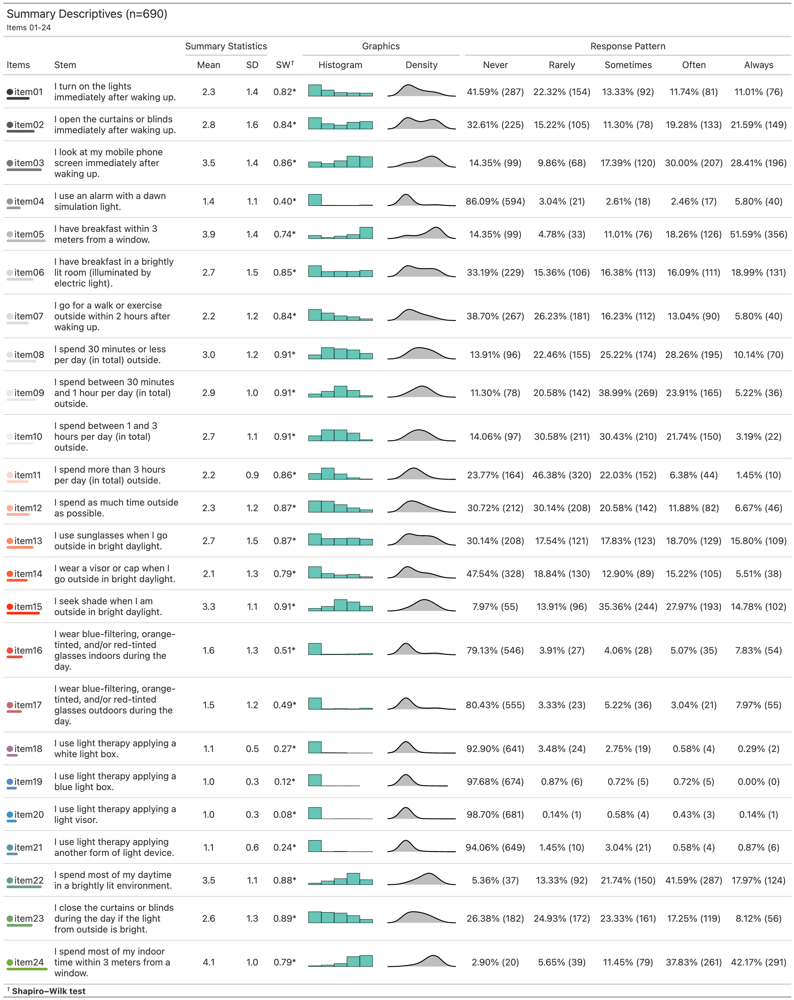
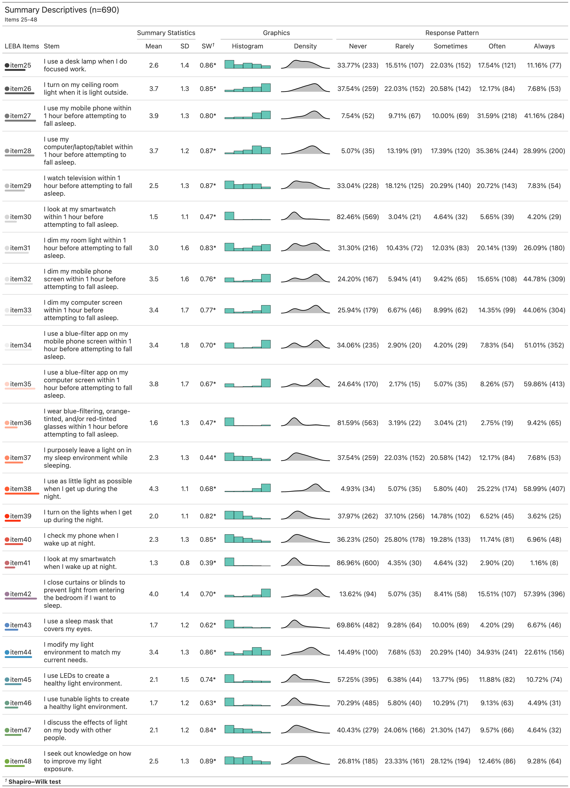
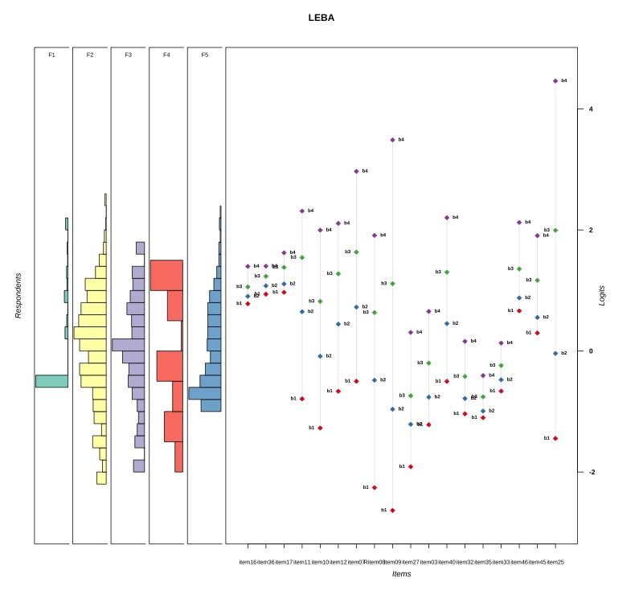

```{r setup, warning=FALSE, include=FALSE}
#This chunk controls the common chunk parameters for the whole manuscript
knitr::opts_chunk$set(echo = FALSE, warning = F, message = F, dpi=600, fig.width = 6,
 fig.asp = 0.8,out.width = "80%", dev=c('png','postscript'))
#options(knitr.duplicate.label = "allow")
set.seed(123)
par(family = "Arial")
```

```{r pacman, eval=FALSE, include=FALSE}
#This chunk holds code for 'pacman' based library management.

#You need to run this chunk 1X in your system 
#install.packages("pacman")#Run this if you don't have pacman installed.
pacman::p_load(MOTE, tidyverse, psych, lavaan,kableExtra,gt,gtsummary, mirt,likert,kutils,semPlot,semTable,semTools,ggcorrplot,dlookr, paran,EFA.MRFA,VIM,DiagrammeR,DiagrammeRsvg,ggplot2,cowplot,questionr,magick, simsem,readxl, stringr,RColorBrewer,WrightMap,reshape, ggsci,ggtext)
webshot::install_phantomjs()
pacman::p_install_gh("jthomasmock/gtExtras")
pacman::p_install_gh("crsh/papaja")
pacman::p_install_gh("masiraji/tabledown")
pacman::p_install_gh("crsh/citr")
devtools::install_github("unDocUMeantIt/koRpus")
koRpus::install.koRpus.lang(lang=c("en"))

install.packages("correlation")
install.packages("ggtext")
#if you don't have LaTeX installed run the following lines
#install.packages("tinytex")
#tinytex::install_tinytex()
```

```{r library, include=FALSE}
#This chunk holds code for calling the required packages

library(papaja) # devtools::install_github("crsh/papaja")
library(lavaan)
library(semPlot) #devtools::install_github('SachaEpskamp/semPlot',  dependencies = T)
library(semTools)
library(MOTE)
library(car)#reverse-coding 
library(psych)
library(dlookr)
library(tidyverse)
library(qgraph)
library(kableExtra)
library(paran) # Parallel analysis
library(EFA.MRFA) # Hull method
library(ggcorrplot)
library(semTable)
library(mirt)
library(gtsummary)
library(gt)
library(gtExtras)
library(likert)
library(VIM) #Missing data
library(kutils)
library(tabledown)
library(readxl)
library(koRpus)# stable release
library(koRpus.lang.en)
library(reshape)
library(ggsci)
library(ggtext)
r_refs("lib_references.bib")
```

```{r ggplot2, include=F}
#This chunk holds code for creating ggplot2 based apatheme for plots.
apatheme=theme_bw()+
  theme(panel.grid.major = element_blank(),
        panel.grid.minor = element_blank(),
        panel.background = element_blank(),
        #text=element_text(family = "Helvetian"),
        axis.text.x = element_text(size = 15),
        axis.text.y = element_text(size = 15),
        axis.title.x = element_text(size = 15),
        axis.title.y = element_text(size = 15),
        plot.title = element_text(size = 15),
        legend.text = element_text(size = 15),
        legend.title=element_blank(),
        axis.line.x = element_line(color='black'),
        axis.line.y = element_line(color='black'),
        panel.border = element_rect(color = "black",
                                    fill = NA,
                                    size = 1))

```

---
nocite: |
  `r cite_r("lib_references.bib")`
  [@verriotto2017new][@eklund1996development][@bajaj2011validation][@dianat2013objective]
  [@horne1976self][@roenneberg2003life][@buysse1989pittsburgh][@Xie.2021][@bossini2006sensibilita][@grandner2014development]
---

# Introduction

-   Light exposure is important

-   Light exposure Behaviour is important

-   Supplementary Table S1: Overview Existing Related Scales

-   Existing Scales: Review them in text

-   None of these do light exposure behaviour.

# Methods

```{r Data, include=FALSE}
#This chunk holds code for data wrangling

data <- readRDS("leba_2021-09-08.rds")

# Separating EFA and CFA samples with descriptive column
descriptives.data <- data

## Merge "0"s and "1"s into "1"s select,subset assign)
descriptives.data[ , 9:56 ][ descriptives.data[ , 9:56 ] == 0 ] <- 1
#EFA.descriptives <- descriptives.data[1:428,]
EFA.descriptives <- subset(descriptives.data, IncludedInEFA == "TRUE")
#CFA.descriptives <- descriptives.data[429:690, ]
CFA.descriptives<- subset(descriptives.data, IncludedInEFA == "FALSE")

#Separating the EFA and CFA(only items)
sem.data <- data[, 9:56] #EFA & CFA data
sem.data[ sem.data == 0] <- 1 #Merged "0"s and "1"s into "1"s


invariance.data.descriptives.count <- CFA.descriptives %>% 
  group_by(slypos_demographics_language.factor) %>% 
  count() %>% 
  as.data.frame()


## renaming the column-header
prefix <- "item"
sufix <- c(1:48)
colnam <- paste(prefix,sufix, sep = "" )
colnames(sem.data) <- colnam
names(sem.data)[names(sem.data) == "item1"] <- "item01"
names(sem.data)[names(sem.data) == "item2"] <- "item02"
names(sem.data)[names(sem.data) == "item3"] <- "item03"
names(sem.data)[names(sem.data) == "item4"] <- "item04"
names(sem.data)[names(sem.data) == "item5"] <- "item05"
names(sem.data)[names(sem.data) == "item6"] <- "item06"
names(sem.data)[names(sem.data) == "item7"] <- "item07"
names(sem.data)[names(sem.data) == "item8"] <- "item08"
names(sem.data)[names(sem.data) == "item9"] <- "item09"
```

```{r country, include=FALSE}
#This chunk holds code for time-zone calculation

library(stringr)
country <- data

TZ <- as.data.frame(str_split_fixed(country$slypos_demographics_tz.factor, "-", 2))
TZ[97, 2] <- " East Africa/Dodoma (UTC +03:00)"
TZ[146, 2] <- " European /Skopje (UTC +01:00)"
TZ[176, 2] <- " Asia /Taipei City (UTC +08:00)"
TZ[574, 2] <- " Asia /Taipei City (UTC +08:00)"
TZ[690, 2] <- " Asia /Taipei City (UTC +08:00)"
TZ[273, 2] <- " Iran /Tehran (UTC +0:30)"
TZ[418, 2] <- " Iran /Tehran (UTC +0:30)"
TZ[673, 2] <- " Iran /Tehran (UTC +0:30)"

num.countries <- as.data.frame(unique(TZ$V1))
num.Timezone <- unique(TZ$V2)

UTC <- as.data.frame(str_split_fixed(TZ$V2, "UTC", 2))
numUTC <- as.data.frame(unique(UTC$V2))
nrow(numUTC)
```

```{r timezone, include=F}
#This chunk holds code for creating time-zone.csv file
timezone <- TZ %>% 
  group_by(V2) %>% 
  count() %>% 
  as.data.frame()

write.csv(timezone, "Table_raw/timezone.csv")


```

```{r prepareDescTable, include=FALSE}
#This chunk holds code for demographic data wrangling.

listdescVars <- colnames(descriptives.data[c(1:3,5:7)])


#separating naming and  reducing data for descriptive Table 
desctable.data <- dplyr::select(descriptives.data, c(listdescVars,
                          IncludedInCFA))

#renaming TRUE and FALSE from the IncludedInCFA to EFA and CFA for Descriptive Table
desctable.data$IncludedInCFA[desctable.data$IncludedInCFA == T ] <-
 "2. CFA Sample"
desctable.data$IncludedInCFA[desctable.data$IncludedInCFA == F ] <- 
 "1. EFA Sample"

# recode the Gender factor so it will only show "Gender Diverse" in the summary table
desctable.data$slypos_demographics_gender.factor <-
  recode_factor(desctable.data$slypos_demographics_gender.factor, "No" = "Yes",
         "Yes"= "No")
       
# create descriptive table for the demographic vars (excluding tz & Country) with gtsummary
desctable.data %>%
  tbl_summary(
    by = IncludedInCFA,
    statistic = list(all_continuous() ~ "{mean} ({sd})",
                     all_categorical() ~ "{n} ({p}%)"),
    digits = all_continuous() ~ 2,
    label = list(slypos_demographics_age ~ "Age",
                 slypos_demographics_sex.factor ~ "Sex",
                 slypos_demographics_gender.factor ~ "Gender-Variant Identity",
                 slypos_demographics_language.factor ~ "Native English Speaker",
                 slypos_demographics_work_or_school.factor ~ "Occupational Status",
                 slypos_demographics_school.factor ~ "Occupational setting"
                 ),
    
    missing = "no"
    ) %>% add_overall() %>% bold_labels() %>% 
  # add_p() %>% add_q() %>%
modify_header(label ~ "**Variable**") %>% 
  # separate_p_footnotes() %>%
  modify_caption("Demographic Characteristics of Participants (n=690).") -> desc_table 

as_tibble(desc_table) -> desc_tibble 
as_kable_extra(desc_table, format = "latex",booktabs = T) -> desc_kable #save it as a knitr::kable

#summarise country/time zone data
#The following chunk is not working now. May be package problem (Sorting command is not working)

descriptives.data%>%
  tbl_summary(
    label = slypos_demographics_tz.factor ~ "Time zone - Country",
    statistic = list(all_categorical() ~ "{n} ({p}%)"),
    missing = "no",
    sort = all_categorical() ~ "frequency",
    include = "slypos_demographics_tz.factor"
  )  %>% bold_labels() %>%
  modify_header(label ~ "") %>%
  as_tibble(format = 'pipe') -> tz_tibble

```

## Data Collection

```{r demotab, warning=F, message=F}
desc_kable  %>% kable_styling(latex_options = c("scale_down")) %>% landscape()
```

A quantitative cross-sectional fully anonymous online large-scale survey was conducted via REDCap [@harris2009research; @harris2019redcap] by way of the University of Basel [sciCORE](https://redcap.scicore.unibas.ch). Participants were recruited via the [website](https://enlightenyourclock.org/participate-in-research) (<https://enlightenyourclock.org/participate-in-research>) of the science-communication comic-book "Enlighten your clock" co-released with the survey [@Weinzaepflen.2021], social media (i.e., LinkedIn, Twitter, Facebook), mailing lists, word of mouth, the investigators' personal contacts, and supported by distribution of the survey link via f.lux [@f.lux]. The landing page of the online survey had the explanatory statements where we mentioned participation was voluntary and that respondents could withdraw from participation any time without being penalized. At the beginning of the survey, for the adult participants (\>18 years) consent was recorded digitally. Under-aged participants (\<18 years) were urged to obtain assent from their parents/legal guardians. The entire survey was estimated to take \<30 minutes. Participants were not compensated. As a part of the demographic information participants provided information regarding age, sex, gender identity, occupational status, COVID-19 related occupational setting, time zone/country of residence and native language. The demographic characteristics of our sample are given in Table 1. To ensure high data quality, five attention check items were included in the survey (e.g., "We want to make sure you are paying attention. What is 4+5?"). Participants were asked to confirm that they were participating the survey for the first time. Questions incorporating retrospective recall were all aligned to the period of "past four weeks".\
We conducted two rounds of data collection. At first, we collected data for from `r nrow(EFA.descriptives)` participants (EFA sample). In the second round we collected data from another `r nrow(CFA.descriptives)` participants (CFA sample) making a total sample of `r nrow(desctable.data)`. The data analysed in this study was collected between 17 May 2021 and 3 September 2021.

## Analytic Strategy

Figure \@ref(fig:FlowchartFig) summarizes the steps we followed while developing LEBA. In our analysis we used R statistical tool [@R-base] with several packages [@R-lavaan; @R-mirt; @R-psych; @R-semPlot; @R-tabledown; @R-tidyverse]. **First**, we developed an item pool of 48 items with six-point Likert type response format (0-Does not apply/I don't know, 1-Never, 2-Rarely 3-Sometimes, 4-Often, 5-Always) for our initial scale. Our purpose was to capture light exposure related behaviour. In that context, the first two response options: "Does not apply/I don't know" and "Never" were providing similar information. As such we collapsed them into one, making it a 5 point Likert type response format (1-Never, 2-Rarely 3-Sometimes, 4-Often, 5-Always).

**Second**, for data collection we conducted two rounds of large-scale survey. **Third**, as a part of psychometric analysis, we conducted descriptive and item analysis and proceeded to the exploratory factor analysis (EFA) using "psych" package [@R-psych] on the data collected in the first round (EFA sample; n=`r nrow(EFA.descriptives)`). Prior to the EFA, necessary assumptions, including sample adequacy, normality assumptions, quality of correlation matrix were assessed. Our data violated both the univariate and multivariate normality assumptions. Due to these violations and the ordinal nature of our response data, in EFA we used polychoric correlation matrix and employed principal axis (PA) as the factor extraction method [@desjardinsHandbookEducationalMeasurement2018; @watkinsStepbyStepGuideExploratory2020]. We used a combination of factor identification method including Scree plot [@cattellScreeTestNumber1966], minimum average partials method [@velicerDeterminingNumberComponents1976], and Hull method [@lorenzo-sevaHullMethodSelecting2011] to identify factor numbers. To determine the latent structure, we followed the common guidelines : (i) no factors with fewer than three items (ii) no factors with a factor loading \<0.3 (iii) no items with cross-loading \> .3 across factors [@bandalosFactorAnalysisExploratory2018]. <!-- We also conducted an EFA on non-merged response options data set (**Supplementary File 1**). -->

For reliability estimation "psych" package was used [@R-psych]. Though Cronbach's internal consistency coefficient alpha is widely used for estimating internal consistency, it has a tendency to deflate the estimates for Likert-type data since the calculation is based on Pearson-correlation matrix which requires response data to be continuous in nature [@gadermann2012estimating; @zumbo2007ordinal]. Subsequently to get better estimates of reliability we reported ordinal alpha for each factors obtained in EFA [@zumbo2007ordinal]. We also estimated the internal consistency reliability of the total scale using McDonald's $\omega_t$ coefficient which is a better reliability estimate for multidimensional constructs [@dunn2014alpha; @sijtsma2009use]. Both ordinal alpha and McDonald's $\omega_t$ coefficient value range between 0 to 1 and higher value represents better reliability. 

To validate the latent structure obtained in EFA, We conducted a categorical confirmatory factor analysis (CFA) with weighted least square with mean and variance adjusted (WLSMV) estimator [@desjardinsHandbookEducationalMeasurement2018] using "lavaan" package [@R-lavaan] on the data collected in the second round (CFA sample; n=`r nrow(CFA.descriptives)`). We assessed the model fit using common model fit guidelines: (i) $\chi^2$ test statistics: a non-significant test statistics is required to accept the model (ii) comparative fit index (CFI) and Tucker Lewis index (TLI): close to .95 or above/ between .90-.95 and above (iii) root mean square error of approximation (RMSEA): close to .06 or below, (iv) Standardized root mean square (SRMR): close to .08 or below [@huCutoffCriteriaFit1999; @schumacker2004beginner]. However, the $\chi^2$ test is sensitive to sample size [@brownConfirmatoryFactorAnalysis2015] and SRMR does not work well with ordinal data [@RN1272] As such, we judged the model fit using CFI, TLI and RMSEA.

We assessed the measurement invariance (MI) of our scale between native English speakers (n=`r invariance.data.descriptives.count[1,2]`) and non-native English speakers (n=`r invariance.data.descriptives.count[2,2]`) in the CFA sample (n=`r nrow(CFA.descriptives)`). MI evaluates whether a construct has the psychometric equivalence and the same meaning across groups [@putnick2016measurement; @klinePrinciplesPracticeStructural2015]. We used structural equation modelling framework using "lavaan" package [@R-lavaan] to assess the measurement invariance. We successively compared four nested models: configural, metric, scalar, and residual models using the $\chi^2$ difference test ($\Delta \chi^2$). Among MI models, the configural model is the least restrictive model and residual model is the most restrictive model. A non-significant $\Delta \chi^2$ test between two nested measurement invariance models indicates mode fit does not significantly decrease for the superior model thus allowing the superior invariance model to be accepted [@dimitrov2010testing; @widaman1997exploring].

**Fourth**, as secondary analysis we identified the educational grade level required to understand the items in our scale using Flesch-Kincaid grade level identification method [@flesch1948new] using "koRpus" [@R-koRpus] package. Also, we analysed possible semantic overlap of our developed scale using ["Semantic Scale Network" (SSN)](https://rosenbusch.shinyapps.io/semantic_net/) engine [@rosenbusch2020semantic]. The SSN detects semantically related scales and provides cosine similarity index ranging between -.66 to 1 [@rosenbusch2020semantic]. Pair of scales with a cosine similarity index value of 1 indicates they are perfectly semantically similar scales indicating redundancy.

**Lastly**, we developed a short form of LEBA using Item Response Theory (IRT) based analysis. We fitted each factor of LEBA using the graded response model [@samejima1997handbook] to the combined EFA and CFA sample (n =`r nrow(sem.data)`) using "mirt" package [@R-mirt]. IRT assesses the item quality by estimating item discrimination, item difficulty, item information curve, and test information curve [@bakerBasicsItemResponse2017]. Item discrimination indicates how well a particular item can differentiate between participants across the given latent trait continuum ($\theta$). Item difficulty corresponds to the latent trait level at which the probability of endorsing a particular response option is 50%. Item information curve (IIC) indicates the amount of information an item carries along the latent trait continuum. Here, we reported the item difficulty and discrimination parameter and categorize the items based on their item discrimination index: none = 0; very low =0.01 to 0.34; low = 0.35 to 0.64; moderate = 0.65 to 1.34 ; high = 1.35 to 1.69; very high \>1.70 [@bakerBasicsItemResponse2017]. We discarded the items with relatively flat item information curve (information \<.2) to develop the short form of LEBA. We also assessed the precision of the short LEBA using Test information curve (TIC). TIC indicates the amount of information a particular scale carries along the latent trait continuum. Item fit and person fit of the fitted IRT models were also analysed to gather more evidence on validity and meaningfulness of our scale [@desjardinsHandbookEducationalMeasurement2018]. Item fit was evaluated using the RMSEA value obtained from Signed-$\chi^2$ index implementation, RMSEA value $\le$.06 was considered adequate item fit. Person fit was estimated using standardized fit index Zh statistics [@drasgow1985appropriateness]. Zh \< -2 was considered as a misfit [@drasgow1985appropriateness].

```{r FlowchartFig, echo=FALSE, fig.align='center', fig.cap='Flow chart of the LEBA (long and short form) development and evaluation. ', out.height='100%', out.width='100%'}
knitr::include_graphics('Figures/Figure1.png', dpi = 600 )
```

## Ethical Approval

By reason of using fully anonymous online survey data, the present research project does not fall under the scope of the Human Research Act, making an authorisation from the ethics committee redundant. Nevertheless, the cantonal ethics commission (Ethikkommission Nordwest- und Zentralschweiz, EKNZ) reviewed our proposition (project ID Req-2021-00488) and issued an official clarification of responsibility.

## Data Availability

The present article is a fully reproducible open access "R Markdown" document. All code and data underlying this article -- along with two versions of the LEBA questionnaire (full and short) and online survey implementation templates on common survey platforms -- will be available under open-access licence (CC-BY-NC-ND) on a public [GitHub repository](https://github.com/leba-instrument).

# Results

## Development of the Initial Scale

After reviewing the literature, we identified several light exposure related scales. However, no scale specifically measuring the behavioural component of light exposure were found (**Supplementary Table 1**). As such, an expert panel developed a comprehensive item pool of 48 items. The expert panel composed of all authors and researchers from the fields of chronobiology, light research, neuroscience and psychology. The 48 items were then judged based on their relevance and representativeness of the construct "Light Exposure Related Behaviour" by the expert panel. The panel members independently judged each of the items in terms of their relevance and representativeness and suggested required modification, if there is any. The author team acknowledged the suggestions and amended the items as required thus creating a 48-item scale.

## Large-scale Survey

Table 1 summarizes the survey participants' demographic characteristics. Only participants completing the full LEBA questionnaire were included, thus there are no missing values in the item analyses. (XX??) participants were excluded from analysis due to not passing at least one of the "attention check" items. For EFA, a sample of 250-300 is recommended [@comreyFirstCourseFactor1992; @schonbrodtWhatSampleSize2013]. To assess sampling adequacy for CFA, we followed the N:q rule [@bentlerPracticalIssuesStructural1987; @jacksonRevisitingSampleSize2003; @klinePrinciplesPracticeStructural2015; @worthingtonScaleDevelopmentResearch2006], where ten participants per item is required to earn trustworthiness of the result. Both our EFA and CFA sample size exceeded these requirements. We collected data from `r nrow(num.countries)` countries (`r nrow(numUTC)` time zones). Participants reported a diverse range of geographic location Participants indicated filling out the online survey from a diverse range of geographic locations. For a complete list of geographic locations, see **Supplementary Table 2**.

Participants in our survey aged between `r min(desctable.data$slypos_demographics_age)` to `r max(desctable.data$slypos_demographics_age)` years [EFA sample: `r min(desctable.data$slypos_demographics_age[desctable.data$IncludedInCFA == "1. EFA Sample"])` to `r max(desctable.data$slypos_demographics_age[desctable.data$IncludedInCFA == "1. EFA Sample"])`; CFA sample: `r min(desctable.data$slypos_demographics_age[desctable.data$IncludedInCFA == "2. CFA Sample"])`to `r max(desctable.data$slypos_demographics_age[desctable.data$IncludedInCFA == "2. CFA Sample"])`], with an overall mean of \~ `r round(mean(desctable.data$slypos_demographics_age), 2)` years of age [Overall: `r mean(desctable.data$slypos_demographics_age)`± `r sd(desctable.data$slypos_demographics_age)`; EFA: `r mean(desctable.data$slypos_demographics_age[desctable.data$IncludedInCFA == "1. EFA Sample"])`± `r sd(desctable.data$slypos_demographics_age[desctable.data$IncludedInCFA == "1. EFA Sample"])`; CFA: `r mean(desctable.data$slypos_demographics_age[desctable.data$IncludedInCFA == "2. CFA Sample"])`± `r sd(desctable.data$slypos_demographics_age[desctable.data$IncludedInCFA == "2. CFA Sample"])`]. In total `r desc_tibble[3,2]` of the participants indicated female sex [EFA: `r desc_tibble[3,3]`; CFA: `r desc_tibble[3,4]`], `r desc_tibble[4,2]` indicated male [EFA: `r desc_tibble[4,3]`; CFA: `r desc_tibble[4,4]`] and `r desc_tibble[5,2]` indicated other sex [EFA: `r desc_tibble[5,3]`, CFA: `r desc_tibble[5,4]`]. Overall, `r desc_tibble[6,2]` [EFA: `r desc_tibble[6,3]`; CFA: `r desc_tibble[6,4]`] participants indicated a gender-variant identity. In a "Yes/No" question regarding native language, `r desc_tibble[7,2]` of respondents [EFA: `r desc_tibble[7,3]`; CFA: `r desc_tibble[7,4]`] indicated to be native English speakers. For their "Occupational Status", more than half of the overall sample reported that they currently work [Overall: `r desc_tibble[9,2]`; EFA: `r desc_tibble[9,3]`; CFA: `r desc_tibble[9,4]`], whereas `r desc_tibble[10,2]` [EFA: `r desc_tibble[10,3]`; CFA: `r desc_tibble[10,4]`] reported that they go to school and `r desc_tibble[11,2]` [EFA: `r desc_tibble[11,3]`; CFA: `r desc_tibble[11,4]`] responded that they do "Neither". With respect to the COVID-19 pandemic we asked participants to indicate their occupational setting during the last four weeks: In the overall sample `r desc_tibble[13,2]` [EFA: `r desc_tibble[13,3]`; CFA: `r desc_tibble[13,4]`] of the participants indicated that they were in a home office/ home schooling setting, while `r desc_tibble[14,2]` overall [EFA: `r desc_tibble[14,3]` ; CFA: `r desc_tibble[14,4]`] reported face-to-face work/schooling. Lastly, `r desc_tibble[15,2]` overall [EFA: `r desc_tibble[15,3]` ; CFA: `r desc_tibble[15,4]`] reported a combination of home- and face-to-face work/schooling, whereas `r desc_tibble[16,2]` overall [EFA: `r desc_tibble[16,3]`; CFA: `r desc_tibble[16,4]`] filled in the "Neither (no work or school, or on vacation)" response option.

## Psychometric Analysis: Development of the Long Form

### Descriptive Statistics and Item Analysis

```{r full-data-mardia, include =F}
mardia.all.data <- psych::mardia(sem.data, na.rm = T, plot =T)
descriptives.all.data <- tabledown::des.tab(sem.data)
```

```{r gtvis, include =F}
#This chunk holds codes for creating 'gtExtra' based descriptive figures (data preparation)

## Recoding sem.data$item8
gt.data <- sem.data
gt.data$item08 <- as.character(gt.data$item08)
gt.data$item08 <- fct_recode(gt.data$item08,
  "5" = "1",
  "4" = "2",
  "2" = "4",
  "1" = "5"
)

## Recoding gt.data$item26
gt.data$item26 <- as.character(gt.data$item26)
gt.data$item26 <- fct_recode(gt.data$item26,
  "5" = "1",
  "4" = "2",
  "2" = "4",
  "1" = "5"
)
## Recoding gt.data$item37
gt.data$item37 <- as.character(gt.data$item26)
gt.data$item37 <- fct_recode(gt.data$item26,
  "5" = "1",
  "4" = "2",
  "2" = "4",
  "1" = "5"
)


# all data Gt Table
##Long table
gt.long <- as.data.frame(gather(gt.data, Items, value))
gt.long$value <- as.numeric(as.character(gt.long$value))

##Summarizing and creating gt object

gt.tab <- gt.long %>% 
  group_by(Items) %>% 
  # calculate summary stats & create data for the histogram and density plot
  dplyr::summarise(
    nr = n(),
    mean = mean(value, na.rm = TRUE),
    # med = median(value, na.rm = TRUE),
    sd = sd(value, na.rm = TRUE),
    hist_data = list(value),
    dens_data = list(value),
    .groups = "drop"
  ) %>% 
  gt() 

gt.tab1 <- gt.tab$`_data` 

gt.tab2 <- gt.tab1[,-c(1,2)]


vars_labels = as.data.frame(sapply(sem.data,
       function(x){attr(x,"label")}))

vars_labels<- tibble::rownames_to_column(vars_labels, "Items")
colnames(vars_labels) <- c("Item", "Stem")


gt.tab3 <- cbind(vars_labels, gt.tab2[,c(1,2)], descriptives.all.data$Normality,gt.tab2[,c(3,4)] )

colnames(gt.tab3) <- c("Item", "Stem", "mean", "sd","S-W Statistics", "hist_data","dens_data"  )
#Preparation for likert data
LEBA.likert <- as.data.frame(gt.data) 

recod_LEBA <- c( "1" = "Never", "2" = "Rarely", "3"= "Sometimes","4" = "Often",
                 "5" = "Always")
LEBA.likert <-  mutate(LEBA.likert, across(starts_with("item"), ~unname(recod_LEBA[.])))

LEBA.Factor = as.data.frame(lapply(LEBA.likert,factor,
                                   ordered = T))
#get the items name
items <- names(LEBA.Factor) 
#Calculate percentage
percentage <- kutils::likert(LEBA.Factor, vlist = items ) 

percentage <- percentage$table %>% 
  as.data.frame(.)


#data wrangling
labels <- c("Always", "Never","Often", "Rarely", "Sometimes","Total")
as.data.frame(labels)

full.percentage <- cbind(labels,percentage) #tables with labels  
full.percentage<- t(full.percentage ) #transpose
as.data.frame(full.percentage)
full.percentage1 <- full.percentage[-1,-6] #removing 1st row and total column
full.percentage2 <- full.percentage1[, c(2, 4, 5, 3,1)]# rearranging
as.data.frame(full.percentage2)


colnames(full.percentage2) <- c("Never","Rarely","Sometimes","Often","Always")

Items <- rownames(full.percentage2)
as.data.frame(Items)
full.percentage3 <- cbind(Items,full.percentage2)

full.percentage3 <- full.percentage3[order(Items),] 
full.percentage3 <- as.data.frame(full.percentage3[,-1]) %>% 
  gt()


liket.full <- full.percentage3$"_data"


full.table <-  cbind( gt.tab3, liket.full)%>% 
  gt()


```

```{r fullgt,  include=FALSE}
#This chunk holds codes for creating 'gtExtra' based descriptive figures (EFA+CFA); 

full.tab <- full.table$`_data`

full.tab.1 <- full.tab[1:24,] %>% 
  gt()

full.tab.2 <- full.tab[25:48,] %>% 
  gt()

full.tab.1 %>% 
# histogram and density plots
  gtExtras::gt_sparkline(
    hist_data,
    type = "histogram",
    line_color = "black", 
    fill_color = "#00A08799",
    bw = 1,
    same_limit = TRUE)%>%
  gtExtras::gt_sparkline(
    dens_data,
    type = "density",
    line_color = "black", 
    fill_color = "grey",
    bw = 0.75,
    same_limit = TRUE
  )%>%
# format decimals
  fmt_number(columns = mean:sd, decimals = 1) %>%
# header
  tab_header(
    title = md("Summary Descriptives (n =690)"),
    subtitle = md("Items 01-24 ")) %>% 
#create groups of columns
tab_spanner(
  label = "Item",
  columns = Item:Stem
) %>%
  cols_align(
    align = "left",
    columns = Item:Stem
  ) %>% 
  tab_spanner(
    label = "Summary Statistics",
    columns = mean:sd
  ) %>%
  tab_spanner(
    label = "Graphics",
    columns = hist_data:dens_data
  ) %>% 
  tab_spanner(
    label = "Response Pattern",
    columns = Never:Always
  ) %>%
  

     tab_footnote(
     footnote = md("**Shapiro–Wilk test**"),
     locations = cells_column_labels(columns = `S-W Statistics`)
  ) %>% 
# change column names to appear in the table
cols_label(
  Item = ("Items"),
  Stem = ("Stem"),
  mean = ("Mean"),
  sd = (("SD")),
  `S-W Statistics` = ("SW"),
  hist_data = "Histogram",
  dens_data = "Density"
)  %>% 
# set alignment as per wish
  cols_align(
    align = "center",
    columns = mean:Always
  ) %>%
  opt_align_table_header(align = "left") %>%
# add coloured dots and lines on the first column
  gt_plt_dot(
    mean,
    Item,
    palette = "ggthemes::fivethirtyeight"
  ) %>% tab_options(
    table.font.size = px(14L)) %>% 
  cols_width(
    Stem ~ px(200)) %>% 
 gtsave("Figures/Figure2.png", vwidth = 6000)


full.tab.2 %>% 
# histogram and density plots
  gtExtras::gt_sparkline(
    hist_data,
    type = "histogram",
    line_color = "black", 
    fill_color = "#00A08799",
    bw = 1,
    same_limit = TRUE)%>%
  gtExtras::gt_sparkline(
    dens_data,
    type = "density",
    line_color = "black", 
    fill_color = "grey",
    bw = 0.75,
    same_limit = TRUE
  )%>%
# format decimals
  fmt_number(columns = mean:sd, decimals = 1) %>%
# header
  tab_header(
    title = md("Summary Descriptives (n =690)"),
    subtitle = md("Items 25-48 ")) %>% 
#create groups of columns
tab_spanner(
  label = "Item",
  columns = Item:Stem
) %>%
  cols_align(
    align = "left",
    columns = Item:Stem
  ) %>% 
  tab_spanner(
    label = "Summary Statistics",
    columns = mean:sd
  ) %>%
  tab_spanner(
    label = "Graphics",
    columns = hist_data:dens_data
  ) %>% 
  tab_spanner(
    label = "Response Pattern",
    columns = Never:Always
  ) %>%
  
     tab_footnote(
     footnote = md("**Shapiro–Wilk test**"),
     locations = cells_column_labels(columns = `S-W Statistics`)
  ) %>% 
# change column names to appear in the table
cols_label(
  Item = ("LEBA  Items"),
  Stem = ("Stem"),
  mean = ("Mean"),
  sd = (("SD")),
  `S-W Statistics` = ("SW"),
  hist_data = "Histogram",
  dens_data = "Density"
)  %>% 
# set alignment as per wish
  cols_align(
    align = "center",
    columns = mean:Always
  ) %>%
  opt_align_table_header(align = "left") %>%
# add coloured dots and lines on the first column
  gt_plt_dot(
    mean,
    Item,
    palette = "ggthemes::fivethirtyeight"
  ) %>% tab_options(
    table.font.size = px(14L)) %>% 
  cols_width(
    Stem ~ px(200)) %>% 
gtsave("Figures/Figure3.png",vwidth = 6000)

```

```{r efagtPic1, echo=FALSE,  fig.cap= 'Summary descriptives and response pattern observed in the large-scale survey for item 01-24. All items violated normality assumption.', out.height='100%', out.width='250%'}


```

```{r efagtPic2, echo=FALSE,  fig.cap= 'Summary descriptives and response pattern observed in the large-scale survey for item 25-48. All items violated normality assumption.', out.height='100%', out.width='250%'}


```

Figure \@ref(fig:efagtPic1) and Figure \@ref(fig:efagtPic2) summarize the response pattern of our total sample (n = `r nrow(sem.data)`) for all 48 items. Most of the items appeared skewed.The Shapiro–Wilk test of univariate normality [@shapiroAnalysisVarianceTest1965] and Mardia test of multivariate normality [@mardiaMeasuresMultivariateSkewness1970] indicated our data violated both univariate and multivariate normality. Multivariate skew was `r printnum(mardia.all.data$b1p)` (p \<0.001) and multivariate kurtosis was `r printnum(mardia.all.data$b2p)` (p \<0.001). 

```{r EFAdata, include=FALSE}
#This chunk holds code for creating EFA data subset
### EFA data
EFA.data <- sem.data[1:428, ]
#library(VIM)
missing <- VIM::aggr(EFA.data, plot =T)

```

```{r EFAassumptions, include=FALSE}
#This chunk holds code for checking assumptions of EFA

#KMO test
KMO <- psych::KMO(EFA.data) 

# Test of correlation matrix
bartlet <- psych::cortest.bartlett(EFA.data, n =428)


#Histogram
psych::multi.hist(EFA.data[,sapply(EFA.data, is.numeric)])

# Univariate normality

descriptives <- tabledown::des.tab(EFA.data)

colnames(descriptives) <- c("Items", "Mean", "SD", "Skew", "Kurtosis", "SW", "Item Total Correlation")

vars_labels = as.data.frame(sapply(EFA.data,
       function(x){attr(x,"label")}))

vars_labels<- tibble::rownames_to_column(vars_labels, "Items")
colnames(vars_labels) <- c("Item", "Stem")


descriptives2 <- cbind(vars_labels, descriptives[,-1])
# Multivariate Normality
mardia <- psych::mardia(EFA.data, na.rm = T, plot =T)


```

```{r ItemAnalysis, include=FALSE}
#This chunk holds code for Item analysis (Classical Test Theory)
# Item analysis
Item_analysis <- psych::alpha(EFA.data,check.keys=TRUE)
Item_analysis$item.stats$r.cor
low.r.corec <- (min(Item_analysis$item.stats$r.cor))  #minimum item total correlation
high.r.corec <- (max(Item_analysis$item.stats$r.cor))     # maximum item total correlation
```

```{r gt-EFA, include =F}
#EFA data
gt.efa.data <- EFA.data

# gt.efa.data.table <- gt.efa.data %>% 
#   dplyr::select(item16, item36, item17,
#                  item11, item10,item12,item07,item08,item09,
#                  item27,  item03, item40,  item30, item41,
#                  item33, item32,item35, item37,item38, 
#                  item46, item45, item25, item04, item01,item26)

#Creating long data
gt.efa.long <- as.data.frame(gather(gt.efa.data, Items, value))
gt.efa.long$value <- as.numeric(as.character(gt.efa.long$value))

#Summarizing and creating gt object
gt.efa.tab <- gt.efa.long %>% 
  group_by(Items) %>% 
  # calculate summary stats & create data for the histogram and density plot
  dplyr::summarise(
    # nr = n(),
    # mean = mean(value, na.rm = TRUE),
    # med = median(value, na.rm = TRUE),
    # sd = sd(value, na.rm = TRUE),
    hist_data = list(value),
    dens_data = list(value),
    .groups = "drop"
  ) %>% 
  gt() 


#Preparation for likert data
efa.LEBA.likert <- as.data.frame(gt.efa.data) 

recod_LEBA <- c( "1" = "Never", "2" = "Rarely", "3"= "Sometimes","4" = "Often",
                 "5" = "Always")
efa.LEBA.likert <-  mutate(efa.LEBA.likert, across(starts_with("item"), ~unname(recod_LEBA[.])))

efa.LEBA.Factor = as.data.frame(lapply(efa.LEBA.likert,factor,
                                   ordered = T))
#get the items name
efa.items <- names(efa.LEBA.Factor) 
#Calculate percentage
efa.percentage <- kutils::likert(efa.LEBA.Factor, vlist = efa.items ) 

efa.percentage <- efa.percentage$table %>% 
  as.data.frame(.)

#data wrangling
labels <- c("Always", "Never","Often", "Rarely", "Sometimes","Total")
as.data.frame(labels)

full.efa.percentage <- cbind(labels,efa.percentage) #tables with labels  
full.efa.percentage<- t(full.efa.percentage ) #transpose
as.data.frame(full.efa.percentage)
full.efa.percentage1 <- full.efa.percentage[-1,-6] #removing 1st row and total column
full.efa.percentage2 <- full.efa.percentage1[, c(2, 4, 5, 3,1)]# rearranging
as.data.frame(full.efa.percentage2)


colnames(full.efa.percentage2) <- c("Never","Rarely","Sometimes","Often","Always")

efa.Items <- rownames(full.efa.percentage2)
as.data.frame(efa.Items)
full.efa.percentage3 <- cbind(efa.Items,full.efa.percentage2)

full.efa.percentage3 <- full.efa.percentage3[order(efa.Items),] 
full.efa.percentage3 <- as.data.frame(full.efa.percentage3[,-1]) %>% 
  gt()


gt.efa.table <- gt.efa.tab$'_data'
gt.liket.efa <- full.efa.percentage3$"_data"


efaTable <-  cbind( gt.efa.table, gt.liket.efa)%>% 
  gt()


 efa.gt <- efaTable$"_data"
 
 efa.gt.2 <- cbind(descriptives2[,-2], efa.gt[,-1])
```

```{r efagt,include=F}

#This chunk holds codes for creating 'gtExtra' based descriptive figures (EFA descriptives Supplementary

efa.gt.2 %>% 
gt() %>% 
# histogram and density plots
  gtExtras::gt_sparkline(
    hist_data,
    type = "histogram",
    line_color = "black", 
    fill_color = "#00A08799",
    bw = 1,
    same_limit = TRUE)%>%
  gtExtras::gt_sparkline(
    dens_data,
    type = "density",
    line_color = "black", 
    fill_color = "#E64B3599",
    bw = 0.75,
    same_limit = TRUE
  )%>%
# # format decimals
#   fmt_number(columns = mean:sd, decimals = 1) %>%
# header
  tab_header(
    title = md("**Light Exposure Behavior Assessment**"),
    subtitle = md("Summary Descriptives EFA Sample (n =428)")
  ) %>% 
   tab_footnote(
     footnote = md("**Shapiro–Wilk test**"),
     locations = cells_column_labels(columns = SW)
  ) %>%
  
#create groups of columns
tab_spanner(
  label = "Items",
  columns = Item
)  %>% 
  tab_spanner(
    label = "Summary Statistics",
    columns = Mean:SW
  ) %>%
  tab_spanner(
    label = "Graphics",
    columns = hist_data:dens_data
  ) %>% 
  tab_spanner(
    label = "Response Pattern",
    columns = Never:Always
  ) %>%
# change column names to appear in the table
cols_label(
  hist_data = "Histogram",
  dens_data = "Density"
) %>%
# set alignment as per wish
  cols_align(
    align = "center",
    columns = everything()
  ) %>%
  opt_align_table_header(align = "left") %>%
# add coloured dots and lines on the first column
  gt_plt_dot(
    Mean,
    Item,
    palette = "ggthemes::fivethirtyeight") %>% 
  tab_options(
    table.font.size = px(14L)) %>% 
  
  gtsave("Figures/S1_Fig.png", vwidth=6000)
  
# tab_row_group(
  #     label = md("**F5: Using light in the morning and during daytime**"),
  #     rows = c(1,3,12,13,24,25) 
  #       ) %>% 
  # tab_row_group(
  #     label = md("**F4: Using light before bedtime**"),
  #     rows = c(16,17,18,20,21) 
  #       ) %>% 
  # tab_row_group(
  #     label = md("**F3: Using phone and smart-watch in bed**"),
  #     rows = c(2,14,15,22,23) 
  #       ) %>% 
  # tab_row_group(
  #     label = md("**F2: Spending time outdoors**"),
  #     rows = c(4,5,6,7,8,9) 
  #       ) %>% 
  # tab_row_group(
  #     label = md("**F1: Wearing blue light filters**"),
  #     rows = c(10,11,19) )

  
  
  
  
  
  
  
```

**Supplementary Figure 1** summarizes the univariate descriptive statistics for the 48 items in the EFA sample (n =`r nrow(EFA.data)`). Here also our data violated univariate [@shapiroAnalysisVarianceTest1965] and multivariate normality assumptions [@mardiaMeasuresMultivariateSkewness1970]. Multivariate skew was `r printnum(mardia$b1p)` (p \<0.001) and multivariate kurtosis was `r printnum(mardia$b2p)` (p \<0.001). The corrected item-total correlation ranges between `r apa(low.r.corec,2,F)` -`r apa(high.r.corec,2,F)`. However, no item was discarded based on descriptive statistics or item analysis.

### Exploratory Factor Analysis and Reliability Analysis

```{r CorrMatrix, include=FALSE}
#This chunk holds code for producing correlation matrix and its details.

#Polychoric Correlation matrix

correlations <- psych::polychoric(EFA.data, correct = 0)

upper <- correlations$rho[upper.tri(correlations$rho, diag = F)]

min.cor <- apa(min((upper)),2,F) #minimum cor.coefficient of the matrix
max.cor <- apa(max((upper)),2,F) # max. correlation coefficient of the matrix

determinets <- det(correlations$rho) 
# Calculating the percentage of correlations higher than .30

BigR = sum(correlations$rho >= abs(.30) & correlations$rho < abs(1.0), na.rm =T)/2 
totR = length(EFA.data)*(length(EFA.data)-1)/2
cor.per <- print (BigR/totR)*100
```

Sampling adequacy was checked using Kaiser-Meyer-Olkin (KMO) measures of sampling adequacy using the EFA sample (n =`r nrow(EFA.data)`) [@kaiserIndexFactorialSimplicity1974] . The overall KMO vale for 48 items was `r printnum(KMO$MSA)` which was above the cut-off value (.50) indicating adequate sample size [@hutchesonMultivariateSocialScientist1999]. Bartlett's test of sphericity [@bartlettNoteMultiplyingFactors1954], $\chi^2$ (`r bartlet$df`) = `r apa(bartlet$chisq, 2, T)`, p \< .001 indicated the correlations between items are adequate for conducting the EFA. However only `r apa(cor.per, 2,T)`% of the inter-item correlation coefficients were greater than \|.30\|. The inter-item correlation coefficients ranged between `r min.cor` to `r max.cor`. Figure \@ref(fig:efa-plot-print)-A depicts the correlation matrix.

```{r tabDes, eval=FALSE, include=FALSE, results='asis'}
descriptives2 %>% 
apa_table(landscape =T,caption ="Univariate Descriptive Statistics for the 48 Items. All Items Violated Univariate Normality Assumption Assessed by Shapiro–Wilk (SW) Test. The  Item-total Correlation Ranges Between .03-.48", escape =F, font_size = "footnotesize", note = ("$^{*}$p<.001, $^{1}$Shapiro–Wilk Statistics"), align = c("p{1cm}","p{10cm}", rep("p{1cm}", ncol(descriptives2)))) 
```

```{r correlation-hits, eval=FALSE, include=FALSE}
#This chunk holds code for plotting the correlation matrix in histogram format

cor.hits <- as.data.frame(melt(upper))
colnames(cor.hits) <- c("value")
corr.histogram <- ggplot(cor.hits,aes(x=value)) + 
  geom_histogram(binwidth=.1, col=I("black"),fill="#00A08799")+apatheme+
  labs( y="", x = "Inter-item correlation")

# ggsave("Figures/correlation_histogram.png", corr.histogram, width = 6, height = 6, dpi = 600, bg ="white")
```

```{r corplot, include =F}
#This chunk holds code for plotting the correlation matrix

p.mat <- correlation::cor_to_p(correlations$rho, 428, method = "polychoric")


corplot <- ggcorrplot(correlations$rho, p.mat=p.mat$p, insig = "pch", hc.order = FALSE, outline.col = "white", type = "lower", legend.title = "Correlation",sig.level = 0.05, pch.cex=1.2,
                      # insig = "blank",
           ggtheme = ggplot2::theme_minimal(),tl.srt = 90,colors = c("#E64B35FF", "white", "#3C5488FF") )+
  theme( panel.grid.major = element_blank(),
         axis.text.x = element_text(size = 6),
         axis.text.y = element_text(size = 6),
         panel.border = element_rect(color = "black",
                                    fill = NA,
                                    size = 1))
#to show pvalue in the fig add p.mat=p.mat
# ggsave("Figures/corplot.png",corplot, width = 12, height = 8.5, dpi = 600, bg ="white")

```

```{r ParallelEFA, eval=FALSE, include=FALSE}
#This chunk holds code for factor identification method : Horn
# Parallel analysis
Horn <- paran(correlations$rho, iterations=500, centile=0, quietly=FALSE,
           status=TRUE, all=FALSE, cfa=FALSE, graph=TRUE,
           color=TRUE, col=c("black","red","blue"),
           lty=c(1,2,3), lwd=1, legend=TRUE, 
           width=640, height=640, grdevice=png, seed=0, mat=NA, n=NA)


Adjusted.EV <- data.frame(Horn$AdjEv)
Adjusted.EV$type = c('Adjusted Ev')
Adjusted.EV$num = c(row.names(Adjusted.EV))
Adjusted.EV$num = as.numeric(Adjusted.EV$num)
colnames(Adjusted.EV) = c('eigenvalue', 'type', 'num')


Random.EV <- data.frame(Horn$RndEv)
Random.EV$type = c('Random EV')
Random.EV$num = c(row.names(Random.EV))
Random.EV$num = as.numeric(Random.EV$num)
colnames(Random.EV) = c('eigenvalue', 'type', 'num')


Unadjusted.EV <- data.frame(Horn$Ev)
Unadjusted.EV$type = c('Unadjusted EV')
Unadjusted.EV$num = c(row.names(Unadjusted.EV))
Unadjusted.EV$num = as.numeric(Unadjusted.EV$num)
colnames(Unadjusted.EV) = c('eigenvalue', 'type', 'num')


parallel = ggplot(Adjusted.EV, aes(x=num, y=eigenvalue, shape=type, color=type)) +
  #Add lines connecting data points
  geom_line(colour ='#DC000099')+
    #geom_line(data = Random.EV) +
  #geom_line(data = Unadjusted.EV)+
    #Add the data points.
  geom_point(size=1.5,colour ='#3C5488FF')+
  #geom_point(data = Random.EV, size=3)+
  #geom_point(data = Unadjusted.EV, size=3)+
  scale_y_continuous(name="Eigen Value", limits=c(0, 7), breaks=seq(0,7,1)) +
   #Label the x-axis 'Factor Number', and ensure that it ranges from 1-max # of factors, increasing by one with each 'tick' mark.
  scale_x_continuous(name='Factor Number (Parallel Analysis)', limits=c(0, 48),breaks=seq(0,48,4))+
    #Add vertical line indicating parallel analysis suggested max # of factors to retain
  geom_hline(yintercept=1, linetype = 'dashed') + apatheme +theme(,legend.position = "None") 
#text = element_text(size = 25)

```

```{r ScreePlot, include=FALSE}

#This chunk holds code for factor identification method : Scree Plot

Scree <- scree(correlations$rho,factors=TRUE,pc=TRUE,main="(B)",
      hline=NULL,add=F)


FA.Scree <- data.frame(Scree$fv)
FA.Scree$type = c('Factor Analysis')
FA.Scree$num = c(row.names(FA.Scree))
FA.Scree$num = as.numeric(FA.Scree$num)
colnames(FA.Scree) = c('eigenvalue', 'type', 'num')

PA.Scree <- data.frame(Scree$pcv)
PA.Scree$type = c('Principal Component Analysis')
PA.Scree$num = c(row.names(PA.Scree))
PA.Scree$num = as.numeric(PA.Scree$num)
colnames(PA.Scree) = c('eigenvalue', 'type', 'num')


scree.plot <-ggplot(FA.Scree, aes(x=num, y=eigenvalue,color=type, shape=type))+
   geom_line(colour ='#DC000099')+
  #geom_line(data = PA.Scree)+ 
  geom_point(size=1.5,colour ='#3C5488FF')+
  #geom_point(data = PA.Scree, size=3)+
  scale_y_continuous(name="Eigen Value", limits=c(0, 5), breaks=seq(0,5,1)) +
  scale_x_continuous(name="Factor Number", limits=c(0, 18),breaks=c(0,6,18))+
  geom_hline(yintercept=1, linetype = 'dashed') + apatheme +theme(legend.position = "None")
#text = element_text(size = 25

```

```{r HullEFA, include=FALSE}
#This chunk holds code for factor identification method : Hull

# HULL
EFA.MRFA::hullEFA(EFA.data,extr = "ULS", index_hull = "CAF", display = TRUE, graph = T,
        details = TRUE)
hull <- ggplot2::last_plot()
Hull <- hull+ ggtitle(NULL)+xlab("Factor Number")+ylab("CAF")+ aes(color = '#DC000099')+geom_point(color ='#3C5488FF',size =1)+
  apatheme +theme(legend.position = "None") +scale_fill_identity()+
  scale_x_continuous(breaks=c(0,5,12))


```

```{r MAPefa, include=FALSE}
#This chunk holds code for factor identification method : MAP
#MAP
map <- psych::VSS(EFA.data, rotate = "varimax", fm = 'minres', n.obs =428 )
map.map <- as.data.frame(map$map)
colnames(map.map) <- "MAP Statistic"
map.statistics <- map$vss.stats[,c(1,2,5,6,7,10,11)]
full.map <- cbind(map.map,map.statistics)

write.csv(full.map, "Table_raw/map_stat.csv")
```

Scree plot ( Figure \@ref(fig:efa-plot-print)-B) suggested a six-factor solution. However, the minimum average partial (MAP) [@velicerDeterminingNumberComponents1976] method (**Supplementary Table 3**) and Hull method [@lorenzo-sevaHullMethodSelecting2011] ( Figure \@ref(fig:efa-plot-print)-C) suggested a five-factor solution. As a result, we tested both five-factor and six-factor solutions.

```{r EFA, include=FALSE}
#This chunk holds code for five factor EFA (pa-varimax)

fa.5F.1 <- fa(r=correlations$rho, nfactors = 5, fm= "pa",rotate ="varimax",
              residuals = TRUE, SMC = TRUE, n.obs =428)
AA <- print(fa.5F.1, cut = .3, digits = 3, sort = TRUE)


reduced.model.5F.1 <- dplyr::select(EFA.data ,
                                    -c( item20, item19, item05, item31, item44, item24, item43, item39, item22, item02, item18, item48, item42, item29, item06, item15, item23, item28, item14))

correlations.red.5F.1 <- polychoric(reduced.model.5F.1,correct = 0)

fa.5F.2 <- fa(r=correlations.red.5F.1$rho, nfactors = 5, fm= "pa",rotate ="varimax",
              residuals = TRUE, SMC = TRUE, n.obs =428)

BB <- print(fa.5F.2, cut = .3, digits = 3, sort = TRUE)

reduced.model.5F.2 <- dplyr::select(EFA.data, -c( item20, item19, item05, item31, item44, item24, item43, item39, item22, item02, item18, item48, item42, item29, item06, item15, item23, item28, item14, item34, item47, item21, item13))

correlations.red.5F.2 <- polychoric(reduced.model.5F.2,correct = 0)


fa.5F.3 <- fa(r=correlations.red.5F.2$rho, nfactors = 5, fm= "pa",rotate ="varimax",
              residuals = TRUE, SMC = TRUE, n.obs =428,max.iter = 500 )

CC <- print(fa.5F.3, cut = .3, digits = 3, sort = TRUE)

var1 <- CC$Vaccounted[2,1]*100
var2 <- CC$Vaccounted[2,2]*100
var3 <- CC$Vaccounted[2,3]*100
var4 <- CC$Vaccounted[2,4]*100
var5 <- CC$Vaccounted[2,5]*100

omega <- omega(reduced.model.5F.2,nfactors=5,fm="minres",n.iter=1,p=.05,poly=T,key=NULL,
    flip=TRUE,digits=2, title="Omega",sl=TRUE,labels=NULL,
    plot=TRUE,n.obs=NA,rotate="oblimin",Phi=NULL,option="equal",covar=FALSE)
```

```{r Cronbach alpha for 5 fators, message=TRUE, warning=FALSE, include=FALSE}
#This chunk holds code for estimating cronbach's alpha for the five factors.

Five.F1 <- dplyr::select(EFA.data, item16, item36, item17)
Five.F2 <- dplyr::select(EFA.data, item11, item10, item12, item07, item08, item09) 
Five.F3 <-  dplyr::select(EFA.data, item27, item03,item40, item30, item41)
Five.F4 <-  dplyr::select(EFA.data, item33,item32,item35, item37, item38)
Five.F5 <- dplyr::select(EFA.data, item46, item45, item25, item04, item01, item26)

#ordinal alpha
Five.F1.alpha <- psych::alpha(polychoric(Five.F1)$rho,check.keys=TRUE)
Five.F2.alpha <- psych::alpha(polychoric(Five.F2)$rho,check.keys=TRUE)
Five.F3.alpha <- psych::alpha(polychoric(Five.F3)$rho,check.keys=TRUE)
Five.F4.alpha <- psych::alpha(polychoric(Five.F4)$rho,check.keys=TRUE)
Five.F5.alpha <- psych::alpha(polychoric(Five.F5)$rho,check.keys=TRUE)

F1.alpha <- Five.F1.alpha$total$raw_alpha
F2.alpha <- Five.F2.alpha$total$raw_alpha
F3.alpha <- Five.F3.alpha$total$raw_alpha
F4.alpha <- Five.F4.alpha$total$raw_alpha
F5.alpha <- Five.F5.alpha$total$raw_alpha


alpha.tab <- rbind(F1.alpha,F2.alpha,F3.alpha,F4.alpha,F5.alpha )


```

```{r tabledown, include=F}
#This chunk holds codes for creating factor analysis output table

efa.table <- tabledown::fac.tab(fa.5F.3,cut=.3, complexity = F)


item16 <- Hmisc::label(EFA.data$item16)
item36 <- Hmisc::label(EFA.data$item36)
item17 <- Hmisc::label(EFA.data$item17)
item11 <- Hmisc::label(EFA.data$item11)
item10 <- Hmisc::label(EFA.data$item10)
item12 <- Hmisc::label(EFA.data$item12)
item07 <- Hmisc::label(EFA.data$item07)
item08 <- Hmisc::label(EFA.data$item08)
item09 <- Hmisc::label(EFA.data$item09)
item27 <- Hmisc::label(EFA.data$item27)
item03 <- Hmisc::label(EFA.data$item03)
item40 <- Hmisc::label(EFA.data$item40)
item30 <- Hmisc::label(EFA.data$item30)
item41 <- Hmisc::label(EFA.data$item41)
item33 <- Hmisc::label(EFA.data$item33)
item32 <- Hmisc::label(EFA.data$item32)
item35 <- Hmisc::label(EFA.data$item35)
item37 <- Hmisc::label(EFA.data$item37)
item38 <- Hmisc::label(EFA.data$item38)
item46 <- Hmisc::label(EFA.data$item46)
item45 <- Hmisc::label(EFA.data$item45)
item25 <- Hmisc::label(EFA.data$item25)
item04 <- Hmisc::label(EFA.data$item04)
item01 <- Hmisc::label(EFA.data$item01)
item26 <- Hmisc::label(EFA.data$item26)

efa.stems <- as.data.frame(rbind(item16,item36, item17, item11, item10, item12, item07, item08, item09, item27, item03, item40, item30, item41, item33, item32, item35, item37, item38, item46, item45, item25, item04, item01, item26, ""))
colnames(efa.stems) <- "Stem"

efa.tab.ful <- cbind(efa.table[,1],efa.stems, efa.table[,2:7] )


#Communality
Fac.5 <- fa.5F.3
min.com <- min(Fac.5$communality)
max.com <- max(Fac.5$communality)

# loading
Fac.5.min.max <- Fac.5$loadings %>% 
  subset(abs(Fac.5$loadings)>(.3))
min.loadings <- min(abs(Fac.5.min.max))
max.loadings <- max(Fac.5.min.max)

# Residuals
residual.5F =residuals(fa.5F.3, diag = FALSE, na.rm =T)
#Count of numbers of residuals>.05
BigRR= sum(residual.5F>abs(.05), na.rm =T)
print(BigRR)

#Total number of off diagonal elements in the data matrix
totRR = length(reduced.model.5F.2)*(length(reduced.model.5F.2)-1)/2

# Proportion of off-diagonal elements >.05
sumR <- sum(BigRR/totRR*100)


```

```{r EFARes, message=FALSE, warning=FALSE, include=F}
#This chunk holds codes for creating the residual plot for 5 factor EFA (pa-varimax)
res.dat <- as.data.frame(unclass(residual.5F))
residual.data <- as.data.frame(gather(res.dat, Items, Residuals))

residual.plot <- ggplot(residual.data, aes(x=Residuals)) + geom_histogram(binwidth=.04, col=I("black"),fill="#00A08799") + xlim(-.2,.2)+ ylim(0,250)+apatheme +geom_vline(xintercept = .05)+theme(axis.text.x = element_text(size = 12),
        axis.text.y = element_text(size = 12))+
  labs( y="Frequency")

```

```{r efa-plot, include=F}
#This chunk holds code for compiled factor identification plots

cor.scree <- cowplot::plot_grid(corplot, scree.plot,
                                labels = c("A", "B"),
                                nrow =1, ncol =2,
                                rel_widths = c(2, 1),
                                label_fontfamily = "Arial",
                  label_fontface = "plain")

hull.residual <- cowplot::plot_grid(Hull, residual.plot,
                                labels = c("C", "D"),
                                nrow =1, ncol =2,
                                                                label_fontfamily = "Arial",
                  label_fontface = "plain")

efa.plot <- cowplot::plot_grid(cor.scree, hull.residual,
                               
                                nrow =2)


# efa.plot <- cowplot::plot_grid(corplot , scree.plot,Hull, residual.plot,
#                    labels = "AUTO",
#                    ncol=2,nrow=2, 
#                   align = "v", 
#                   label_fontfamily = "Arial",
#                   label_fontface = "plain")
ggsave("Figures/Figure4.png",efa.plot, width = 7, height = 8, dpi = 600)
```

(ref:efa-plot-print) (A) Inter-item polychoric correlation coefficients for the 48 items. 4.9 % inter-item correlation coefficients were higher than \|.30\|. 'x' denotes non-significant item-total correlation. (B) Scree plot suggested six factors. (C) Hull method indicated 5 factors were required to balance the model fit and number of parameters. (D) Histogram of nonredundent residual correlations indicated 26% of inter-item correlations were higher than .05, hinting a possible under factoring.

```{r efa-plot-print, fig.align= 'center', fig.cap='(ref:efa-plot-print)',  warning=FALSE,  out.height='60%', out.width='110%'}

knitr::include_graphics('Figures/Figure4.png', dpi =600)

```

With the initial 48 items we conducted three rounds of EFA and gradually discarded problematic items (cross-loading items and poor factor loading (\<.30) items). Finally, a five-factor EFA solution with 25 items was accepted with all factor-loading higher than .30 and no cross-loading greater than .30. Table \@ref(tab:EFATable) displays the factor-loading (structural coefficients) and communality of the items. The absolute value of the factor-loading ranged from `r apa(min.loadings,2,F)` to `r apa(max.loadings, 2, F)` indicating strong coefficients. The commonalities ranged between `r apa(min.com,2,F)` to `r apa(max.com, 2, F)`. However, the histogram of the absolute values of non-redundant residual-correlations (Figure \@ref(fig:efa-plot-print)-D) showed `r apa(sumR,0, T)`% correlations were greater than the absolute value of .05, indicating a possible under-factoring. [@desjardinsHandbookEducationalMeasurement2018]. Subsequently, we fitted a six-factor solution. However, a factor emerged with only two salient variables, thus disqualifying the six-factor solution (**Supplementary Table 4**).

In the five-factor solution, the first factor contained three items and explained `r apa(var1,2,F)`% of the total variance with an internal reliability coefficient ordinal $\alpha$ = `r apa(F1.alpha,2,F)`. All the items in this factor stemmed from the individual's preference of using blue light filters in different light environments. The second factor contained six items and explained `r apa(var2,2,F)`% of the total variance with an internal reliability coefficient ordinal $\alpha$ = `r apa(F2.alpha,2,F)`. Items under this factor investigated individuals' hours spent outdoor. The third factor contained five items and explained `r apa(var3,2,F)`% of the total variance. Items under this factor dealt with the specific behaviours pertaining to using phone and smart-watch in bed. The internal consistency reliability coefficient was, ordinal $\alpha$ = `r apa(F3.alpha,2,F)`. The fourth factor contained five items and explained `r apa(var4,2,F)`% of the total variance with an internal consistency coefficient, ordinal $\alpha$ = `r apa(F4.alpha,2,F)`. These five items investigated the behaviours related to individual's light exposure before bedtime. Lastly, the fifth factor contained six items and explained `r apa(var5,2,F)`% of the total variance. This factor captured individual's morning and daytime light exposure related behaviour. The internal consistency reliability was, ordinal $\alpha$ = `r apa(F5.alpha,2,F)`. It is essential to attain a balance between psychometric properties and interpretability of the common themes when exploring the latent structure. As all of the emerged factors are highly interpretable and relevant towards our aim to capture light exposure related behaviour, regardless of the apparent low reliability of the fifth factor, we retain all the five-factors with 23 items for our confirmatory factor analysis (CFA). Two items showed negative factor-loading (items 44 and 21). Upon inspection, it was understood that these items are negatively correlated to the respective common theme, and thus in the CFA analysis, we reverse coded these two items. Internal consistency coefficient McDonald's $\omega_t$ for the total scale was `r apa(omega$omega.tot,2,T)`.

```{r EFATable, results='asis'}

apa_table(efa.tab.ful, caption = "Factor loadings and communality of the retained items in EFA using principal axis extraction method (n=482).", note = "Only loading > .30 is reported.", 
          font_size = "footnotesize", escape=F,landscape = T,
           align = c("p{1cm}","p{10cm}", rep("p{1cm}", ncol(efa.tab.ful))))
```

```{r EFAplotprep, eval=FALSE, include=FALSE}
#This chunk holds codes for co-plotting EFA-plot and residual plot.

library(jpeg)
library(png)
library(cowplot)

img1 <- png::readPNG("Figures/EFAplot.png")


p1 <- ggplot2::ggplot() + ggplot2::annotation_custom(grid::rasterGrob(img1,
                                                                      width=.4,
                                                                      height=.8),
                                                     -Inf, Inf, -Inf, Inf)+
  theme(panel.grid.major = element_blank(),
        panel.grid.minor = element_blank(),
        panel.background = element_blank())
        


EFAplot.1 <- cowplot::plot_grid(
  NULL, residual.plot,
  labels = c("", "B"),
  align="h",
  ncol = 1,
  label_size = 15,
  label_fontfamily = "Arial",
  label_fontface = "plain",
  label_y = .99
)

EFAplot.2 <- cowplot::plot_grid(
  p1, EFAplot.1,
  labels = c("A",""),
  align="h",
  ncol = 2,
  label_size = 15,
  label_fontfamily = "Arial",
  label_fontface = "plain",
  label_y = .99,
  label_x = .02
)

ggsave("Figures/EFAfull.png",EFAplot.2, width = 6, height =7, dpi = 1200, bg ="white")

```

### Confirmatory Factor Analysis

```{r gt-CFA, include =F}
gt.cfa.data <- gt.data[429:690,]
gt.cfa.data.table <- gt.cfa.data %>% 
  dplyr::select(item16, item36, item17,
                 item11, item10,item12,item07,item08,item09,
                 item27,  item03, item40,  item30, item41,
                 item32,item35,item38, item33, 
                 item46, item45, item25, item04, item01 )

gt.cfa.long <- gather(gt.cfa.data.table, Items, value)
gt.cfa.long$value <- as.numeric(as.character(gt.cfa.long$value))
gt.cfa.tab <- gt.cfa.long %>% 
  group_by(Items) %>% 
# calculate summary stats & create data for the histogram and density plot
  dplyr::summarise(
    nr = n(),
    mean = mean(value, na.rm = TRUE),
    med = median(value, na.rm = TRUE),
    sd = sd(value, na.rm = TRUE),
    hist_data = list(value),
    dens_data = list(value),
    .groups = "drop"
  ) %>% 
  
  gt()

#Preparation for likert data
cfa.LEBA.likert <- as.data.frame(gt.cfa.data.table) 

recod_LEBA <- c( "1" = "Never", "2" = "Rarely", "3"= "Sometimes","4" = "Often",
                 "5" = "Always")
cfa.LEBA.likert <-  mutate(cfa.LEBA.likert, across(starts_with("item"), ~unname(recod_LEBA[.])))

cfa.LEBA.Factor = as.data.frame(lapply(cfa.LEBA.likert,factor,
                                   ordered = T))
#get the items name
cfa.items <- names(cfa.LEBA.Factor) 
#Calculate percentage
cfa.percentage <- kutils::likert(cfa.LEBA.Factor, vlist = cfa.items ) 

cfa.percentage <- cfa.percentage$table %>% 
  as.data.frame(.)

#data wrangling
labels <- c("Always", "Never","Often", "Rarely", "Sometimes","Total")
as.data.frame(labels)

full.cfa.percentage <- cbind(labels,cfa.percentage) #tables with labels  
full.cfa.percentage <- t(full.cfa.percentage ) #transpose
as.data.frame(full.cfa.percentage)
full.cfa.percentage1 <- full.cfa.percentage[-1,-6] #removing 1st row and total column
full.cfa.percentage2 <- full.cfa.percentage1[, c(2, 4, 5, 3,1)]# rearranging
as.data.frame(full.cfa.percentage2)


colnames(full.cfa.percentage2) <- c("Never","Rarely","Sometimes","Often","Always")

cfa.Items <- rownames(full.cfa.percentage2)
as.data.frame(cfa.Items)
full.cfa.percentage3 <- cbind(cfa.Items,full.cfa.percentage2)

full.cfa.percentage3 <- full.cfa.percentage3[order(cfa.Items),] 
full.cfa.percentage3 <- as.data.frame(full.cfa.percentage3[,-1]) %>% 
  gt()


gt.cfa.table <- gt.cfa.tab$'_data'
gt.liket.cfa <- full.cfa.percentage3$"_data"


cfaTable <-  cbind( gt.cfa.table, gt.liket.cfa) %>% 
  gt() 


cfa.gt <- cfaTable$"_data"

```

```{r cfagt,include=F}
#This chunk holds codes for creating 'gtExtra' based descriptive figures (CFA Descriptives Supplementary


cfa.gt %>% 
gt() %>% 
# histogram and density plots
  gtExtras::gt_sparkline(
    hist_data,
    type = "histogram",
    line_color = "black", 
    fill_color = "#00A08799",
    bw = 1,
    same_limit = TRUE)%>%
  gtExtras::gt_sparkline(
    dens_data,
    type = "density",
    line_color = "black", 
    fill_color = "#E64B3599",
    bw = 0.75,
    same_limit = TRUE
  )%>%
# format decimals
  fmt_number(columns = mean:sd, decimals = 1) %>%
# header
  tab_header(
    title = md("**Light Exposure Behavior Assessment**"),
    subtitle = md("Summary Descriptives CFA Sample (n=262)")
  ) %>% 
  # tab_footnote(
  #   footnote = md("**Histogram**"),
  #   locations = cells_column_labels(columns = hist_data)
  # ) %>%
  # tab_footnote(
  #   footnote = md("**Density**"),
  #   locations = cells_column_labels(columns = dens_data)
  # ) %>% 
#create groups of columns
tab_spanner(
  label = "Items",
  columns = Items
) %>%
  tab_spanner(
    label = "Summary Statistics",
    columns = nr:sd
  ) %>%
  tab_spanner(
    label = "Graphics",
    columns = hist_data:dens_data
  ) %>% 
  tab_spanner(
    label = "Response Pattern",
    columns = Never:Always
  ) %>%
# change column names to appear in the table
cols_label(
  Items = (""),
  nr = ("n"),
  mean = ("Mean"),
  med = ("Median "),
  sd = (("SD")),
  hist_data = "Histogram",
  dens_data = "Density"
) %>%
# set alignment as per wish
  cols_align(
    align = "center",
    columns = everything()
  ) %>%
  opt_align_table_header(align = "left") %>%
# add coloured dots and lines on the first column
  gt_plt_dot(
    mean,
    Items,
    palette = "ggthemes::fivethirtyeight") %>% 
  tab_row_group(
      label = md("**F5: Using light in the morning and during daytime**"),
      rows = c(1,3,12,13,22,23) 
        ) %>% 
  tab_row_group(
      label = md("**F4: Using light before bedtime**"),
      rows = c(15,16,17,19) 
        ) %>% 
  tab_row_group(
      label = md("**F3: Using phone and smart-watch in bed**"),
      rows = c(2,13,14,20,21) 
        ) %>% 
  tab_row_group(
      label = md("**F2: Spending time outdoors**"),
      rows = c(4,5,6,7,8,9) 
        ) %>% 
  tab_row_group(
      label = md("**F1: Wearing blue light filters**"),
      rows = c(10,11,18) 
        ) %>% 
  gtsave("Figures/S2_Fig.png",vwidth = 7000)

```

```{r CFAdataframe, include=FALSE}
#This chunk holds codes for CFA data preparation.

### CFA Data
CFA.data <- sem.data[429:690,]

## Recoding CFA.data$item8 into CFA.data$Ritem8
CFA.data$Ritem08 <- as.character(CFA.data$item08)
CFA.data$Ritem08 <- fct_recode(CFA.data$Ritem08,
  "5" = "1",
  "4" = "2",
  "2" = "4",
  "1" = "5"
)
CFA.data$Ritem08 <- as.numeric(as.character(CFA.data$Ritem08))

## Recoding CFA.data$item37 into CFA.data$item37_rec
CFA.data$Ritem37 <- as.character(CFA.data$item37)
CFA.data$Ritem37 <- fct_recode(CFA.data$Ritem37,
  "5" = "1",
  "4" = "2",
  "2" = "4",
  "1" = "5"
)
CFA.data$Ritem37 <- as.numeric(as.character(CFA.data$Ritem37))

## Recoding CFA.data$item26 into CFA.data$Ritem26
CFA.data$Ritem26 <- as.character(CFA.data$item26)
CFA.data$Ritem26 <- fct_recode(CFA.data$Ritem26,
  "5" = "1",
  "4" = "2",
  "2" = "4",
  "1" = "5"
)

#Hitogram
#psych::multi.hist(CFA.data[,sapply(CFA.data, is.numeric)])
```

```{r CFA25items, include=FALSE }
#This chunk holds codes for 1st CFA 

LB.model.Cor.1 <- "F1 =~ a1*item16 + item36 + a2*item17
                 F2 =~ item11 + item10 + item12+ item07+ Ritem08+ item09
                 F3 =~  item27+ item03+ item40 + item30 + item41
                 F4 =~ a3*item32 + item35 + item38+ a4*item33 + item37
                 F5 =~ item46+ item45+ item25+ item04+ item01 +item26
                       a1==a2
                       a3==a4" 


fit.Cor.1 <- cfa(LB.model.Cor.1, data = CFA.data, ordered = names(CFA.data),estimator = "WLSMV") 

## Summary of Model 
cfa.sum.1 <- summary(fit.Cor.1, fit.measures =TRUE,standardized = TRUE,rsq =TRUE)


## Selected Fit measures 
fit.1 <- fitmeasures (fit.Cor.1,c("gfi", "agfi", "nfi","rfi", 
                       "cfi.scaled","tli.scaled",
                       "rmsea.scaled", "rmsea.ci.lower.scaled", "rmsea.ci.upper.scaled","srmr"))


reliability1 <- semTools::reliability(fit.Cor.1)

```

```{r mod1, eval=FALSE, include=FALSE}
#This chunk holds codes for modification indices for 1st CFA
modfit.Cor.one <- modindices(fit.Cor.1, sort. = TRUE) 
modfit.Cor.one[modfit.Cor.one$mi>3.84,]
```

```{r CFA23withMI, include=FALSE}
#This chunk holds codes for 2nd CFA (Accepted)

LB.model.Cor.2 <- "F1 =~ a1*item16 + item36 + a2*item17
                 F2 =~ item11 + item10 + item12+ item07+ Ritem08+ item09
                 F3 =~  item27+ item03+ item40 + item30 + item41
                 F4 =~ a3*item32 + item35 + item38+ a4*item33 
                 F5 =~ item46+ item45+ item25+ item04+ item01 
                       a1==a2
                       a3==a4
                item30 ~~  item41
                     F1 ~~ 0*F2
F1 ~~ 0*F3
F1 ~~ 0*F4
F1 ~~ 0*F5
F2 ~~ 0*F3
F2 ~~ 0*F4
F2 ~~ 0*F5
F3 ~~ 0*F4
F3 ~~ 0*F5
F4 ~~ 0*F5"  


#item26 & 37 are removed
                
## Fit the model 
fit.Cor.2 <- cfa(LB.model.Cor.2, data = CFA.data, ordered = names(CFA.data),estimator = "WLSMV") 

rel.k <- semTools::reliability(fit.Cor.2, return.total = T)
## Summary of Model 
cfa.sum.2 <- summary(fit.Cor.2, fit.measures =TRUE,standardized = TRUE, rsq =TRUE)


## Selected Fit measures 
fit.2 <- fitmeasures (fit.Cor.2,c("gfi", "agfi", "nfi","rfi", 
                       "cfi.scaled","tli.scaled",
                       "rmsea.scaled", "rmsea.ci.lower.scaled", "rmsea.ci.upper.scaled","srmr"))


```

```{r mod2, eval=FALSE, include=FALSE}
#This chunk holds codes for modification indices for 2nd CFA
modfit.Cor.one <- modindices(fit.Cor.2, sort. = TRUE) 
modfit.Cor.one[modfit.Cor.one$mi>3.84,]
```

Table \@ref(tab:tabCfa) summarizes the CFA fit indices of our fitted model. Our fitted model attained acceptable fit (CFI =`r apa(fit.1[5],2,F)`; TLI = `r apa(fit.1[6],2,F)`; RMSEA = `r apa(fit.1[7],2,F)`[`r apa(fit.1[8],2,F)`-`r apa(fit.1[9],2,F)`, 90% CI]) with two imposed equity constrain on item pairs 32-33 [`r Hmisc::label(sem.data$item32)`; `r Hmisc::label(sem.data$item33)`] and 16-17 [`r Hmisc::label(sem.data$item16)`; `r Hmisc::label(sem.data$item17)`]. Items pair 32-33 stemmed from the preference of dimming electric device's brightness before bed time and items pair 16 and 19 stemmed from the preference of using blue filtering or coloured glasses during the daytime. Nevertheless, SRMR value was higher than the guideline (SRMR = `r apa(fit.1[10],2,F)`). Further by allowing one pair of items (30-41) [`r Hmisc::label(sem.data$item30)`; `r Hmisc::label(sem.data$item41)`] to covary their error variance and discarding two item (item 37 & 26) for possible cross-loading, our model attained the best fit (CFI =`r apa(fit.2[5],2,F)`; TLI = `r apa(fit.2[6],2,F)`); RMSEA = `r apa(fit.2[7],2,F)`[`r apa(fit.2[8],2,F)`-`r apa(fit.2[9],2,F)`, 90% CI]). Internal consistency ordinal $\alpha$ for the five factors of LEBA were `r apa(rel.k[2,1],2,F)`, `r apa(rel.k[2,2],2,F)`, `r apa(rel.k[2,3],2,F)`, `r apa(rel.k[2,4],2,F)`, `r apa(rel.k[2,5],2,F)` respectively. As such, we accept this model thus finalizing the long Form of LEBA with 23 items. The items are provided in the **Supplementary File 1**.  Internal consistency McDonald's $\omega_t$ coefficient for the total scale was `r apa(rel.k[5,6],2,F)`. Figure \@ref(fig:figcfa) depicts the obtained CFA structure. **Supplementary Figure 2** depicts the data distribution and endorsement pattern of the retained 23 items in our CFA sample.

```{r cfaMat, results='asis'}
#This chunk holds codes to create CFA output table (better options are avaiable at 'tabledown' package)

CFa.matrix <- matrix("NA", nrow =2, ncol = 9)
colnames(CFa.matrix) = c("Model", "$\\chi^{2}$", "df", "CFI", "TLI", "RMSEA", "RMSEA 90\\% Lower CI", "RMSEA 90\\% Upper CI", "SRMR")
CFa.matrix[1,] = c("Model 1", 
                   apa(cfa.sum.1$FIT[6],2,T), 
                   apa(cfa.sum.1$FIT[7],2,T), 
                   apa(cfa.sum.1$FIT[19],2,F), 
                   apa(cfa.sum.1$FIT[20],2,T),
                   apa(cfa.sum.1$FIT[27],2,T),
                   apa(cfa.sum.1$FIT[28],2,T),
                   apa(cfa.sum.1$FIT[29],2,T),
                   apa(cfa.sum.1$FIT[35],2,T))


CFa.matrix[2,] = c("Model 2", 
                   apa(cfa.sum.2$FIT[6],2,T), 
                   apa(cfa.sum.2$FIT[7],2,T), 
                   apa(cfa.sum.2$FIT[19],2,F), 
                   apa(cfa.sum.2$FIT[20],2,T),
                   apa(cfa.sum.2$FIT[27],2,T),
                   apa(cfa.sum.2$FIT[28],2,T),
                   apa(cfa.sum.2$FIT[29],2,T),
                   apa(cfa.sum.2$FIT[35],2,T))
```

```{r tabCfa, results='asis'}
apa_table(CFa.matrix, caption = "Confirmatory Factor Analysis model fit indices of the two model: (a) Model 1: five factor model with 25 items (b) Model 2:  five factor model with 23 items. Model 2 attained the best fit.", align = "c", landscape = T, escape=F, note = "df: Degrees of Freedom; CFI: Comparative Fit Index; TLI: Tucker Lewis Index; RMSEA: Root Mean Square Error of Approximation; CI: Confidence Interval; SRMR: Standardized Root Mean Square.")
```

```{r cfaplot, eval=FALSE, include=FALSE}
#This chunk holds codes to store CFA plot


png(filename="Figures/CFAplot2.png", 
    type="cairo",
    units="in", 
    width=12, 
    height=12, 
    pointsize=12, 
    res=1200)
semPaths (fit.Cor.2 , 
          what= "std",
          #"hide", #(hides coefficeits)
          #whatLabels = "std",
          intercepts = F,
          style ="OpenMx",
          #residScale = 6,
          theme = "colorblind",
          nCharNodes = 0,
          reorder =T,
          rotation =2,
          layout ="tree",
          cardinal = T,
          curvePivot =T,
          sizeMan =8,#items length
          sizeMan2 = 2,#items
          sizeLat = 12,#factors
          thresholds = FALSE,
          equalizeManifests =F,
          fade = FALSE,
          edge.label.cex = .8,
          #exoCov = T,
          centerLevels = T,
          #edge.color="black",
          label.scale=T,
          label.cex=1.2, #Font of factor and item name
          residuals=T,
           #exoVar=FALSE,
          #fixedStyle=6, #Style of arrow (guide item)
          #freeStyle=1#Style of arrow (other item), #XKCD = TRUE
           
          )


dev.off()
```

```{r figcfa, fig.cap = "Five factor  model of LEBA obtained by confirmatory factor analysis. By allowing item pair 41 and 30 to covary their error variance our model attained the best fit.",  out.height='100%',out.width='100%', warning=FALSE}

knitr::include_graphics("Figures/Figure5.png", dpi =600)


```

### Measurement Invariance

```{r InvarianceAnalysis_data, include=FALSE}
#This chunk holds codes to prepare measurement invariance data.

invariance.data <- cbind(CFA.data, data$slypos_demographics_language.factor[429:690])
colnames(invariance.data)[52] <- "English_Speaking"


mi.count <- invariance.data %>% 
  group_by(English_Speaking) %>% 
  count() %>% 
  as.data.frame()

mi.descriptives <- CFA.descriptives[, c(1,2,5,6,7)] 
colnames(mi.descriptives)[3] <- "English_Speaking"


english.speaking <- mi.descriptives %>% 
  subset(English_Speaking=="Yes")

non.english.speaking <- mi.descriptives %>% 
  subset(English_Speaking=="No")


mi.des.sum <- mi.descriptives %>% 
psych::describeBy("English_Speaking")

mi.english.sum <- english.speaking %>% 
psych::describeBy("slypos_demographics_sex.factor")

mi.non.english.sum <- non.english.speaking %>% 
psych::describeBy("slypos_demographics_sex.factor")

mi.des.sum.english <- as.data.frame(mi.des.sum$Yes)
mi.des.sum.nonenglish <- as.data.frame(mi.des.sum$No)
```

In our CFA sample we had `r mi.count[1,2]` native English speakers and `r mi.count[2,2]` non-native English speakers. **Supplementary Table 5** summarizes the demographic descriptions native and non-native English speakers.Table \@ref(tab:InvarianceTab) indicates our fitted model had acceptable fit indices for all of the fitted MI models. The model fit did not significantly decrease across the nested models indicating the acceptability of the highest measurement invariance model : residual model.

```{r Invariancedetail, include=FALSE}
#This chunk holds codes for measurement Invariance

LB.model.Cor.2 <- "F1 =~ a1*item16 + item36 + a2*item17
                 F2 =~ item11 + item10 + item12+ item07+ Ritem08+ item09
                 F3 =~  item27+ item03+ item40 + item30 + item41
                 F4 =~ a3*item32 + item35 + item38+ a4*item33 
                 F5 =~ item46+ item45+ item25+ item04+ item01 
                       a1==a2
                       a3==a4
                item30 ~~  item41
                       "  
# Configural invariance ####
configural <- cfa(model = LB.model.Cor.2,
                  data = invariance.data,
                  group = "English_Speaking",
                  ordered =   names(CFA.data),
                  estimator = "WLSMV")

summary(configural, fit.measures =TRUE,standardized = TRUE, rsq =TRUE)

fitmeasures (configural,c("gfi", "agfi", "nfi","rfi", 
                       "cfi.scaled","tli.scaled",
                       "rmsea.scaled", "rmsea.ci.lower.scaled", "rmsea.ci.upper.scaled","srmr"))

#Metric
weak <- cfa(model = LB.model.Cor.2,
                  data = invariance.data,
                  group = "English_Speaking",
                  ordered =   names(CFA.data),
                  estimator = "WLSMV", 
            group.equal = "loadings")
            
summary(weak, fit.measures =TRUE,standardized = TRUE, rsq =TRUE)


fitmeasures (weak,c("gfi", "agfi", "nfi","rfi", 
                       "cfi.scaled","tli.scaled",
                       "rmsea.scaled", "rmsea.ci.lower.scaled", "rmsea.ci.upper.scaled","srmr"))

First.comp <- compareFit (configural, weak)
summary(First.comp)


#Scaler
strong <- cfa(model = LB.model.Cor.2,
                  data = invariance.data,
                  group = "English_Speaking",
                  ordered =   names(CFA.data),
                  estimator = "WLSMV", 
              group.equal = c("loadings", "intercepts"))
summary(strong, fit.measures =TRUE,standardized = TRUE, rsq =TRUE)

Second.comp <- compareFit  (weak, strong)
summary(Second.comp)

#residual
strict <- cfa(model = LB.model.Cor.2,
                  data = invariance.data,
                  group = "English_Speaking",
                  ordered =   names(CFA.data),
                  estimator = "WLSMV",  
              group.equal = c("loadings", "intercepts", "residuals")) 

summary(strict, fit.measures =TRUE,standardized = TRUE, rsq =TRUE)
residual.fitm <- as.data.frame(fitmeasures (strict,c("gfi", "agfi", "nfi","rfi", "cfi","tli","rmsea", "srmr","aic")))

Third.comp <- compareFit(strict,strong)
summary(Third.comp)
#structural
structural <-cfa(model = LB.model.Cor.2,
                  data = invariance.data,
                  group = "English_Speaking",
                  ordered =   names(CFA.data),
                  estimator = "WLSMV",  
                 group.equal = c("loadings", "intercepts", "residuals", "means","lv.variances","lv.covariances"))

summary(structural, fit.measures =TRUE,standardized = TRUE, rsq =TRUE)
fitmeasures (structural,c("gfi", "agfi", "nfi","rfi", "cfi","tli","rmsea", "srmr","aic"))

fourth.comp <- compareFit  (structural,strict)
summary(fourth.comp)
comfit.par <- compareFit(configural, weak, strong, strict)
summary (comfit.par)

models <-  list("Configural" = configural, 
                "Metric" = weak, 
                "Scalar" = strong, 
                "Residual" = strict)


Invariance.table <- compareLavaan(models,
              nesting = "Configural > Metric > Scalar > Residual", 
              fitmeas = c("chisq.scaled", "df",  "cfi.scaled","tli.scaled","rmsea.scaled", "rmsea.ci.lower.scaled", "rmsea.ci.upper.scaled" ),
              scaled = T,
              chidif = T, digits = 2)


colnames(Invariance.table) <- c("$\\chi^{2}$", "df", "CFI", "TLI", "RMSEA", "RMSEA 90\\% Lower CI", "RMSEA 90\\% Upper", "$\\Delta$ $\\chi^{2}$", "$\\Delta$ df*", "p")


```

```{r InvarianceTab, results='asis'}
apa_table(Invariance.table, align = "c",  caption = "Measurment Invariance analysis on CFA sample (n=262) across native and non-native English speakers.", note = "df: Degrees of Freedom; CFI: Comparative Fit Index; TLI: Tucker Lewis Index; RMSEA: Root Mean Square Error of Approximation; CI: Confidence Interval; SRMR: Standardized Root Mean Square; a = Metric vs Configural; b = Scalar vs Metric; c = Residual vs Scalar; d = Structural vs Residual; * =  df of model comparison.", landscape = T, font_size = "footnotesize", escape=F )

```

## Secondary Analysis: Grade Level Identification and Semantic Scale Network Analysis
Flesch-Kincaid grade level [@flesch1948new] analysis on the 23 items indicated required educational grade level was 3.33 and with a age above 8.33 years. This indicated our scale will be understandable to students of grade four and aged at least 8.33. 
Semantic Scale Network (SSN) analysis [@rosenbusch2020semantic] indicated that LEBA (23 items) appeared most strongly related to scales about sleep: "Sleep Disturbance Scale For Children" [@bruni1996sleep] and "Composite International Diagnostic Interview (CIDI): Insomnia"[@robins1988composite]. The cosine similarities lie between .47 to .51. 

```{r textanalysis, include=F}
#This chunk holds codes for semantic analysis and readability test

#devtools::install_github("unDocUMeantIt/koRpus")
library(koRpus)# stable release
#koRpus::install.koRpus.lang(lang=c("en"))
library(koRpus)
library(koRpus.lang.en)
ques <- tokenize("Table_raw/items.txt", 
                 format = "file",
                 fileEncoding = NULL,
                 split = "[[:space:]]",
                 ign.comp = "-",
                 heuristics = "abbr",
                 heur.fix = list(pre = c("\u2019", "'"), suf = c("\u2019", "'")),
                 abbrev = NULL,
                 tag = TRUE,
                 lang = "en",
                 sentc.end = c(".", "!", "?", ";", ":"),
                 detect = c(parag = FALSE, hline = FALSE),
                 clean.raw = NULL,
                 perl = FALSE,
                 stopwords = NULL,
                 stemmer = NULL,
                 doc_id = NA,
                 add.desc = "kRp.env")

readability <- readability(ques,
                           hyphen = NULL,
                           index = "Flesch.Kincaid",
                           parameters = list(),
                           word.lists = list(Bormuth = NULL, Dale.Chall = NULL,                              Harris.Jacobson = NULL, Spache =NULL),
                           fileEncoding = "UTF-8",
                           sentc.tag = "sentc",
                           nonword.class = "nonpunct",
                           nonword.tag = c(),
                           quiet = FALSE,
                           keep.input = NULL,
                           as.feature = FALSE)
```

## Developing Short form of LEBA: IRT Based Analysis

We fitted each factor of LEBA with the graded response model [@samejima1997handbook] to the combined EFA and CFA sample (n =690). Item discrimination parameters of our scale fell in very high (10 items), high (4 items), moderate (4 items), and low ( 5 items) categorizes indicating a good range of discrimination along the latent trait level ($\theta$) (**Supplementary Table 6**). Examination of the item information curve (**Supplementary Figure 3**) indicated five items (1, 25, 38, 30, & 41) had relatively flat information curves (I($\theta$) \<.20). We discarded those items which yielded a short form of LEBA with 5 factors and 18 items (**Supplementary File 2**).

```{r IRTdata, include=FALSE}
#This chunk holds codes for preparing IRT data and 1st IRT model fitting

## Recoding sem.data$item8 into sem.data$Ritem8
sem.data$Ritem08 <- as.character(sem.data$item08)
sem.data$Ritem08 <- fct_recode(sem.data$Ritem08,
  "5" = "1",
  "4" = "2",
  "2" = "4",
  "1" = "5"
)
sem.data$Ritem08 <- as.numeric(as.character(sem.data$Ritem08))
# Recoding sem.data$item26 
sem.data$Ritem26 <- as.character(sem.data$item26)
sem.data$Ritem26 <- fct_recode(sem.data$Ritem26,
  "5" = "1",
  "4" = "2",
  "2" = "4",
  "1" = "5"
)
sem.data$Ritem26 <- as.numeric(as.character(sem.data$Ritem26))

# Recoding sem.data$item37 i
sem.data$Ritem37 <- as.character(sem.data$item37)
sem.data$Ritem37 <- fct_recode(sem.data$Ritem37,
  "5" = "1",
  "4" = "2",
  "2" = "4",
  "1" = "5"
)
sem.data$Ritem37 <- as.numeric(as.character(sem.data$Ritem37))


F1 <- sem.data %>% 
  dplyr::select(item16, item36,  item17)


F2 <- sem.data %>% 
  dplyr::select(item11,  item10 , item12, item07, Ritem08, item09)

F3 <- sem.data %>% 
 dplyr::select(item27, item03,  item40,  item30,  item41)


F4 <- sem.data %>% 
 dplyr::select(item32, item35,  item38,  item33)

F5 <- sem.data %>% 
  dplyr::select(item46, item45, item25, item04, item01 )


## F1 IRT model####
F1_fit <- mirt(F1, model = 1, itemtype = 'graded', 
               SE = TRUE, Se.type = 'MHRM',
               technical = list(NCYCLES = 10000))


## F2 IRT model####
F2_fit <- mirt(F2, model = 1, itemtype = 'graded', SE = TRUE,
               Se.type = 'MHRM',technical = list(NCYCLES = 10000))


## F3 IRT model####
F3_fit <- mirt(F3, model = 1, itemtype = 'graded', SE = TRUE,
               Se.type = 'MHRM',technical = list(NCYCLES = 10000))


## F4 IRT model####
F4_fit <- mirt(F4, model = 1, itemtype = 'graded', SE = TRUE,
               Se.type = 'MHRM',technical = list(NCYCLES = 10000))


## F5 IRT model####
F5_fit <- mirt(F5, model = 1, itemtype = 'graded', SE = TRUE,
               Se.type = 'MHRM',technical = list(NCYCLES = 10000))


# Model Parameters ####
## F1 Model Parameters####
F1_params <- coef(F1_fit, IRTpars = TRUE, simplify = TRUE, rawug = FALSE) 
F1_items <- data.frame(F1_params$items)
F1l_se <- coef(F1_fit, printSE = TRUE)

## F2 Model Parameters####
F2_params <- coef(F2_fit, IRTpars = TRUE, simplify = TRUE, rawug = FALSE) 
F2_items <- data.frame(F2_params$items)
F2_se <- coef(F2_fit, printSE = TRUE)

## F3 Model Parameters####
F3_params <- coef(F3_fit, IRTpars = TRUE, simplify = TRUE, rawug = FALSE) 
F3_items <- data.frame(F3_params$items)
F3_se <- coef(F3_fit, printSE = TRUE)

## F4 Model Parameters####
F4_params <- coef(F4_fit, IRTpars = TRUE, simplify = TRUE, rawug = FALSE) 
F4_items <- data.frame(F4_params$items)
F4_se <- coef(F4_fit, printSE = TRUE)

## F5 Model Parameters####
F5_params <- coef(F5_fit, IRTpars = TRUE, simplify = TRUE, rawug = FALSE) 
F5_items <- data.frame(F5_params$items)
F5_se <- coef(F5_fit, printSE = TRUE)


itemparameters <- rbind(F1_items,F2_items, F3_items, F4_items,F5_items)


# Model Fit (degrees of freedom too low to check model fit)
#F1.model <- M2(F1_fit)
#F2.model <- M2(F2_fit)
#F3.model <- M2(F3_fit)
#F4.model <- M2(F4_fit)
#F5.model <- M2(F5_fit)


#Item fit
F1.item.fit<- itemfit(F1_fit, fit_stats = c("S_X2", "G2","Zh", "infit"),
                                  impute=10)

F2.item.fit<- itemfit(F2_fit, fit_stats = c("S_X2", "G2","Zh", "infit"),
                                  impute=10)
F3.item.fit<- itemfit(F3_fit, fit_stats = c("S_X2", "G2","Zh", "infit"),
                                  impute=10)
F4.item.fit<- itemfit(F4_fit, fit_stats = c("S_X2", "G2","Zh", "infit"),
                                  impute=10)

F5.item.fit<- itemfit(F5_fit, fit_stats = c("S_X2", "G2","Zh", "infit"),
                                  impute=10)

#Identifying Missfit items based on RMSEA Value
F1.item_misfits <- subset(F1.item.fit, RMSEA.S_X2 >= .06)
F2.item_misfits <- subset(F2.item.fit, RMSEA.S_X2 >= .06)
F3.item_misfits <- subset(F3.item.fit, RMSEA.S_X2 >= .06)
F4.item_misfits <- subset(F4.item.fit, RMSEA.S_X2 >= .06)
F5.item_misfits <- subset(F5.item.fit, RMSEA.S_X2 >= .06)

# Person Fit ####
## F1 Person fit ####
F1.personfit <- personfit(F1_fit) 
F1.personfit_model_misfits <- subset(F1.personfit, Zh < -2)
rownames(F1.personfit_model_misfits)
nrow(F1.personfit_model_misfits)
hist(F1.personfit$Zh, xlab = "Zh Statistics",main = "F1 Person Fit")
abline(v = -2, lwd = 2, lty = 2)

## F2 Person fit ####
F2.personfit <- personfit(F2_fit) 
F2.personfit_model_misfits <- subset(F2.personfit, Zh < -2)
rownames(F2.personfit_model_misfits)
nrow(F2.personfit_model_misfits)
hist(F2.personfit$Zh, xlab = "Zh Statistics",main = "F1 Person Fit")
abline(v = -2, lwd = 2, lty = 2)

## F3 Person fit ####
F3.personfit <- personfit(F3_fit) 
F3.personfit_model_misfits <- subset(F3.personfit, Zh < -2)
rownames(F3.personfit_model_misfits)
nrow(F3.personfit_model_misfits)
hist(F3.personfit$Zh, xlab = "Zh Statistics",main = "F1 Person Fit")
abline(v = -2, lwd = 2, lty = 2)

## F4 Person fit ####
F4.personfit <- personfit(F4_fit) 
F4.personfit_model_misfits <- subset(F4.personfit, Zh < -2)
rownames(F4.personfit_model_misfits)
nrow(F4.personfit_model_misfits)
hist(F4.personfit$Zh, xlab = "Zh Statistics",main = "F1 Person Fit")
abline(v = -2, lwd = 2, lty = 2)


## F5 Person fit ####
F5.personfit <- personfit(F5_fit) 
F5.personfit_model_misfits <- subset(F5.personfit, Zh < -2)
rownames(F3.personfit_model_misfits)
nrow(F5.personfit_model_misfits)
hist(F5.personfit$Zh, xlab = "Zh Statistics",main = "F1 Person Fit")
abline(v = -2, lwd = 2, lty = 2)


# Plots ####
## F1 Plots ####
F1_OCC <- plot(F1_fit, type = "trace", facet =T, main = "F1: Wearing blue light filters OCC")
F1_info <- plot(F1_fit, type = "infoSE", main = "F1: Wearing blue light filters")
F1_iteminfo <- plot(F1_fit, type = "infotrace", 
                    facet_items = T, main = "F1: Wearing blue light filters")

## F2 Plots ####
F2_OCC <- plot(F2_fit, type = "trace", facet =T, main = "F2: Spending time outdoors OCC")
F2_info <- plot(F2_fit, type = "infoSE", main = "F2: Spending time outdoors")
F2_iteminfo <- plot(F2_fit, type = "infotrace", facet_items = T, main = "F2: Spending time outdoors")

## F3 Plots ####
F3_OCC <-plot(F3_fit, type = "trace", facet =T, main = "F3: Using phone and smart-watch in bed OCC")
F3_info <- plot(F3_fit, type = "infoSE", main = "F3: Using phone and smart-watch in bed")
F3_iteminfo <- plot(F3_fit, type = "infotrace", 
                    facet_items = T, main = "F3: Using phone and smart-watch in bed")

## F4 Plots ####
F4_OCC <-plot(F4_fit, type = "trace", facet =T, main = "F4: Using light before bedtime OCC")
F4_info <- plot(F4_fit, type = "infoSE", main = "F4: Using light before bedtime")
F4_iteminfo <- plot(F4_fit, type = "infotrace", facet_items = T,main = "F4: Using light before bedtime",cex = .8)


## F5 Plots ####
F5_OCC <-plot(F5_fit, type = "trace", facet =T, main = "F5: Using light in the morning and during daytime OCC")
F5_info <- plot(F5_fit, type = "infoSE", main = "F5: Using light in the morning and during daytime")
F5_iteminfo <- plot(F5_fit, type = "infotrace", facet_items = T,main = "F5: Using light in the morning and during daytime")


```

```{r IRTreliability, eval=FALSE, include=FALSE}
#This chunk holds codes for IRT model's conditional  and merginal reliability

#conditional reliability
F1.reliability <- plot(F1_fit, type = 'rxx', theta_lim = c(-6, 6), 
      main="" )
F2.reliability <- plot(F2_fit, type = 'rxx', theta_lim = c(-6, 6), 
      main="" )
F3.reliability <- plot(F3_fit, type = 'rxx', theta_lim = c(-6, 6), 
      main="" )
F4.reliability <- plot(F4_fit, type = 'rxx', theta_lim = c(-6, 6), 
      main="" )
F5.reliability <- plot(F5_fit, type = 'rxx', theta_lim = c(-6, 6), 
      main="" )

##IRT reliability (marginal reliability of scales)
F1.marginal.rel <- marginal_rxx(F1_fit)
F2.marginal.rel <-marginal_rxx(F2_fit)
F3.marginal.rel <-marginal_rxx(F3_fit)
F4.marginal.rel <-marginal_rxx(F4_fit)
F5.marginal.rel <-marginal_rxx(F5_fit)


##Scale characteristic curve
F1.scale <- plot(F1_fit, type = 'score', theta_lim = c(-6, 6), main = "")
F2.scale <- plot(F1_fit, type = 'score', theta_lim = c(-6, 6), main = "")
F3.scale <- plot(F1_fit, type = 'score', theta_lim = c(-6, 6), main = "")
F4.scale <- plot(F1_fit, type = 'score', theta_lim = c(-6, 6), main = "")
F5.scale <- plot(F1_fit, type = 'score', theta_lim = c(-6, 6), main = "")
```

```{r iteminfoggplot3, include=FALSE}
#This chunk holds the code for compiled item info curve for the 1st IRT model

Theta <- matrix(seq(-6,6, by = .1))

##Item Extraction
F1.item1 <- extract.item(F1_fit, 1)#item number
F1.item2 <- extract.item(F1_fit, 2)
F1.item3 <- extract.item(F1_fit, 3)
F2.item1 <- extract.item(F2_fit, 1)
F2.item2 <- extract.item(F2_fit, 2)
F2.item3 <- extract.item(F2_fit, 3)
F2.item4 <- extract.item(F2_fit, 4)
F2.item5 <- extract.item(F2_fit, 5)
F2.item6 <- extract.item(F2_fit, 6)
F3.item1 <- extract.item(F3_fit, 1)
F3.item2 <- extract.item(F3_fit, 2)
F3.item3 <- extract.item(F3_fit, 3)
F3.item4 <- extract.item(F3_fit, 4)
F3.item5 <- extract.item(F3_fit, 5)
F4.item1 <- extract.item(F4_fit, 1)
F4.item2 <- extract.item(F4_fit, 2)
F4.item3 <- extract.item(F4_fit, 3)
F4.item4 <- extract.item(F4_fit, 4)
F5.item1 <- extract.item(F5_fit, 1)
F5.item2 <- extract.item(F5_fit, 2)
F5.item3 <- extract.item(F5_fit, 3)
F5.item4 <- extract.item(F5_fit, 4)
F5.item5 <- extract.item(F5_fit, 5)


##Item Info
F1.item.info.1 <- iteminfo(F1.item1, Theta)
F1.item.info.2 <- iteminfo(F1.item2, Theta)
F1.item.info.3 <- iteminfo(F1.item3, Theta)
F2.item.info.1 <- iteminfo(F2.item1, Theta)
F2.item.info.2 <- iteminfo(F2.item2, Theta)
F2.item.info.3 <- iteminfo(F2.item3, Theta)
F2.item.info.4 <- iteminfo(F2.item4, Theta)
F2.item.info.5 <- iteminfo(F2.item5, Theta)
F2.item.info.6 <- iteminfo(F2.item6, Theta)
F3.item.info.1 <- iteminfo(F3.item1, Theta)
F3.item.info.2 <- iteminfo(F3.item2, Theta)
F3.item.info.3 <- iteminfo(F3.item3, Theta)
F3.item.info.4 <- iteminfo(F3.item4, Theta)
F3.item.info.5 <- iteminfo(F3.item5, Theta)
F4.item.info.1 <- iteminfo(F4.item1, Theta)
F4.item.info.2 <- iteminfo(F4.item2, Theta)
F4.item.info.3 <- iteminfo(F4.item3, Theta)
F4.item.info.4 <- iteminfo(F4.item4, Theta)
F5.item.info.1 <- iteminfo(F5.item1, Theta)
F5.item.info.2 <- iteminfo(F5.item2, Theta)
F5.item.info.3 <- iteminfo(F5.item3, Theta)
F5.item.info.4 <- iteminfo(F5.item4, Theta)
F5.item.info.5 <- iteminfo(F5.item5, Theta)


#Data frame

F1.item.info.data <- as.data.frame(cbind(Theta, F1.item.info.1, 
                                              F1.item.info.2,
                                              F1.item.info.3))

F2.item.info.data <- as.data.frame(cbind(Theta, F2.item.info.1, 
                                              F2.item.info.2,
                                              F2.item.info.3,
                                         F2.item.info.4,
                                         F2.item.info.5,
                                         F2.item.info.6))

F3.item.info.data <- as.data.frame(cbind(Theta, F3.item.info.1, 
                                              F3.item.info.2,
                                              F3.item.info.3,
                                         F3.item.info.4,
                                         F3.item.info.5))

F4.item.info.data <- as.data.frame(cbind(Theta, F4.item.info.1, 
                                              F4.item.info.2,
                                              F4.item.info.3,
                                         F4.item.info.4))
F5.item.info.data <- as.data.frame(cbind(Theta, F5.item.info.1, 
                                              F5.item.info.2,
                                              F5.item.info.3,
                                         F5.item.info.4,
                                         F5.item.info.5))


## GGplot2 item-info
###F1
F1.iteminfo.1 <- ggplot(F1.item.info.data , aes(x=Theta, y=F1.item.info.1)) +
  geom_line()  +apatheme +labs(title = "F1 item16") + geom_hline(yintercept = .18, colour ="red")+geom_area( fill="#E64B3599", alpha=0.4)+xlab(expression(theta)) + 
  ylab(expression(I(theta)))+scale_y_continuous(breaks=c(0, 100, 200))


F1.iteminfo.2 <- ggplot(F1.item.info.data , aes(x=Theta, y=F1.item.info.2)) +
  geom_line()  +apatheme +labs( title = "F1 item36")+geom_hline(yintercept = .18, colour ="red")+geom_area( fill="#E64B3599", alpha=0.4)+xlab(expression(theta)) + 
  ylab(expression(I(theta)))+scale_y_continuous(breaks=c(0, 3, 6))

F1.iteminfo.3 <- ggplot(F1.item.info.data , aes(x=Theta, y=F1.item.info.3)) +
  geom_line()  +apatheme +labs(title = "F1 item17")+geom_hline(yintercept = .18, colour ="red")+geom_area( fill="#E64B3599", alpha=0.4)+xlab(expression(theta)) + 
  ylab(expression(I(theta)))+scale_y_continuous(breaks=c(0, 3, 6), limits = c(0,6))


###F2

F2.iteminfo.1 <- ggplot(F2.item.info.data , aes(x=Theta, y=F2.item.info.1)) +
  geom_line()  +apatheme +labs( title = "F2 item11")+geom_hline(yintercept = .18, colour ="red")+geom_area( fill="#00A08799", alpha=0.4)+xlab(expression(theta)) + 
  ylab(expression(I(theta)))+scale_y_continuous(breaks=c(0, 1.5, 3), limits = c(0,3))

F2.iteminfo.2 <- ggplot(F2.item.info.data , aes(x=Theta, y=F2.item.info.2)) +
  geom_line()  + apatheme +
  labs( title = "F2 item10")+
  geom_hline(yintercept = .18, colour ="red")+geom_area( fill="#00A08799", alpha=0.4)+xlab(expression(theta)) + 
  ylab(expression(I(theta)))+scale_y_continuous(breaks=c(0, 1.5, 3), limits = c(0,3))

F2.iteminfo.3 <- ggplot(F2.item.info.data , aes(x=Theta, y=F2.item.info.3)) +
  geom_line()  +apatheme +
  labs( title = "F2 item12")+
  geom_hline(yintercept = .18, colour ="red")+geom_area( fill="#00A08799", alpha=0.4)+xlab(expression(theta)) + 
  ylab(expression(I(theta)))+scale_y_continuous(breaks=c(0, 1.5, 3), limits = c(0,3))

F2.iteminfo.4 <- ggplot(F2.item.info.data , aes(x=Theta, y=F2.item.info.4)) +
  geom_line()  +apatheme +
  labs( title = "F2 item07")+
  geom_hline(yintercept = .18, colour ="red")+geom_area( fill="#00A08799", alpha=0.4)+xlab(expression(theta)) + 
  ylab(expression(I(theta)))+scale_y_continuous(breaks=c(0, 1.5, 3), limits = c(0,3))

F2.iteminfo.5 <- ggplot(F2.item.info.data , aes(x=Theta, y=F2.item.info.5)) +
  geom_line()  +apatheme +
  labs( title = "F2 item08")+
  geom_hline(yintercept = .18, colour ="red")+geom_area( fill="#00A08799", alpha=0.4)+xlab(expression(theta)) + 
  ylab(expression(I(theta)))+scale_y_continuous(breaks=c(0, 1.5, 3), limits = c(0,3))

F2.iteminfo.6 <- ggplot(F2.item.info.data , aes(x=Theta, y=F2.item.info.6)) +
  geom_line()  +apatheme +
  labs( title = "F2 item09")+
  geom_hline(yintercept = .18, colour ="red")+geom_area( fill="#00A08799", alpha=0.4)+xlab(expression(theta)) + 
  ylab(expression(I(theta)))+scale_y_continuous(breaks=c(0, 1.5, 3), limits = c(0,3))


###F3
F3.iteminfo.1 <- ggplot(F3.item.info.data , aes(x=Theta, y=F3.item.info.1)) +
  geom_line()  +apatheme +labs( title = "F3 item27")+
 geom_hline(yintercept = .18, colour ="red")+geom_area( fill="3C5488FF", alpha=0.6)+xlab(expression(theta)) + 
  ylab(expression(I(theta)))+scale_y_continuous(breaks=c(0, 1.5, 3), limits = c(0,3))

F3.iteminfo.2 <- ggplot(F3.item.info.data , aes(x=Theta, y=F3.item.info.2)) +
  geom_line()  +apatheme +
  labs(title = "F3 item03")+
  geom_hline(yintercept = .18, colour ="red")+geom_area( fill="3C5488FF", alpha=0.6)+xlab(expression(theta)) + 
  ylab(expression(I(theta)))+scale_y_continuous(breaks=c(0, 1.5, 3), limits = c(0,3))

F3.iteminfo.3 <- ggplot(F3.item.info.data , aes(x=Theta, y=F3.item.info.3)) +
  geom_line()  +apatheme +
  labs(title = "F3 item40")+
  geom_hline(yintercept = .18, colour ="red")+geom_area( fill="3C5488FF", alpha=0.6)+xlab(expression(theta)) + 
  ylab(expression(I(theta)))+scale_y_continuous(breaks=c(0, 1.5, 3), limits = c(0,3))

F3.iteminfo.4 <- ggplot(F3.item.info.data , aes(x=Theta, y=F3.item.info.4)) +
  geom_line()  +apatheme +
  labs(title = "F3 item30")+
  geom_hline(yintercept = .18, colour ="red")+theme(axis.line.x = element_line(color='red'),
        axis.line.y = element_line(color='red'),
        panel.border = element_rect(color = "red",
                                    fill = NA,
                                    size = 1))+geom_area( fill="3C5488FF", alpha=0.6)+xlab(expression(theta)) + 
  ylab(expression(I(theta)))+scale_y_continuous(breaks=c(0, 1.5, 3), limits = c(0,3))

F3.iteminfo.5 <- ggplot(F3.item.info.data , aes(x=Theta, y=F3.item.info.5)) +
  geom_line()  +apatheme +
  labs(title = "F3 item41")+
 geom_hline(yintercept = .18, colour ="red")+theme(axis.line.x = element_line(color='red'),
        axis.line.y = element_line(color='red'),
        panel.border = element_rect(color = "red",
                                    fill = NA,
                                    size = 1))+geom_area( fill="3C5488FF", alpha=0.6)+xlab(expression(theta)) + 
  ylab(expression(I(theta)))+scale_y_continuous(breaks=c(0, 1.5, 3), limits = c(0,3))

#F4

F4.iteminfo.1 <- ggplot(F4.item.info.data , aes(x=Theta, y=F4.item.info.1)) +
  geom_line()  +apatheme +labs(title = "F4 item32")+
 geom_hline(yintercept = .18, colour ="red")+geom_area( fill="#4DBBD5FF", alpha=0.4)+xlab(expression(theta)) + 
  ylab(expression(I(theta)))+scale_y_continuous(breaks=c(0, 1.5, 3), limits = c(0,3))

F4.iteminfo.2 <- ggplot(F4.item.info.data , aes(x=Theta, y=F4.item.info.2)) +
  geom_line()  +apatheme +
  labs(title = "F4 item35")+
  geom_hline(yintercept = .18, colour ="red")+geom_area( fill="#4DBBD5FF", alpha=0.4)+xlab(expression(theta)) + 
  ylab(expression(I(theta)))+scale_y_continuous(breaks=c(0, 1.5, 3), limits = c(0,3))

F4.iteminfo.3 <- ggplot(F4.item.info.data , aes(x=Theta, y=F4.item.info.3)) +
  geom_line()  +apatheme +
  labs(title = "F4 item38")+
 geom_hline(yintercept = .18, colour ="red")+theme(axis.line.x = element_line(color='red'),
        axis.line.y = element_line(color='red'),
        panel.border = element_rect(color = "red",
                                    fill = NA,
                                    size = 1))+geom_area( fill="#4DBBD5FF", alpha=0.4)+xlab(expression(theta)) + 
  ylab(expression(I(theta)))+scale_y_continuous(breaks=c(0, 1.5, 3), limits = c(0,3))

F4.iteminfo.4 <- ggplot(F4.item.info.data , aes(x=Theta, y=F4.item.info.4)) +
  geom_line()  +apatheme +
  labs(title = "F4 item33")+geom_hline(yintercept = .18, colour ="red")+geom_area( fill="#4DBBD5FF", alpha=0.4)+xlab(expression(theta)) + 
  ylab(expression(I(theta)))+scale_y_continuous(breaks=c(0, 20, 40))


#F5

F5.iteminfo.1 <- ggplot(F3.item.info.data , aes(x=Theta, y=F5.item.info.1)) +
  geom_line()  +apatheme +labs(title = "F5 item46")+
 geom_hline(yintercept = .18, colour ="red")+geom_area( fill="#7E6148FF", alpha=0.4)+xlab(expression(theta)) + 
  ylab(expression(I(theta)))+scale_y_continuous(breaks=c(0, 1, 2), limits = c(0,2))

F5.iteminfo.2 <- ggplot(F3.item.info.data , aes(x=Theta, y=F5.item.info.2)) +
  geom_line()  +apatheme +
  labs(title = "F5 item45")+
 geom_hline(yintercept = .18, colour ="red")+geom_area( fill="#7E6148FF", alpha=0.4)+xlab(expression(theta)) + 
  ylab(expression(I(theta)))+scale_y_continuous(breaks=c(0, 1, 2), limits = c(0,2))

F5.iteminfo.3 <- ggplot(F3.item.info.data , aes(x=Theta, y=F5.item.info.3)) +
  geom_line()  +apatheme +
  labs(title = "F5 item25")+
  geom_hline(yintercept = .18, colour ="red")+theme(axis.line.x = element_line(color='red'),
        axis.line.y = element_line(color='red'),
        panel.border = element_rect(color = "red",
                                    fill = NA,
                                    size = 1))+geom_area( fill="#7E6148FF", alpha=0.4)+xlab(expression(theta)) + 
  ylab(expression(I(theta)))+scale_y_continuous(breaks=c(0, 1, 2), limits = c(0,2))

F5.iteminfo.4 <- ggplot(F3.item.info.data , aes(x=Theta, y=F5.item.info.4)) +
  geom_line()  +apatheme +
  labs(title = "F5 item04")+
 geom_hline(yintercept = .18, colour ="red")+geom_area( fill="#7E6148FF", alpha=0.4)+xlab(expression(theta)) + 
  ylab(expression(I(theta)))+scale_y_continuous(breaks=c(0, 1, 2), limits = c(0,2))

F5.iteminfo.5 <- ggplot(F3.item.info.data , aes(x=Theta, y=F5.item.info.5)) +
  geom_line()  +apatheme +
  labs( title = "F5 item01")+
 geom_hline(yintercept = .18, colour ="red")+geom_area( fill="#7E6148FF", alpha=0.4)+xlab(expression(theta)) + 
  ylab(expression(I(theta)))+theme(axis.line.x = element_line(color='red'),
        axis.line.y = element_line(color='red'),
        panel.border = element_rect(color = "red",
                                    fill = NA,
                                    size = 1))+scale_y_continuous(breaks=c(0, 1, 2), limits = c(0,2))


#Panel plots

F1.plots <- cowplot::plot_grid(F1.iteminfo.1,F1.iteminfo.2, F1.iteminfo.3,NULL, NULL, NULL,
                     labels = c("A", "B", "C"),
                     align="h",
                     nrow = 1,
                     label_size = 12,
                     label_fontfamily = "Arial",
                     label_fontface = "plain")


F2.plots <- cowplot::plot_grid(F2.iteminfo.1,F2.iteminfo.2, F2.iteminfo.3,F2.iteminfo.4,F2.iteminfo.5,F2.iteminfo.6,
                     labels = c("D", "E", "F", "G", "H", "I"),
                     align="h",
                     nrow = 1,
                     label_size = 12,
                     label_fontfamily = "Arial",
                     label_fontface = "plain")


F3.plots <- cowplot::plot_grid(F3.iteminfo.1, F3.iteminfo.2, F3.iteminfo.3, F3.iteminfo.4, F3.iteminfo.5,NULL,
                     labels = c("J", "K", "L", "M", "N"),
                     align="h",
                     nrow = 1,
                     label_size = 12,
                     label_fontfamily = "Arial",
                     label_fontface = "plain")


F4.plots <- cowplot::plot_grid(F4.iteminfo.1, F4.iteminfo.2 ,F4.iteminfo.3 ,F4.iteminfo.4,NULL, NULL,
                     labels = c("O", "P", "Q", "R"),
                     align="h",
                     nrow = 1,
                     label_size = 12,
                     label_fontfamily = "Arial",
                     label_fontface = "plain")


F5.plots <- cowplot::plot_grid(F5.iteminfo.1,F5.iteminfo.2,F5.iteminfo.3,F5.iteminfo.4,F5.iteminfo.5,NULL,
                     labels = c("S", "T", "U", "V", "W"),
                     align="h",
                     nrow = 1,
                     label_size = 12,
                     label_fontfamily = "Arial",
                     label_fontface = "plain")


all.factot.itemplots <- cowplot::plot_grid(F1.plots,
                                           F2.plots,
                                           F3.plots,
                                           F4.plots,
                                           F5.plots,
                     
                     align="v",
                     nrow = 5,
                     label_size = 12,
                     label_fontfamily = "Arial",
                     label_fontface = "plain")


ggsave("Figures/S3_Fig.png",all.factot.itemplots, width = 18, height = 12, dpi = 600, bg = "white")


# allitemplots <- cowplot::plot_grid(F1.iteminfo.1,F1.iteminfo.2, F1.iteminfo.3,NULL, NULL,NULL,
#                                    
#                                    F2.iteminfo.1,F2.iteminfo.2, F2.iteminfo.3,F2.iteminfo.4,F2.iteminfo.5,F2.iteminfo.6, 
#                                    
#                                    F3.iteminfo.1, F3.iteminfo.2, F3.iteminfo.3, F3.iteminfo.4, F3.iteminfo.5,   NULL, 
#                                    F4.iteminfo.1, F4.iteminfo.2 ,F4.iteminfo.3 ,F4.iteminfo.4,NULL, NULL,
#                                    F5.iteminfo.1,F5.iteminfo.2,F5.iteminfo.3,F5.iteminfo.4,F5.iteminfo.5,NULL,
#                                    
#                                    
#                      labels = "AUTO",
#                      align="v",
#                      ncol = 6,
#                      label_size = 12,
#                      label_fontfamily = "Arial",
#                      label_fontface = "plain")
# 
# 
# # ggsave("Figures/allitemplots.png",allitemplots, width = 18, height = 12, dpi = 600, bg = "white")
# 
# 
# 
# 
# 
# discarded.items.plot <- cowplot::plot_grid(F3.iteminfo.4,
#                                            F3.iteminfo.5,
#                                            F4.iteminfo.3,
#                                            F5.iteminfo.3,
#                                            F5.iteminfo.5, 
#                                             labels = "AUTO",
#                                    align="v",
#                                    ncol = 5,
#                                    label_size = 12,
#                                    label_fontfamily = "Arial",
#                                    label_fontface = "plain")
# 


# ggsave("Figures/discarded.png",discarded.items.plot, width = 18, height = 4, dpi = 600, bg = "white")


```

```{r IRTparameters, eval=FALSE, include=FALSE, results='asis'}
apa_table(itemparameters, caption = "Items discrimination and response category difficulty thresholds of 23 items in  LEBA (n =690)", note = "a = item discrimination parameter; b(1-4) = response category difficulty parameter")
```

```{r shortIRT, include=FALSE}
#This chunk holds codes for our SHORT LEBA IRT with item = 18 (2nd IRT)

#Define model
F1 <- sem.data %>% 
  dplyr::select(item16, item36,  item17)
F2.redu <- sem.data %>% 
  dplyr::select(item11,  item10 , item12, item07, Ritem08, item09)
F3.redu <- sem.data %>% 
 dplyr::select(item27, item03,  item40)

F4.redu <- sem.data %>% 
 dplyr::select(item32, item35,  item33)

F5.redu <- sem.data %>% 
  dplyr::select(item46, item45, item25 )


#fit model
F1_fit <- mirt(F1, model = 1, itemtype = 'graded', 
               SE = TRUE, Se.type = 'MHRM',
               technical = list(NCYCLES = 10000))

F2_fit.redu <- mirt(F2.redu, model = 1, itemtype = 'graded', SE = TRUE,
               Se.type = 'MHRM',technical = list(NCYCLES = 10000))


F3_fit.redu <- mirt(F3.redu, model = 1, itemtype = 'graded', SE = TRUE,
               Se.type = 'MHRM',technical = list(NCYCLES = 10000))


F4_fit.redu <- mirt(F4.redu, model = 1, itemtype = 'graded', SE = TRUE,
               Se.type = 'MHRM',technical = list(NCYCLES = 10000))

F5_fit.redu <- mirt(F5.redu, model = 1, itemtype = 'graded', SE = TRUE,
               Se.type = 'MHRM',technical = list(NCYCLES = 10000))


#Item fit
F1.item.fit<- itemfit(F1_fit, fit_stats = c("S_X2", "G2","Zh", "infit"),
                                  impute=10)

F2.item.fit<- itemfit(F2_fit.redu, fit_stats = c("S_X2", "G2","Zh", "infit"),
                                  impute=10)
F3.item.fit<- itemfit(F3_fit.redu, fit_stats = c("S_X2", "G2","Zh", "infit"),
                                  impute=10)
F4.item.fit<- itemfit(F4_fit.redu, fit_stats = c("S_X2", "G2","Zh", "infit"),
                                  impute=10)

F5.item.fit<- itemfit(F5_fit.redu, fit_stats = c("S_X2", "G2","Zh", "infit"),
                                  impute=10)


#Itemfit short
#Item fit
F1.item.fit<- itemfit(F1_fit, fit_stats = c("S_X2"),
                                  impute=10)

F2.item.fit<- itemfit(F2_fit.redu, fit_stats = c("S_X2"),
                                  impute=10)
F3.item.fit<- itemfit(F3_fit.redu, fit_stats = c("S_X2"),
                                  impute=10)
F4.item.fit<- itemfit(F4_fit.redu, fit_stats = c("S_X2"),
                                  impute=10)

F5.item.fit<- itemfit(F5_fit.redu, fit_stats = c("S_X2"),
                                  impute=10)

itemfit <- rbind(F1.item.fit,F2.item.fit,F3.item.fit,F4.item.fit,F5.item.fit)

colnames(itemfit) <- c("Item","Signed Chi-square", "df", "RMSEA", "p")

#Identifying Missfit items based on RMSEA Value
F1.item_misfits <- subset(F1.item.fit, RMSEA.S_X2 >= .06)
F2.item_misfits <- subset(F2.item.fit, RMSEA.S_X2 >= .06)
F3.item_misfits <- subset(F3.item.fit, RMSEA.S_X2 >= .06)
F4.item_misfits <- subset(F4.item.fit, RMSEA.S_X2 >= .06)
F5.item_misfits <- subset(F5.item.fit, RMSEA.S_X2 >= .06)


# Person Fit ####
## F1 Person fit ####
F1.personfit <- personfit(F1_fit) 
F1.personfit_model_misfits <- subset(F1.personfit, Zh < -2)
rownames(F1.personfit_model_misfits)
nrow(F1.personfit_model_misfits)

F1.person <- ggplot(F1.personfit, aes(x=Zh)) + geom_histogram(binwidth=.5,col=I("black"),fill="#00A08799")+geom_vline(xintercept = -2)+
  labs( y="Number of Participants", x = "Zh Statistics: F1")+apatheme+ ylim(0,600) + xlim(-4,2)

## F2 Person fit ####
F2.personfit <- personfit(F2_fit.redu) 
F2.personfit_model_misfits <- subset(F2.personfit, Zh < -2)
rownames(F2.personfit_model_misfits)
nrow(F2.personfit_model_misfits)


F2.person <- ggplot(F2.personfit, aes(x=Zh)) + geom_histogram(binwidth=.5, col=I("black"),fill="#00A08799")+
  scale_x_continuous(limits = c(-5, 1))+geom_vline(xintercept = -2)+
  labs( y="Number of Participants", x = "Zh Statistics: F2")+apatheme+ylim(0,600) + xlim(-4,2)


## F3 Person fit ####
F3.personfit <- personfit(F3_fit.redu) 
F3.personfit_model_misfits <- subset(F3.personfit, Zh < -2)
rownames(F3.personfit_model_misfits)
nrow(F3.personfit_model_misfits)


F3.person <- ggplot(F3.personfit, aes(x=Zh)) + geom_histogram(binwidth=.5, col=I("black"),fill="#00A08799")+geom_vline(xintercept = -2)+
  labs( y="Number of Participants", x = "Zh Statistics: F3")+apatheme+ylim(0,600) + xlim(-4,2)


## F4 Person fit ####
F4.personfit <- personfit(F4_fit.redu) 
F4.personfit_model_misfits <- subset(F4.personfit, Zh < -2)
rownames(F4.personfit_model_misfits)
nrow(F4.personfit_model_misfits)


F4.person <- ggplot(F4.personfit, aes(x=Zh)) + geom_histogram(binwidth=.5, col=I("black"),fill="#00A08799")+geom_vline(xintercept = -2)+
  labs( y="Number of Participants", x = "Zh Statistics: F4")+apatheme+ylim(0,600) + xlim(-4,2)


## F5 Person fit ####
F5.personfit <- personfit(F5_fit) 
F5.personfit_model_misfits <- subset(F5.personfit, Zh < -2)
rownames(F3.personfit_model_misfits)
nrow(F5.personfit_model_misfits)

F5.person <- ggplot(F5.personfit, aes(x=Zh)) + geom_histogram(binwidth=.5, col=I("black"),fill="#00A08799")+geom_vline(xintercept = -2)+
  labs( y="Number of Participants", x = "Zh Statistics: F5")+apatheme+ylim(0,600) + xlim(-4,2)

# Model Parameters ####
## F1 Model Parameters####
F1_params <- coef(F1_fit, IRTpars = TRUE, simplify = TRUE, rawug = FALSE) 
F1_items.redu <- data.frame(F1_params$items)
F1l_se <- coef(F1_fit, printSE = TRUE)

## F2 Model Parameters####
F2_params <- coef(F2_fit.redu, IRTpars = TRUE, simplify = TRUE, rawug = FALSE) 
F2_items.redu <- data.frame(F2_params$items)
F2_se <- coef(F2_fit.redu, printSE = TRUE)

## F3 Model Parameters####
F3_params <- coef(F3_fit.redu, IRTpars = TRUE, simplify = TRUE, rawug = FALSE) 
F3_items.redu <- data.frame(F3_params$items)
F3_se <- coef(F3_fit.redu, printSE = TRUE)

## F4 Model Parameters####
F4_params <- coef(F4_fit.redu, IRTpars = TRUE, simplify = TRUE, rawug = FALSE) 
F4_items.redu <- data.frame(F4_params$items)
F4_se <- coef(F4_fit.redu, printSE = TRUE)

## F5 Model Parameters####
F5_params <- coef(F5_fit.redu, IRTpars = TRUE, simplify = TRUE, rawug = FALSE) 
F5_items.redu<- data.frame(F5_params$items)
F5_se.redu <- coef(F5_fit.redu, printSE = TRUE)


items.quality.2 <- rbind(F1_items.redu,F2_items.redu,F3_items.redu,F4_items.redu,F5_items.redu )

itemfit2 <- itemfit[,-1] 


IRT.details <- as.data.frame(cbind(items.quality.2 ,itemfit2))
IRT.details <- tibble::rownames_to_column(IRT.details, "Items")

#F1.reliability <- plot(F1_fit, type = 'rxx', theta_lim = c(-6, 6),  main="" )
#F2.reliability <- plot(F2_fit.redu, type = 'rxx', theta_lim = c(-6, 6),  main="" )
#F3.reliability <- plot(F3_fit.redu, type = 'rxx', theta_lim = c(-6, 6), main="" )
#F4.reliability <- plot(F4_fit.redu, type = 'rxx', theta_lim = c(-6, 6), main="" )
#F5.reliability <- plot(F5_fit, type = 'rxx', theta_lim = c(-6, 6), main="" )

##IRT reliability (marginal reliability of scales)
#F1.marginal.rel <- marginal_rxx(F1_fit)
#F2.marginal.rel <-marginal_rxx(F2_fit.redu)
#F3.marginal.rel <-marginal_rxx(F3_fit.redu)
#F4.marginal.rel <-marginal_rxx(F4_fit.redu)
#F5.marginal.rel <-marginal_rxx(F5_fit)


# Plots2 ####

#F1_test.info <- plot(F1_fit, type = "infoSE", main = "F1: Wearing blue light filters") 

#F2_test.info.redu <- plot(F2_fit.redu, type = "infoSE", main = "F2: Spending time outdoors")


#F3_test.info.redu <- plot(F3_fit.redu, type = "infoSE", main = "F3: Using phone and smart-watch in bed")

#F4_test.info.redu <- plot(F4_fit.redu, type = "infoSE", main = "F4: Using light before bedtime")

#F5_test.info <- plot(F5_fit.redu, type = "infoSE", main = "F5: Using light in the morning and during daytime")


##Scale characteristic curve
#F1.scale <- plot(F1_fit, type = 'score', theta_lim = c(-6, 6), main = "")
#F2.scale <- plot(F2_fit.redu, type = 'score', theta_lim = c(-6, 6), main = "")
#F3.scale <- plot(F3_fit.redu, type = 'score', theta_lim = c(-6, 6), main = "")
#F4.scale <- plot(F4_fit.redu, type = 'score', theta_lim = c(-6, 6), main = "")
#F5.scale <- plot(F5_fit.redu, type = 'score', theta_lim = c(-6, 6), main = "")

```

```{r testinfoggplot2, include=F}

#This chunk holds codes for Test information curve (IRT model 2)

Theta <- matrix(seq(-6,6, by = .1))

F1.T1 <- 0
for(i in 1:ncol(F1)){
  F1.T1 <- F1.T1 + iteminfo(extract.item(F1_fit, i), Theta)
}

F2.T1 <- 0
for(i in 1:ncol(F2.redu)){
  F2.T1 <- F2.T1 + iteminfo(extract.item(F2_fit.redu, i), Theta)
}

F3.T1 <- 0
for(i in 1:ncol(F3.redu)){
  F3.T1 <- F3.T1 + iteminfo(extract.item(F3_fit.redu, i), Theta)
}

F4.T1 <- 0
for(i in 1:ncol(F4.redu)){
  F4.T1 <- F4.T1 + iteminfo(extract.item(F4_fit.redu, i), Theta)
}

F5.T1 <- 0
for(i in 1:ncol(F5.redu)){
  F5.T1 <- F5.T1 + iteminfo(extract.item(F5_fit.redu, i), Theta)
}


F1.test.data <- as.data.frame(cbind(Theta, F1.T1))

F2.test.data <- as.data.frame(cbind(Theta, F2.T1))

F3.test.data <- as.data.frame(cbind(Theta, F3.T1))

F4.test.data <- as.data.frame(cbind(Theta, F4.T1))

F5.test.data <- as.data.frame(cbind(Theta, F5.T1))

Test.data <- as.data.frame(cbind(F1.T1,F2.T1, F3.T1, F4.T1, F5.T1))

Test.data.long <- melt(Test.data)
Test.data.2 <- data.frame(Theta=seq(-6,6, by =.1),Test.data.long)


TIC <- ggplot(Test.data.2,aes(Theta,value))+geom_line(size = 1)+apatheme+
  ggtitle("Test Information Plot")+theme(legend.position = "none")+
  labs(y = "Test Information")+ geom_path()+facet_wrap(~variable,scales = "free") +theme(strip.text.x = element_text(size = 15))+geom_area()+ scale_color_npg()+aes(fill = as.factor(variable))


F1.tic <- ggplot(F1.test.data, aes(x=Theta, y=F1.T1)) +
  geom_line()+apatheme+
  labs(y="Test Information", title = "F1: Wearing blue light filters")+geom_area()+theme(legend.position = "none")+
  aes(fill =  "#E64B3599")+
     scale_fill_identity()+xlab(expression(theta)) + 
  ylab(expression(I(theta)))

F2.tic <- ggplot(F2.test.data, aes(x=Theta, y=F2.T1)) +
  geom_line()+apatheme+
  labs(y="Test Information", title = "F2: Spending time outdoors")+ylim(0,8)+
  geom_area()+aes(fill =  "#4DBBD599")+theme(legend.position = "none")+
     scale_fill_identity()+xlab(expression(theta)) + 
  ylab(expression(I(theta)))

F3.tic <- ggplot(F3.test.data, aes(x=Theta, y=F3.T1)) +
  geom_line()+apatheme+
  labs(y="Test Information", title = "F3: Using phone and smart-watch in bed")+ylim(0,8)+
  geom_area()+aes(fill =  "#00A08799")+theme(legend.position = "none")+
     scale_fill_identity()+xlab(expression(theta)) + 
  ylab(expression(I(theta)))

F4.tic <- ggplot(F4.test.data, aes(x=Theta, y=F4.T1)) +
  geom_line()+apatheme+
  labs(y="Test Information", title = "F4: Using light before bedtime")+
  geom_area()+aes(fill =  "#3C548899")+theme(legend.position = "none")+
     scale_fill_identity()+xlab(expression(theta)) + 
  ylab(expression(I(theta)))

F5.tic <- ggplot(F5.test.data, aes(x=Theta, y=F5.T1)) +
  geom_line()+apatheme+
  labs(y="Test Information", title = "F5:Using light in the morning and during daytime") +ylim(0,8)+geom_area()+aes(fill =  "#B09C8599")+theme(legend.position = "none")+
scale_fill_identity()+xlab(expression(theta)) + 
  ylab(expression(I(theta)))


#panel TIC

TIC.plot <- cowplot::plot_grid(F1.tic,F2.tic, F3.tic,
                                   F4.tic,F5.tic,
                   labels = "AUTO",
                     align="v",
                     ncol = 3,
                     label_size = 15,
                     label_fontfamily = "Arial",
                     label_fontface = "plain")
ggsave("Figures/Figure6.png",TIC.plot, width = 18, height = 12, dpi = 600, bg = "white")

```

```{r Testinfo, fig.env = "sidewaysfigure", fig.cap="Test information curves for the five factors of LEBA: (a) wearing blue light filters (b) spending time outdoors (c) using phone and smart-watch in bed (d) using light before bedtime (e) using light in the morning and during daytime. Along x-axis we plotted the underlying latent trait continuum for each factor. Along y-axis we plotted how much information a particular factor is caring across its latent trait continuum", warning=FALSE, out.width="100%", out.height="120%"}

knitr::include_graphics('Figures/Figure6.png', dpi =600)
```

We treated each factor of short-LEBA as a unidimensional construct and obtain 5 TICs (Figure \@ref(fig:Testinfo)). These information curves indicated except the first and fifth factors, the other three factor's TICs are roughly centred on the centre of the trait continuum ($\theta$). The first and fifth factor had a peak to the right side of the centre of latent trait.Thus we conferred the LEBA scale estimated the light exposure related behaviour with precision near the centre of trait continuum for 2nd, 3rd and 4th factors and near the right side of the centre of trait continuum for 1st and 5th factors [@bakerBasicsItemResponse2017].

**Supplementary Table 7** summarizes the item fit indexes of the 18 items. All items had RMSEA value $\le$.06 indicating adequate fit of the items to the fitted IRT model. **Supplementary Figure 4** depicts the person fit Zh statistics histogram of our fitted models. Zh statistics are larger than -2 for most participants, suggesting a good person fit of the selected IRT models.

```{r itemfittab, eval=FALSE, message=FALSE, warning=FALSE, include=FALSE, results='asis'}
apa_table(IRT.details , caption ="Item discrimination, response category difficulty thrsholds and fit statistics of the 18 items in short LEBA (n=690)",note = "a = item discrimination parameter; b(1-4) = response category difficulty parameter")
```

```{r perfit, include=F}
#This chunk holds codes for arranging the person fit plot of IRT model 2

personfit <- cowplot::plot_grid(F1.person, F2.person,F3.person,F4.person,F5.person, 
          labels = "AUTO", label_size = 12,align = "v", ncol =2,
                       label_fontfamily = "Arial",
                     label_fontface = "plain")


ggsave("Figures/S4_Fig.png",personfit , width = 10, height = 12, dpi = 600, bg = "white")

```

```{r fscore, include=FALSE}
#This chunk holds codes for score estimation using IRT model 2

LEBA.Total <- sem.data %>% 
  rowwise() %>% 
  mutate(F1.Total = sum(item16, item36,  item17))


LEBA.Total <- LEBA.Total %>% 
  rowwise() %>% 
  mutate(F2.Total = sum(item11,  item10 , item12, item07, Ritem08, item09))


LEBA.Total <- LEBA.Total %>% 
  rowwise() %>% 
  mutate(F3.Total = sum(item27, item03,  item40))

LEBA.Total <- LEBA.Total %>% 
  rowwise() %>% 
  mutate(F4.Total = sum(item32, item35,  item33))

LEBA.Total <- LEBA.Total %>% 
  rowwise() %>% 
  mutate(F5.Total = sum(item46, item45, item25))


F1.estimation <- as.vector(fscores(F1_fit, method = "EAP",
                                           full.scores = TRUE, 
                                           full.scores.SE = F))


F2.estimation <- as.vector(fscores(F2_fit.redu, method = "EAP",
                                           full.scores = TRUE, 
                                           full.scores.SE = F))

F3.estimation <- as.vector(fscores(F3_fit.redu, method = "EAP",
                                           full.scores = TRUE, 
                                           full.scores.SE = F))

F4.estimation <- as.vector(fscores(F4_fit.redu, method = "EAP",
                                           full.scores = TRUE, 
                                           full.scores.SE = F))

F5.estimation <- as.vector(fscores(F5_fit, method = "EAP",
                                           full.scores = TRUE, 
                                           full.scores.SE = F))


Ability.F1 <- data.frame(Rawscore = LEBA.Total$F1.Total,
                      Theta =  F1.estimation)


Ability.F2 <- data.frame(Rawscore = LEBA.Total$F2.Total,
                      Theta =  F2.estimation)

Ability.F3 <- data.frame(Rawscore = LEBA.Total$F3.Total,
                      Theta =  F3.estimation)

Ability.F4 <- data.frame(Rawscore = LEBA.Total$F3.Total,
                      Theta =  F3.estimation)

Ability.F5 <- data.frame(Rawscore = LEBA.Total$F3.Total,
                      Theta =  F3.estimation)


ggplot(Ability.F1, aes(x =Theta, y =Rawscore)) +
  geom_point() +
  geom_smooth(method='lm', se =TRUE, formula= y~x,colour = "red")+
  xlim(-2,2) +
  ylim(0,15)


ggplot(Ability.F2, aes(x =Theta, y =Rawscore)) +
  geom_point() +
  geom_smooth(method='lm', se =TRUE, formula= y~x,colour = "red")+
  xlim(-2,2) +
  ylim(0,15)


ggplot(Ability.F3, aes(x =Theta, y =Rawscore)) +
  geom_point() +
  geom_smooth(method='lm', se =TRUE, formula= y~x,colour = "red")+
  xlim(-2,2) +
  ylim(0,15)

ggplot(Ability.F4, aes(x =Theta, y =Rawscore)) +
  geom_point() +
  geom_smooth(method='lm', se =TRUE, formula= y~x,colour = "red")+
  xlim(-2,2) +
  ylim(0,15)


ggplot(Ability.F5, aes(x =Theta, y =Rawscore)) +
  geom_point() +
  geom_smooth(method='lm', se =TRUE, formula= y~x,colour = "red")+
  xlim(-2,2) +
  ylim(0,15)


Score.correation <- cbind(Ability.F1,Ability.F2, Ability.F3, Ability.F4, Ability.F5)
colnames(Score.correation) <- c("F1.Raw", "F1.Estimated","F2.Raw", "F2.Estimated","F3.Raw", "F3.Estimated","F4.Raw", "F4.Estimated","F5.Raw", "F5.Estimated")

F1.cor <- corr.test(Score.correation$F1.Raw, Score.correation$F1.Estimated)

F2.cor <- corr.test(Score.correation$F2.Raw, Score.correation$F2.Estimated)

F3.cor <- corr.test(Score.correation$F3.Raw, Score.correation$F3.Estimated)

F4.cor <- corr.test(Score.correation$F4.Raw, Score.correation$F4.Estimated)

F5.cor <- corr.test(Score.correation$F5.Raw, Score.correation$F5.Estimated)


#Putting significance star for correlation
F1.p <-F1.cor$p
F1.stars <- ifelse(F1.p < .001, "***"
                   , ifelse(p < .01, "**"
                            , ifelse(p < .05, "*"
                                     , ifelse(p < .10, "+", " "))))


F2.p <-F2.cor$p
F2.stars <- ifelse(F2.p < .001, "**"
                   , ifelse(p < .01, "**"
                            , ifelse(p < .05, "*"
                                     , ifelse(p < .10, "+", " "))))


F3.p <-F3.cor$p
F3.stars <- ifelse(F3.p < .001, "***"
                   , ifelse(p < .01, "**"
                            , ifelse(p < .05, "*"
                                     , ifelse(p < .10, "+", " "))))

F4.p <-F4.cor$p
F4.stars <- ifelse(F4.p < .001, "***"
                   , ifelse(p < .01, "**"
                            , ifelse(p < .05, "*"
                                     , ifelse(p < .10, "+", " "))))

F5.p <-F5.cor$p
F5.stars <- ifelse(F5.p < .001, "***"
                   , ifelse(p < .01, "**"
                            , ifelse(p < .05, "*"
                                     , ifelse(p < .10, "+", " "))))


theta.correlation.matrix <- matrix("NA", nrow =1, ncol = 5)

theta.correlation.matrix[1,1] <- paste(apa(F1.cor$r,2,F), F1.stars,sep="")
theta.correlation.matrix[1,2] <- paste(apa(F2.cor$r,2,F), F2.stars,sep="")
theta.correlation.matrix[1,3] <- paste(apa(F3.cor$r,2,F), F3.stars,sep="")
theta.correlation.matrix[1,4] <- paste(apa(F4.cor$r,2,F), F4.stars,sep="")
theta.correlation.matrix[1,5] <- paste(apa(F5.cor$r,2,F), F5.stars,sep="")


as.data.frame(theta.correlation.matrix)
colnames(theta.correlation.matrix) <- c("F1", "F2", "F3", "F4", "F5")
```

```{r WPdata, warning=F, include=FALSE}
#This chunk holds codes for preparing data for wright-map
library(RColorBrewer)
F1.e <- as.data.frame(F1.estimation)
F2.e <- as.data.frame(F2.estimation)
F3.e <- as.data.frame(F3.estimation)
F4.e <- as.data.frame(F4.estimation)
F5.e <- as.data.frame(F5.estimation)

estimation <- as.data.frame(cbind(F1.e,F2.e,F3.e,F4.e,F5.e))


threshold <- rbind(F1_items.redu[,2:5],
                   F2_items.redu[,2:5],
                   F3_items.redu[,2:5],
                   F4_items.redu[,2:5],
                   F5_items.redu[,2:5])


itemlevelcolors <- matrix(rep(brewer.pal(4, "Set1"), 18), byrow = TRUE, ncol = 4)

```

```{r saveWrightmao, eval=FALSE, message=FALSE, warning=FALSE, include=FALSE}
#This chunk holds codes for saving the wright-map
jpeg("Figures/wm.png", width = 800, height = 750)
WrightMap::wrightMap(estimation, threshold, 
          item.prop = 0.65,
          
          main.title = "LEBA",
          dim.names = c("F1", "F2", "F3", "F4", "F5"),
          thr.sym.col.fg = itemlevelcolors,
          thr.sym.col.bg = itemlevelcolors,
          vertLines = TRUE,
          show.thr.lab = T,
          dim.color = brewer.pal(5, "Set3"))
dev.off()
```

```{r WP, eval=FALSE, fig.cap="Person Item Map", warning=FALSE, include=FALSE, out.height="120%", out.width="100%"}


```

```{r IRTscoreCor, eval=FALSE, include=FALSE, results='asis'}
apa_table (theta.correlation.matrix, caption = "correlation coefficents of obtained scores and estimated latent trait for each factots", note = "* p < 0.05; ** p < 0.01; *** p < 0.001"  )
```

# Discussion

Though there are lots of validated scale to measure light exposure, they don't tell us much about the behavioural aspects pertaining to the light exposure. In that vein we have developed a subjective self-reported scale that can capture light exposure related behaviour in different dimensions.

Authors along with an expert panel generated 48 items and evaluated their quality and relevance and made necessary amendments. A large-scale geographically unconstrained quantitative cross-sectional survey was conducted yielding responses from a large sample (n=`r nrow(data)`). Data collected on the first round was used to explore the latent structure (EFA sample; n=`r nrow(EFA.descriptives)`). Exploratory factor analysis revealed a five factor solution with 25 items. ("Wearing blue light filters", "Spending time outdoors", "Using phone and smart-watch in bed", "Using light before bedtime", and "Using light in the morning and during daytime"). The internal consistency reliability coefficient ordinal alpha ranged between `r apa(min(alpha.tab),2,F)`-`r apa(max(alpha.tab),2,F)`. Except for the fifth factor the internal reliability coefficients were above .70. For the fifth factor it was `r apa((alpha.tab[5,1]),2,F)`. As a rule of thumb reliability coefficient higher than .70 is considered to be satisfactory. However for scales with less than 20 items and at the early developmental stage, a value of .50 is also acceptable [@dall2010developmental; @field2013discovering; @Nunnally1978]. Also all of the factors were highly interpretable in terms of a common theme and contributed essentially towards our aim to capture light exposure related behaviour. This eventually led us to accept this five-factor structure. The total scale exhibited satisfactory internal consistency (McDonald's $\omega_t$ = `r apa(omega$omega.tot,2,T)`). 

Our CFA analysis (CFA sample; n=`r nrow(CFA.descriptives)`) confirmed the five factor structure we obtained in our EFA thus provided evidence of structural validity. However, two items were removed from the solution due their less contribution to the model (item 37 & 26). The internal consistency coefficients ordinal alpha for the five factors and the total scale were also satisfactory (Ordinal alpha ranged between`r apa(min(rel.k[2,(1:5)]),2,T)` to `r apa(max(rel.k[2,(1:5)]),2,T)`; McDonald's $\omega_t$ = `r apa(rel.k[5,6],2,F)`). On this same data set our measurement invariance analysis indicated the underlying construct of our scale "Light exposure related behaviour" holds the true across native and non-native English speakers. This indicates the applicability of LEBA on both native and non-native English Speakers. However, this brings up another question to be answered, what is the required grade level to understand the items of our scale? To answer this question we ran secondary analysis where we identified the grade level required using Flesch-Kincaid grade level identification method. Our scale is will appear understandable to those who are at least a grade four student and have a age of at least 8.33 years. As a secondary analysis we also assessed the semantic similarity of our scale to the scales recorded in the "Semantic Scale Network" database [@rosenbusch2020semantic]. "LEBA" was  related to  "Sleep Disturbance Scale For Children" (SDSC) [@bruni1996sleep] and "Composite International Diagnostic Interview (CIDI): Insomnia"[@robins1988composite]. Upon inspecting the item contents we found items under "Using phone and smart-watch in bed" and "Using light before bedtime" have semantic overlap with the items of SDSC and CIDI. However, the aim of those scale and ours was different. Items in those two scales were looking into behaviours related to sleep whereas our  aim was to capture light exposure related behaviour.

lastly, we developed a short-LEBA (18 items) using IRT analysis. We fitted a graded response model model to the combined EFA and CFA sample (n=`r nrow(data)`). We discarded five items (1, 25, 38, 30, & 41) with relatively flat item information curve [I($\theta$) <.20]. Test information curves indicated short form of LEBA is a psychometrically sound measure with adequate coverage of underlying traits to capture different extents of light exposure related behaviours with precision. Item fit index and person fit index for all five fitted model were acceptable providing evidence of validity of our models. Items had diverse item discrimination parameters indicating a good range of discrimination- the ability to differentiate respondents with different levels of the light exposure related behaviour. 

Based on all the gathered evidences, we can say LEBA can be used to profile individuals based on their light exposure related behaviours, which can facilitate the development process of individual interventions to promote health. All the five factors of LEBA may identify 'problematic' behaviours that are opposed to good light hygiene.

## Conclusion

We developed a novel self-reported subjective scale-"Light exposure behaviour assessment"(LEBA) to capture light exposure related behaviour. We developed 48 items, judged the relevance and content of the items and conducted a large-scale geographically unrestricted cross-sectional survey. Our EFA gave a five solution with 25 items. A CFA with this 25-item scale again offered a five-factor solution, but this time two more item was discarded. The 23-item "LEBA" was found reliable (internal consistency) and valid (structural validity). A short-form of LEBA was developed using IRT analysis. IRT analysis gave a 18-item scale with a good coverage across the underlying trait continuum. Hence, we could recommend that LEBA can be used to profile individuals according to their light exposure related behaviours.

## Future Direction

Since, LEBA is the first of its kind, estimating convergent validity with other subjective scale was not possible. One way to establish the convergent validity of LEBA is to administer this subjective scale along which some objective measurement scales (e.g. personalised light dosimeter). Though such objective scales do not directly capture light exposure related behaviour, potential insight can be drawn by understanding the behaviour pattern and light exposure. Also, light exposure related behaviours can be dependent upon the socio-economic status as behaviours can be modulated by available scales individual have on their disposal. Our analysis did not consider socio-economic status, as we didn't measure it. Investigating the properties of LEBA while considering different socio-economic status would be a valuable addition.

\newpage

# References

```{=tex}
\begingroup
\setlength{\parindent}{-0.5in}
\setlength{\leftskip}{0.5in}
```
::: {#refs custom-style="Bibliography"}
:::

```{=tex}
\endgroup
```
