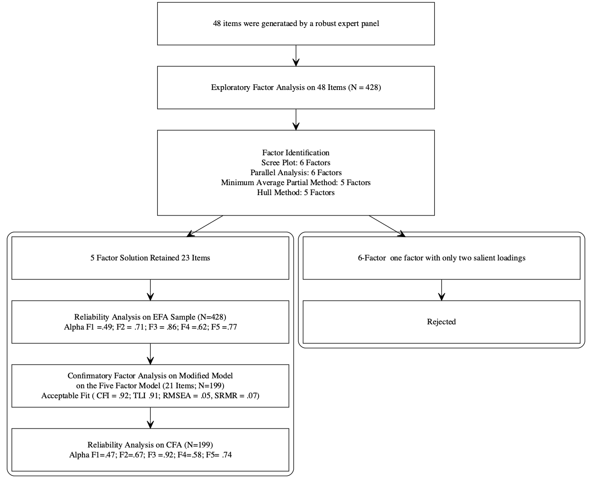
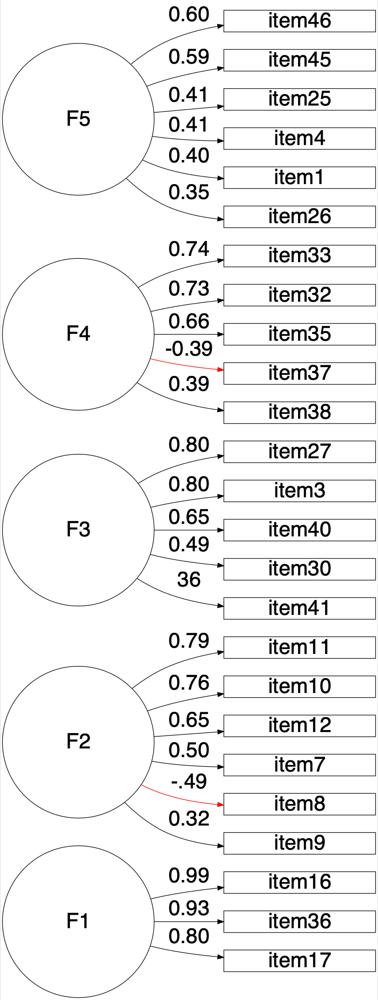

```{r setup, include = FALSE}
library(papaja) # devtools::install_github("crsh/papaja")
library(readr)
library(readxl)
library(lavaan)
library(semPlot)
library(semTools)
library(MOTE)
library(psych)
library(dlookr)
library(tidyverse)
library(qgraph)
library(kableExtra)
library(paran) # Parallel analysis
library(EFA.MRFA) # Hull method
library(DiagrammeR) #devtools::install_github('rich-iannone/DiagrammeR')
library(DiagrammeRsvg) #For DiagrammeR
library(rsvg) #For DiagrammeR
library(correlation)
library(ggcorrplot)
r_refs("references.bib")
```


---
nocite: |
  `r cite_r("references.bib")`
---


```{r setup-chunk, include=FALSE}
knitr::opts_chunk$set(dev = "png",
                      dpi = 600,
                      echo = FALSE,
                      cache = TRUE)

```

# Introduction

# Methods


## Participants

1. Describe EFA and CFA sample separately.
2. Sampling technique: Convince sampling (non-probability sample)
3. Method: cross-sectional survey
4. How many missing data?
5. How incomplete data were addressed.
6. Why such sample was chosen?

EFA: For exploring initial factor structure, a sample of 250-300 is recommended [@comreyFirstCourseFactor1992; @schonbrodtWhatSampleSize2013]

CFA: For estimating the sample size for the confirmatory factor analysis we followed the N:q rule [@bentlerPracticalIssuesStructural1987; @jacksonRevisitingSampleSize2003; @klinePrinciplesPracticeStructural2015; @worthingtonScaleDevelopmentResearch2006] where 10 participants per parameter is required to earn trustworthiness of the result. Our sample size exceeds the requirement.


## Procedure
### Development of the Scale
1. How the items were generated
2. How the literature was reviewed to identify construct adequacy of the items.
3. Discuss the expert panel review process to assess content validity

```{r flowchart, include=FALSE }
Flowchart1 <- grViz("digraph nicegraph{
         
                    graph [layout = dot,fontsize = 14]
                     
                     node[shape = rectangle, margin = 0.2, width = 6.5, height = 1, fixedsize = true]  
                     
                    A[label = '48 items were generataed by a robust expert panel'] 
                    B[label = 'Exploratory Factor Analysis on 48 Items (N = 428)']
                    
                    node[shape = rectangle, margin = 0.2, width = 6.5, height = 2, fixedsize = true]
                    C[label = 'Factor Identification
                    Scree Plot: 6 Factors
                    Parallel Analysis: 6 Factors
                    Minimum Average Partial Method: 5 Factors
                    Hull Method: 5 Factors']
                    
                     subgraph cluster_1 {
                      graph[shape = rectangle]
                      style = rounded
                     node[ margin = 0.2,width = 6.5, height = 1, fixedsize = true ]
                    
                     1[label = '5 Factor Solution Retained 23 Items']
                     2[label = 'Reliability Analysis on EFA Sample (N=428)
                    Alpha F1 =.49; F2 = .71; F3 = .86; F4 =.62; F5 =.77']
                    
                     3[label = 'Confirmatory Factor Analysis on Modified Model
                     on the Five Factor Model (21 Items; N=199)
                      Acceptable Fit ( CFI = .92; TLI .91; RMSEA = .05, SRMR = .07)']
                    
                     4[label = 'Reliability Analysis on CFA (N=199) 
                      Alpha F1=.47; F2=.67; F3 =.92; F4=.58; F5= .74']
                    }
                subgraph cluster_2 {
                      graph[shape = rectangle]
                      style = rounded
                     node[ margin = 0.2,width = 6.5, height = 1, fixedsize = true ]
                    5[label = '6-Factor  one factor with only two salient loadings']
                    6[label = 'Rejected']
                    }     
                     
                    
                     edge[color = black,arrowhead = vee, arrowsize = 1.25]
                     A ->B
                     B ->C
                     C ->1
                     1 ->2
                     2 ->3
                     3 ->4
                     C ->5
                     5 ->6
                     
                     
}")

export_svg(Flowchart1) %>%
  charToRaw() %>%
  rsvg() %>%
  png::writePNG("Flowchart1.png")

```


```{r,  out.width = '100%', out.height= '100%', fig.align = 'center', fig.cap='Development and psychometric properties of LEBA '}

```


## Procedure
Our study had four objectives. First, to develop an instrument to assess an individual's light exposure behavior. Second, to conduct an exploratory factor analysis(EFA)  to understand the latent structure. The third one is to gather structural validity evidence for the latent structure obtained in EFA. Lastly, we gathered item information using Item response theory (IRT)[@bakerBasicsItemResponse2017]


### Data Collection
Timeline of data collection, 
ethical approval
mode of data collection
how consent was recorded.


## Analytic Strategies

We used R (version 4.1.0), including several R packages, for our analyses. Necessary assumptions of EFA, including sample adequacy, normality assumptions, quality of correlation matrix, were assessed. Our data violated both the univariate and multivariate normality assumptions. Due to these violations and the ordinal nature of our response data, we used a polychoric correlation matrix [@desjardinsHandbookEducationalMeasurement2018] for the EFA. We employed principal axis (pa) a factor extraction method with varimax rotation. PA is robust to the normality assumption violations [@watkinsStepbyStepGuideExploratory2020]. The obtained latent structure was confirmed by the minimum residuals extraction method as well. We used a combination factor identification method including scree plot[@cattellScreeTestNumber1966], Horn's parallel analysis [@hornRationaleTestNumber1965], minimum average partials method[@velicerDeterminingNumberComponents1976], and hull method [@lorenzo-sevaHullMethodSelecting2011] to identify factor numbers.  Additionally, to determine the simple structure, we followed the following guidelines recommended by psychometricians (i) no factors with fewer than three items (ii) no factors with a factor loading <0.3 (iii) no items with cross-loading greater than .3 across factors [@bandalosFactorAnalysisExploratory2018; 

# Results

```{r Normality assumption EFA, include=FALSE}
LB <- read_excel("recoded not reversed_EFA.xlsx")
LB$X1 <- NULL
#KMO test
KMO <- KMO(LB) 

# Test of correlation matrix
bartlet <- cortest.bartlett(LB, n =428)

# Univariante normality
normality <- normality(LB) 
normalityprefix <- apa(normality$statistic, 2,T)
normalitysufix <- "*"
normality.names <- paste(normalityprefix,normalitysufix, sep = "" )


# Multivariate Normality
mardia <- mardia(LB, na.rm = T, plot =F)

# Descriptives
Descriptives <- psych::describe(LB)
alpha <- psych::alpha(LB)
Item.total <- alpha$item.stats

Des.combined <- cbind(apa(Descriptives$mean,2,T), apa(Descriptives$sd,2,T), apa(Descriptives$skew,2,T),apa(Descriptives$kurtosis,2,T), normality.names,  apa(Item.total$r.cor,2,F))


colnames(Des.combined) = c("Mean", "SD", "Skew", "Kurtosis", "Shapiro-Wilk Statistics", "Item-Total Correlation")

rownameprefix <- "Item"
rownamesufix <- seq(1:48)
my.names <- paste(rownameprefix,rownamesufix, sep = "" )

rownames(Des.combined) = (my.names)

#Polychoric Correlation matrix
LB.factor <- sapply(LB, as.factor)
correlations <- polychoric(LB.factor, correct = 0)
upper <- correlations$rho[upper.tri(correlations$rho, diag = F)]

min.cor <- abs(min(upper)) #minimum cor.coefficient of the matrix
max.cor <- abs(max(upper)) # max. correlation coefficent of the matrix


# Calulating the percentange of correlations higher than .30

BigR = sum(correlations$rho >= abs(.30) & correlations$rho < abs(1.0), na.rm =T)/2 
totR = length(LB)*(length(LB)-1)/2
cor.per <- print (BigR/totR)*100


# Item analysis
Item_analysis <- psych::alpha(LB)
Item_analysis$item.stats$r.cor
R.cor.sum <- summary(Item_analysis$item.stats$r.cor)
low.r.corec <- abs(R.cor.sum[1])  #minimum item total correlation
high.r.corec <- R.cor.sum[6]     # maximum item total correlation
```

Sampling adequacy was checked using Kaiser-Meyer-Olkin (KMO) measures of sampling adequacy[@kaiserIndexFactorialSimplicity1974] . The overall KMO vale for 48 items was `r printnum(KMO$MSA)` which was above the cutoff value (.50) indicating a mediocre sample [@hutchesonMultivariateSocialScientist1999].

```{r tabDes, results='asis'}
apa_table(Des.combined, caption = "Descriptive Statistics", align = "c", note = "*p<.001", longtable =T)
```

```{r figCor,out.width="50%",fig.cap= "Correlation plot of the items",results='asis', fig.align='center'}

ggcorrplot(correlations$rho, hc.order = TRUE, outline.col = "white", type = "lower")
#p.mat <- cor_to_p(correlations$rho, 428, method = "polychoric")
#to show pvalue in the fig add p.mat=p.mat
```

Table\@ref(tab:tabDes) summarizes the univariate descriptive statistics for the 48 items. some of the items were skewed with high Kurtosis values. Our data violated both univariate normality (Shapiro-Wilk statistics; [@shapiroAnalysisVarianceTest1965]) and multivariate normality assumptions (Marida's test;[@mardiaMeasuresMultivariateSkewness1970]). Multivariate skew was  = `r printnum(mardia$b1p)` (p <0.001) and multivariate kurtosis was = `r printnum(mardia$b2p)` (p <0.001). Due to these violations and ordinal nature of the response data  polychoric correlations over Pearson's correlations was chosen [@desjardinsHandbookEducationalMeasurement2018]. Bartlett's test of sphericity [@bartlettNoteMultiplyingFactors1954], $\chi^2$ (`r bartlet$df`) = `r apa(bartlet$chisq, 2, T)`, p < .001] indicated the correlations between items are adequate for the EFA. However only `r apa(cor.per, 2,T)`% of the inter-item correlation coefficients were greater than .30. The inter item correlation ranged between `r apa(min.cor,2,F)` to `r apa(max.cor,2,F)`. And the corrected item-total correlations ranged between `r apa(low.r.corec,2,F)` to `r apa(high.r.corec,2,F)`. 


```{r factor_identification, eval=FALSE, include=FALSE}

#correlations <- polychoric(LB.factor, correct = 0)

# Parallel analysis
 paran(correlations$rho, iterations=500, centile=0, quietly=FALSE,
      status=TRUE, all=FALSE, cfa=FALSE, graph=TRUE,
      color=TRUE, col=c("black","red","blue"),
      lty=c(1,2,3), lwd=1, legend=TRUE, file="parallel.png",
      width=640, height=640, grdevice=png, seed=0, mat=NA, n=NA)

# HULL
hullEFA(LB,extr = "ULS", index_hull = "CAF", display = TRUE, graph = TRUE,
        details = TRUE)


```

Scree plot ( Figure \@ref(fig:facid)) suggested a six-factor solution. Horn's parallel analysis [@hornRationaleTestNumber1965] with 500 iterations also indicated a six-factor solution. However, the MAP method [@velicerDeterminingNumberComponents1976] and Hull method [@lorenzo-sevaHullMethodSelecting2011] suggested a five-factor solution. As a result, we tested both five-factor and six-factor solutions. 

```{r facid, out.height= "50%",  fig.align='center', fig.cap='Factor Identification (A) Parallel analysis (B) Scree Plot, (C) Hull method', fig.show="hold",fig.ncol = 2, out.width="50%",  warning=FALSE}

scree(correlations$rho,factors=TRUE,pc=TRUE,main="(B)",
      hline=NULL,add=F)
knitr::include_graphics('HUll method.png')

```

```{r EFA, include=FALSE}
fa.5F.1 <- fa(r=correlations$rho, nfactors = 5, fm= "pa",rotate ="varimax",
              residuals = TRUE, SMC = TRUE, n.obs =428)
AA <- print(fa.5F.1, cut = .3, digits = 3, sort = TRUE)


reduced.model.5F.1 <- dplyr::select(LB ,
                                    - c(item20,item17,item3, item15,item40, item4,item11, item39,
                                        item18, item45, item29, item25, item8, item46 ))

correlations.red.5F.1 <- polychoric(reduced.model.5F.1,correct = 0)

fa.5F.2 <- fa(r=correlations.red.5F.1$rho, nfactors = 5, fm= "pa",rotate ="varimax",
              residuals = TRUE, SMC = TRUE, n.obs =428)
BB <- print(fa.5F.2, cut = .3, digits = 3, sort = TRUE)

reduced.model.5F.2 <- dplyr::select(LB,- c(item20,item17,item3, item15,item40, item4,item11, item39,
                                           item18, item45, item29, item25, item8, item46,
                                           item33, item12,item31, item37,
                                           item22, item38, item6, item48))
correlations.red.5F.2 <- polychoric(reduced.model.5F.2,correct = 0)


fa.5F.3 <- fa(r=correlations.red.5F.2$rho, nfactors = 5, fm= "pa",rotate ="varimax",
              residuals = TRUE, SMC = TRUE, n.obs =428)

CC <- print(fa.5F.3, cut = .3, digits = 3, sort = TRUE)


reduced.model.5F.3 <- dplyr::select(LB,- c(item20,item17,item3, item15,item40, item4,item11, item39,
                                           item18, item45, item29, item25, item8, item46,
                                           item33, item12,item31, item37,
                                           item22, item38, item6, item48, item9, item42,
                                           item23))
correlations.red.5F.3 <- polychoric(reduced.model.5F.3,correct = 0)


fa.5F.4 <- fa(r=correlations.red.5F.3$rho, nfactors = 5, fm= "pa",rotate ="varimax",
              residuals = TRUE, SMC = TRUE, n.obs =428)


DD <- print(fa.5F.4, cut = .3, digits = 3, sort = TRUE)

```

```{r EFAplotcode, include=FALSE}
#library(DiagrammeR)
EFAplot.LR <- grViz("
digraph boxes_and_circles {

graph [layout = dot,rankdir = LR, fontsize = 40]

# node definitions with substituted label text
node [fontname = Helvetica, shape = circle,  margin = 0.5, width = 3.5, height = .5,
fixedsize = true, fontsize = 35]
F1 [label = 'Blue 
Filter']
F2 [label = 'Outdoor']
F3 [label = 'Sleep
Environment']
F4 [label = 'Cell Phone']
F5 [label = 'Awareness']
node [fontname = Helvetica, shape = box]
b [label = 'item43']
c [label = 'item26']
d [label = 'item32']
e [label = 'item10']
f [label = 'item47']
g [label = 'item36']
h [label = 'item44']
i [label = 'item35']
j [label = 'item13']
k [label = 'item14']
l [label = 'item41']
m [label = 'item7']
n [label = 'item27']
o [label = 'item21']
p [label = 'item34']
q [label = 'item19']
r [label = 'item2']
s [label = 'item5']
t [label = 'item24']
u [label = 'item30']
v [label = 'item1']
w [label = 'item16']
x [label = 'item28']

{rank = same; F1 F2 F3 F4 F5}
# edge definitions with the node IDs
edge [fontname = Helvetica, fontsize = 35]
F1 -> b[label = '0.99']
F1-> c [label = '0.93']
F1-> d [label = '0.80']
F2 -> e [label = '0.82']
F2 -> f[label = '0.82']
F2 -> g [label = '0.63']
F2 -> h[ label = '-0.47', color =red]
F2 -> i [label = '0.46']
F2 -> j [label = '0.34']
F3 -> k [label = '0.89']
F3 -> l [label = '0.70']
F3 -> m [label = '0.66']
F3 -> n [label = '0.38']
F3 -> o [label = '-0.34', color =red]
F4 -> p [label = '0.84']
F4 -> q [label = '0.80']
F4 -> r [label = '0.69']
F5 -> s [label = '0.69']
F5 -> t [label = '0.54']
F5 -> u [label = '0.52']
F5 -> v [label = '0.35']
F5 -> w [label = '0.31']
F5 -> x [label = '0.31']


}
")


export_svg(EFAplot.LR) %>%
  charToRaw() %>%
  rsvg() %>%
  png::writePNG("EFAplot.LR.png")

```

```{r EFAplot,  fig.cap='Five Factor Solution', fig.align='center', out.width= "120%", out.height= "100%", warning=FALSE}


```


```{r Cronbach alpha for 5 fators, message=TRUE, warning=FALSE, include=FALSE}
Five.F1 <- dplyr::select(LB, item43, item26, item32)
Five.F2 <- dplyr::select(LB, item10, item47, item36, item44, item35, item13) 
Five.F3 <-  dplyr::select(LB, item14, item41,item7, item27, item21)
Five.F4 <-  dplyr::select(LB, item19,item34,item2)
Five.F5 <- dplyr::select(LB, item5, item24, item30, item1, item16, item28)


Five.F1.alpha <- psych::alpha(Five.F1, check.keys = T) 
Five.F2.alpha <- psych::alpha(Five.F2, check.keys = T)
Five.F3.alpha <- psych::alpha(Five.F3, check.keys = T)
Five.F4.alpha <- psych::alpha(Five.F4, check.keys = T) 
Five.F5.alpha <- psych::alpha(Five.F5, check.keys = T) 
```


```{r minres 5 factor supplimentary analyisis, eval=FALSE, include=FALSE}

#Supplementary EFA with Minres Extraction

fa.5F.min.1 <- fa(r=correlations$rho, nfactors = 5, fm= "minres",rotate ="varimax",
                residuals = TRUE, SMC = TRUE, n.obs =428)
EE <- print(fa.5F.min.1, cut = .3, digits = 3, sort = TRUE)


reduced.model.5F.min.1 <- dplyr::select(LB ,
                                    - c(item20,item17,item3, item15,item40, item4,item11, item39,
                                        item18, item45, item29, item25, item8, item46 ))

correlations.red.5F.min.1 <- polychoric(reduced.model.5F.min.1,correct = 0)

fa.5F.min.2 <- fa(r=correlations.red.5F.min.1$rho, nfactors = 5, fm= "minres",rotate ="varimax",
              residuals = TRUE, SMC = TRUE, n.obs =428)
FF <- print(fa.5F.min.2, cut = .3, digits = 3, sort = TRUE)

reduced.model.5F.min.2 <- dplyr::select(LB,- c(item20,item17,item3, item15,item40, item4,item11, item39,
                                           item18, item45, item29, item25, item8, item46,
                                           item33, item12,item31, item37,
                                           item22, item38, item6, item48))

correlations.red.5F.min.2 <- polychoric(reduced.model.5F.min.2, correct = 0)


fa.5F.min.3 <- fa(r=correlations.red.5F.min.2$rho, nfactors = 5, fm= "minres",rotate ="varimax",
              residuals = TRUE, SMC = TRUE, n.obs =428)

GG <- print(fa.5F.min.3, cut = .3, digits = 3, sort = TRUE)


reduced.model.5F.min.3 <- dplyr::select(LB,- c(item20,item17,item3, item15,item40, item4,item11, item39,
                                               item18, item45, item29, item25, item8, item46,
                                               item33, item12,item31, item37,
                                               item22, item38, item6, item48,
                                               item9, item42, item23))
correlations.red.5F.min.3 <- polychoric(reduced.model.5F.min.3,correct = 0)


fa.5F.min.4 <- fa(r=correlations.red.5F.min.3$rho, nfactors = 5, fm= "pa",rotate ="varimax",
              residuals = TRUE, SMC = TRUE, n.obs =428)

HH <- print(fa.5F.min.4, cut = .3, digits = 3, sort = TRUE)


```


```{r EFA 6 Factors Promax, eval=FALSE, message=FALSE, warning=FALSE, include=FALSE, results='hide'}
# EFA with 6 factor (rejected)


#LB.factor <- sapply(LB, as.factor)
#correlations <- polychoric(LB.factor, correct = 0)

fa.6F.1 <- fa(r=correlations$rho, nfactors = 6, fm= "pa",rotate ="varimax",
              residuals = TRUE, SMC = TRUE, n.obs =428)
II <- print(fa.6F.1, cut = .3, digits = 3, sort = TRUE)


reduced.model.6F.1 <- dplyr::select(LB ,
                                    -c(item15, item17, item40, item4, item3, item46, item8,item29, item25 ))

correlations.red.6F.1 <- polychoric(reduced.model.6F.1,correct = 0)

fa.6F.2 <- fa(r=correlations.red.6F.1$rho, nfactors = 6, fm= "pa",rotate ="varimax",
              residuals = TRUE, SMC = TRUE, n.obs =428)
JJ <- print(fa.6F.2, cut = .3, digits = 3, sort = TRUE)

reduced.model.6F.2 <- dplyr::select(LB,-c(item15, item17, item40, item4, item3, item46, item8,item29, item25, item9, item33, item48, item16, item6 ))

correlations.red.6F.2 <- polychoric(reduced.model.6F.2,correct = 0)


fa.6F.3 <- fa(r=correlations.red.6F.2$rho, nfactors = 6, fm= "pa",rotate ="varimax",
              residuals = TRUE, SMC = TRUE, n.obs =428)

KK <- print(fa.6F.3, cut = .3, digits = 3, sort = TRUE)


reduced.model.6F.3 <- dplyr::select(LB,- -c(item15, item17, item40, item4, item3, item46, item8,item29, item25, item9, item33, item48, item16, item6, item11, item23, item18, item39))

correlations.red.6F.3 <- polychoric(reduced.model.6F.3,correct = 0)


fa.6F.4 <- fa(r=correlations.red.6F.3$rho, nfactors = 6, fm= "pa",rotate ="varimax",
              residuals = TRUE, SMC = TRUE, n.obs =428, max.iter = 500)

LL <- print(fa.6F.4, cut = .3, digits = 3, sort = TRUE)


# Residuals
residual.6F =residuals(fa.6F.4 , diag = FALSE, na.rm =T)
#Count of numbers of residuals>.05
BigRRR= sum(residual.6F>abs(.05), na.rm =T)
print(BigRRR)

#Total number of off diagonal elements in the data matrix
totRRR = length(reduced.model.6F.3)*(length(reduced.model.6F.3)-1)/2

# Proportion of off-diagonal elements >.10
sumRRR <- sum(BigRRR/totRRR*100)

hist(residual.6F, col ="red", main = NULL, xlab = "Five factor oblique rotation: Residuals",ylim=c(0, 250))
abline(h =27, lwd = 2, lty = 2)
abline(v =.05,lwd = 2, lty = 2)
```

```{r factordetails, include=FALSE}
#Preparing the EFA table
factor.des = matrix(, nrow = 25, ncol = 6)
as.table(factor.des)
rownames(factor.des) <- c("item43", "item26",  "item32",   
                          "item10",  "item47",  "item36", "item44",  "item35",  "item13", 
                          "item14", "item41",  "item7","item27","item21",
                          "item34", "item19", "item2",
                          "item5", "item24", "item30", "item1", "item16", "item28", "internal Consistency","% of variance")


colnames(factor.des) <- c("F1", "F2", "F3", "F4", "F5", "Communality")

factor.des[,1] <- c(.99, .93, .80, "-","-","-","-","-","-","-","-","-","-","-","-",
                    "-","-","-","-","-","-","-","-",apa(Five.F1.alpha$total[,1],2,F), 11)

factor.des[,2] <- c("-", "-", "-", .82,.82,.63,-.47,.46,.34,"-","-","-","-","-","-",
                    "-","-","-","-","-","-","-","-",apa(Five.F2.alpha$total[,1],2,F), 10)


factor.des[,3] <- c("-", "-", "-", "-","-","-","-","-","-",.89,.70,.66,.38,-.34,"-",
                    "-","-","-","-","-","-","-","-", apa(Five.F3.alpha$total[,1],2,F),9)


factor.des[,4] <- c("-", "-", "-", "-","-","-","-","-","-","-","-","-","-","-",.84,
                    .80,.67,"-","-","-","-","-","-",apa(Five.F4.alpha$total[,1],2,F), 9)

factor.des[,5] <- c("-", "-", "-", "-","-","-","-","-","-","-","-","-","-","-","-","-","-"
                    ,.69,.54,.52,.35,.31,.31,apa(Five.F5.alpha$total[,1],2,F), 6)

factor.des[,6] <- c (.99, .90,.67,.68,.70,.45,.24,.24,.13,.81,.60,.45,.21,.12,.74,.64,.54,
                     .51,.33,.29,.13,.21,.10, "-", "-")

#Commonality
Fac.5 <- fa.5F.4
min.com <- min(Fac.5$communality)
max.com <- max(Fac.5$communality)

# loadings
min.loadings <- min(Fac.5$loadings)
max.loadings <- max(Fac.5$loadings)

# Residuals
residual.5F =residuals(fa.5F.4, diag = FALSE, na.rm =T)
#Count of numbers of residuals>.05
BigRR= sum(residual.5F>abs(.05), na.rm =T)
print(BigRR)

#Total number of off diagonal elements in the data matrix
totRR = length(reduced.model.5F.3)*(length(reduced.model.5F.3)-1)/2

# Proportion of off-diagonal elements >.10
sumR <- sum(BigRR/totRR*100)


```

The initial five-factor solution with all 48 items showed presence of cross-loading items (item 42, 16, & 1) and poor factor loading (<.30) items (item 20, 3 ,15, 17, 40, 4, 11, 39, 18, 45, 29, 25, 8 , & 46). At first, we discarded the items with poor factor-loading and ran another EFA on the remaining 34 items. This iteration of EFA also appeared as a misfit with items with poor factor-loading (Item 12, 22, 38, 6) and cross-loading (items 23, 31, 37, 48) . Another two rounds of EFA were conducted with gradually identifying problematic items and discarding them from the model. Finally, a five-factor EFA solution with 23 items was accepted with low RMSR = 0.04 [@brownConfirmatoryFactorAnalysis2015], all factor-loading higher than .30 and no cross-loading greater than .30. We confirmed this five-factor latent structure using varimax rotation with a minimum residual extraction method (see the supplementary). Table\@ref(tab:TabEFA5) displays the factor-loading (structural coefficients) and communality of the items. The absolute value of the factor-loading ranged from `r apa(min.loadings,2,F)` to `r apa(max.loadings, 2, F)` indicating strong coefficients. The commonalities ranged between `r apa(min.com,2,F)` to `r apa(max.com, 2, F)`. However, the histogram of the absolute values of non-redundant residual-correlations (Fig\@ref(fig:Residuals) showed `r apa(sumR,2, T)`% correlations greater than the absolute value of .05, indicating under-factoring. [@desjardinsHandbookEducationalMeasurement2018a]. Subsequently, we fitted a six-factor solution. However, a factor emerged with only two salient variable loading in the six-factor solution, thus disqualifying the six-factor solution. 

In the five-factor solution, the first factor contained three items and explained 11% of the total variance with a satisfactory internal reliability coefficient ($\alpha$ =.86). All the items in this factor stemmed from the individual's preference to use blue light filters in different light environments. The second factor contained six items and explained 10% of the total variance with a satisfactory internal reliability coefficient ($\alpha$ =.71). Items under this factor commonly investigate an individual's hours spent outdoor. The third factor contained five items and explained 9% of the total variance. Items under this factor dealt with the specific behaviors pertaining to sleep. However, the internal consistency reliability coefficient was not satisfactory ($\alpha$ =.62). The fourth factor contained three items and explained 9% of the total variance with a satisfactory internal consistency ($\alpha$ =.77). These three items stemmed from the behavior related to an individual's cellphone usage during the sleep-wakeup time. Lastly, the fifth factor contained six items and explained 6% of the total variance. Under this factor tried to measure an individual's behavior lead by the awareness of light's influence on health. However, this factor showed unsatisfactory internal consistency reliability ($\alpha$ =.49). It is essential to attain a balance between psychometric properties and the interpretability of the common themes when exploring the latent structure. As all of the emerged factors are highly interpretable, regardless of the apparent low reliability of the two factors,  we retain the five-factor solution with 23 items for our confirmatory factor analysis (CFA). Two items showed negative factor-loading (items 44 and 21). Upon inspection, it was understood that these items are negatively correlated to the common theme, and thus in the CFA analysis, we reversed the response code for these two items.


```{r TabEFA5, results='asis'}

apa_table(factor.des,align = "c", note = "Only loading higher than .30 is reported")
```

```{r Residuals, out.height= "50%",  fig.align='center', fig.cap= ' Histogram of residulas:  five-factor solution',  out.width="50%",  warning=FALSE}
hist(residual.5F, col ="red", main = NULL, xlab = "Five-factor solution", ylim=c(0, 250))
abline(h =47, lwd = 2, lty = 2)
abline(v =.05,lwd = 2, lty = 2)

```


# Confirmatory Factor Analysis


```{r CFA 23 items, include=FALSE}
LB.cfa <- read_excel("recoded not reversed_CFA.xlsx")
LB.model.Cor <- "F1 =~ item43 + item26 + item32
             F2 =~ item10 + item47 + item36 + item44 + item35 + item13
            F3 =~  item14 + item41+ item7 + item27 + item21
            F4 =~ item19 + item34 + item2
F5 =~ item5 + item24 + item30 + item1 + item16 + item28" 


fit.Cor <- cfa(LB.model.Cor, data = LB.cfa, estimator = "MLR", mimic = "Mplus") 

## Summary of Model 
summary(fit.Cor, fit.measures =TRUE,standardized = TRUE, rsq =TRUE)


## Selected Fit measures 
fit.1 <- fitmeasures (fit.Cor,c("gfi", "agfi", "nfi","rfi", 
                       "cfi.robust","tli.robust",
                       "rmsea.robust", 
                       "srmr","aic"))


semTools::reliability(fit.Cor)

```

```{r CFA23withMI, include=FALSE}
LB.model.Cor.3 <- "F1 =~ item43 + item26 + item32
             F2 =~ item10 + item47 + item36 + item44 + item35 + item13
            F3 =~  item14 + item41+ item7 + item27 + item21
            F4 =~ item19 + item34 + item2
F5 =~ item5 + item24 + item30 + item1 + item16 + item28 
item44 ~~ item13
item14 ~~  item7
item10 ~~ item13" 


## Fit the model 
fit.Cor.3 <- cfa(LB.model.Cor.3, data = LB.cfa, estimator = "MLR", mimic = "Mplus") 

reliability <- semTools::reliability(fit.Cor.3, return.total = T)
as.table(reliability)
## Summary of Model 
summary(fit.Cor.3, fit.measures =TRUE,standardized = TRUE, rsq =TRUE)


## Selected Fit measures 
fit.3 <- fitmeasures (fit.Cor.3,c("gfi", "agfi", "nfi","rfi", 
                       "cfi.robust","tli.robust",
                       "rmsea.robust", 
                       "srmr","aic"))

rownames <-  ("fitIndices")
colnames <- c("gfi", "agfi", "nfi","rfi", 
                       "cfi.robust","tli.robust",
                       "rmsea.robust", 
                       "srmr","aic")


```

```{r CFI18items, include=FALSE}
LB.model.Cor.2 <- "F1 =~ item43 + item26 + item32
             F2 =~ item10 + item47 + item36 + item44 + item35 
            F3 =~  item14 + item41+ item7 
            F4 =~ item19 + item34 + item2
F5 =~ item5 + item24 + item30 + item16 
item14 ~~  item7" 

#item 1 &28 discarded from F5;
#item13 discarded from F2
#item 27 & 21 discarded from F3

## Fit the model 
fit.Cor.2 <- cfa(LB.model.Cor.2, data = LB.cfa, estimator = "MLR", mimic = "Mplus") 

## Summary of Model 
summary(fit.Cor.2, fit.measures =TRUE,standardized = TRUE, rsq =TRUE)


## Selected Fit measures 
fit.2 <- fitmeasures (fit.Cor.2,c("gfi", "agfi", "nfi","rfi", 
                       "cfi.robust","tli.robust",
                       "rmsea.robust", 
                       "srmr","aic"))

rownames <-  ("fitIndices")
colnames <- c("gfi", "agfi", "nfi","rfi", 
                       "cfi.robust","tli.robust",
                       "rmsea.robust", 
                       "srmr","aic")


```


## IRT


# Discussion


\newpage
# References

\begingroup
\setlength{\parindent}{-0.5in}
\setlength{\leftskip}{0.5in}

<div id="refs" custom-style="Bibliography"></div>
\endgroup
